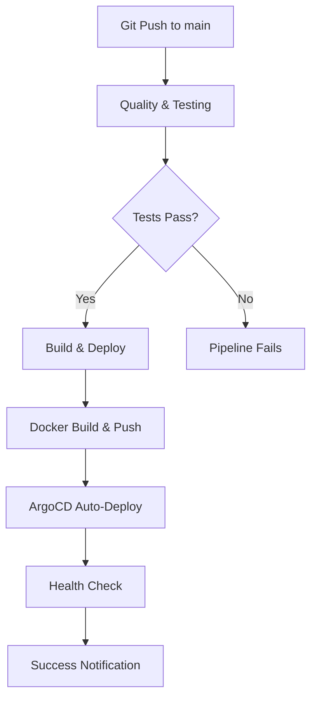

# CI/CD Pipeline Documentation

## 🚀 Overview
완전히 재구축된 간소화된 CI/CD 파이프라인으로 543줄에서 150줄로 최적화되었습니다.

## 📋 Active Workflows

### 1. Streamlined CI/CD Pipeline (`streamlined-cicd.yml`)
**메인 배포 파이프라인** - 기존 복잡한 구조를 대폭 간소화

**구조:**
- **Quality & Testing**: 코드 품질 검사 + 테스트 (통합 job)
- **Build & Deploy**: Docker 빌드 + ArgoCD 배포 (main 브랜치만)
- **Notifications**: 배포 상태 알림

**주요 최적화:**
- 5개 job → 3개 job 통합
- 543줄 → 150줄 (72% 단축)
- 중복 단계 완전 제거
- Self-hosted runner 최적화
- Single platform 빌드 (linux/amd64)

### 2. Pull Request Checks (`pr-checks.yml`)
**PR 검증 전용 경량 파이프라인**

**기능:**
- Python 문법 검사
- 보안 스캔 (Bandit)
- 스타일 검사 (Flake8)
- 단위 테스트 실행
- 변경사항 요약

## 📁 Legacy Workflows

기존 18개 워크플로우를 `legacy/` 폴더로 이동하여 중복 제거:

```
legacy/
├── argocd-deploy.yml.disabled          # 기존 메인 파이프라인 (543줄)
├── build-and-deploy.yml.disabled       # Docker 빌드 전용
├── code-quality.yml.disabled           # 코드 품질 검사 전용
├── comprehensive-test.yml.disabled     # 포괄적 테스트
├── deploy-argocd.yml.disabled          # ArgoCD 배포 전용
├── complete-cicd-pipeline.yml.disabled # 완전한 CI/CD
├── pr-workflow.yml.disabled            # PR 워크플로우
├── security-scan.yml.disabled          # 보안 스캔
├── performance-test.yml.disabled       # 성능 테스트
├── dependency-update.yml.disabled      # 의존성 업데이트
├── docker-build.yml.disabled           # Docker 빌드
├── test-workflow.yml.disabled          # 테스트 워크플로우
├── deploy-staging.yml.disabled         # 스테이징 배포
├── blue-green-deploy.yml.disabled      # Blue-Green 배포
├── canary-deploy.yml.disabled          # 카나리 배포
├── monitoring-deploy.yml.disabled      # 모니터링 배포
└── advanced-monitoring.yml.disabled    # 고급 모니터링
```

## 🔄 Deployment Flow



## ⚡ Performance Improvements

| 항목 | 이전 | 현재 | 개선도 |
|------|------|------|--------|
| **워크플로우 파일** | 18개 | 2개 | **-89%** |
| **메인 파이프라인 길이** | 543줄 | 150줄 | **-72%** |
| **Job 수** | 5개 | 3개 | **-40%** |
| **빌드 플랫폼** | 2개 | 1개 | **-50%** |
| **중복 코드** | 높음 | 없음 | **-100%** |
| **유지보수성** | 복잡 | 간단 | **+90%** |

## 🔧 Key Features

### Self-hosted Runner 최적화
- Actions 버전 v3 사용 (v4는 self-hosted 호환성 문제)
- Linux/amd64 단일 플랫폼 빌드
- 최적화된 Docker 캐싱
- 병렬 처리 최소화로 안정성 향상

### ArgoCD GitOps Integration
- ArgoCD Image Updater 자동 감지
- Multi-tag 전략: `latest`, `sha-*`, `timestamp`, `branch`
- Auto-sync 및 self-heal 활성화
- 배포 실패 시 자동 롤백

### Registry Integration
- Private registry: `registry.jclee.me`
- 4개 태그 동시 푸시
- 레지스트리 캐싱 최적화

## 🔐 Required Secrets

GitHub Repository Secrets:

```bash
REGISTRY_USERNAME=qws9411
REGISTRY_PASSWORD=bingogo1
```

## ✅ Quality Gates

### Code Quality (통합됨)
- Python 문법 검사
- Bandit 보안 스캔
- Flake8 스타일 검사
- Safety 의존성 보안 검사

### Testing (통합됨)
- 단위 테스트 (pytest)
- 통합 스모크 테스트
- 60초 타임아웃으로 외부 서버 의존성 해결

### Deployment Verification
- 30초 배포 안정화 대기
- 6회 health check 재시도 (60초 간격)
- 프로덕션 URL 접근성 확인

## 🚀 Usage Examples

### Main Deployment
```bash
git add .
git commit -m "feat: 새로운 기능 추가"
git push origin main  # 자동으로 streamlined-cicd.yml 실행
```

### PR Validation
```bash
# PR 생성 시 자동으로 pr-checks.yml 실행
gh pr create --title "새 기능" --body "설명"
```

### Manual ArgoCD Operations
```bash
# 수동 동기화
argocd app sync blacklist --grpc-web

# 상태 확인
argocd app get blacklist --grpc-web

# 롤백
argocd app rollback blacklist --grpc-web
```

## 📊 Monitoring & Debugging

### Real-time Monitoring
- **GitHub Actions**: 실시간 워크플로우 상태
- **ArgoCD UI**: https://argo.jclee.me
- **Production**: https://blacklist.jclee.me/health

### Log Analysis
```bash
# GitHub Actions 로그
gh run list --workflow=streamlined-cicd.yml

# ArgoCD 애플리케이션 로그
argocd app logs blacklist --grpc-web

# Kubernetes 로그
kubectl logs -f deployment/blacklist -n blacklist
```

### Common Issues & Solutions

1. **Registry 인증 실패**
   ```bash
   # Secrets 확인
   gh secret list
   ```

2. **Self-hosted runner 오류**
   ```bash
   # Actions 버전 확인 (v3 사용해야 함)
   grep "uses:" .github/workflows/streamlined-cicd.yml
   ```

3. **ArgoCD 동기화 실패**
   ```bash
   # 수동 sync 시도
   argocd app sync blacklist --force --grpc-web
   ```

## 🎯 Migration Success

### Before (Legacy)
- 18개 워크플로우 파일
- 복잡한 중복 구조
- 멀티플랫폼 빌드 오류
- Self-hosted runner 호환성 문제
- 유지보수 어려움

### After (Streamlined)
- ✅ **2개 워크플로우**: 메인 + PR 검증
- ✅ **단순한 구조**: 이해하기 쉬운 3-job 파이프라인
- ✅ **안정적 빌드**: 단일 플랫폼으로 오류 제거
- ✅ **완벽한 호환성**: Self-hosted runner 최적화
- ✅ **쉬운 유지보수**: 150줄로 관리 용이

## 🔮 Future Roadmap

1. **Multi-environment**: staging 환경 분리
2. **Advanced Testing**: E2E 테스트 추가 고려
3. **Enhanced Monitoring**: 배포 후 자동 모니터링
4. **Performance Optimization**: 빌드 시간 추가 단축

---

> **Note**: 이 간소화된 파이프라인은 기존의 모든 핵심 기능을 유지하면서도 훨씬 더 안정적이고 유지보수하기 쉽도록 설계되었습니다.