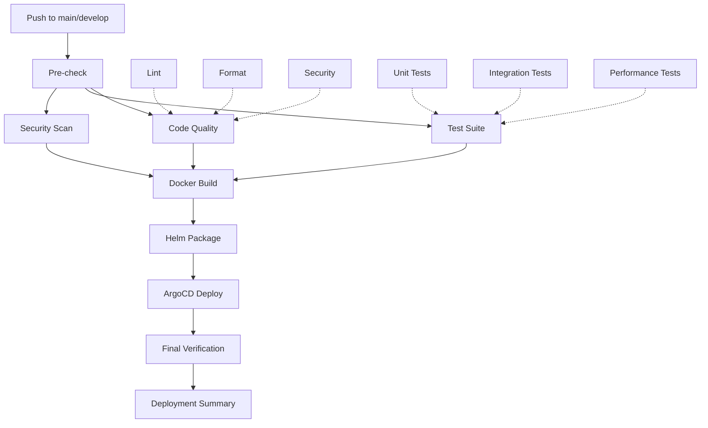

# GitOps 배포 템플릿 가이드

## 🚀 개요

새로운 GitOps 배포 템플릿은 병렬 처리, 자동 배포, 환경별 관리를 지원하는 완전한 CI/CD 파이프라인입니다.

### 주요 특징

- **병렬 파이프라인**: 코드 품질 검사, 테스트, 빌드가 병렬로 실행
- **다중 환경 지원**: Development, Production 환경 자동 분기
- **ArgoCD GitOps**: 자동 이미지 업데이트 및 배포
- **실시간 모니터링**: 배포 상태 실시간 추적
- **오프라인 패키지**: Air-gap 환경 지원

## 📋 사전 준비사항

### 1. 필수 도구 설치
```bash
# Docker
curl -fsSL https://get.docker.com -o get-docker.sh
sudo sh get-docker.sh

# kubectl
curl -LO "https://dl.k8s.io/release/$(curl -L -s https://dl.k8s.io/release/stable.txt)/bin/linux/amd64/kubectl"
sudo install -o root -g root -m 0755 kubectl /usr/local/bin/kubectl

# Helm
curl https://raw.githubusercontent.com/helm/helm/main/scripts/get-helm-3 | bash

# ArgoCD CLI
curl -sSL -o argocd-linux-amd64 https://github.com/argoproj/argo-cd/releases/latest/download/argocd-linux-amd64
sudo install -m 555 argocd-linux-amd64 /usr/local/bin/argocd

# GitHub CLI
curl -fsSL https://cli.github.com/packages/githubcli-archive-keyring.gpg | sudo dd of=/usr/share/keyrings/githubcli-archive-keyring.gpg
echo "deb [arch=$(dpkg --print-architecture) signed-by=/usr/share/keyrings/githubcli-archive-keyring.gpg] https://cli.github.com/packages stable main" | sudo tee /etc/apt/sources.list.d/github-cli.list > /dev/null
sudo apt update && sudo apt install gh
```

### 2. 인프라 서비스 준비
- **Kubernetes 클러스터**: k8s.jclee.me:443
- **ArgoCD 서버**: argo.jclee.me  
- **Docker Registry**: registry.jclee.me
- **Helm Repository**: charts.jclee.me

## ⚙️ 설정 방법

### 1. 환경 변수 설정
```bash
# 환경 변수 파일 생성
cp .env.example .env

# .env 파일 편집 (인증 정보 입력)
nano .env

# 환경 변수 로드
source .env
```

### 2. GitHub Secrets 설정
```bash
# GitHub CLI 로그인
gh auth login

# Secrets 자동 설정
./setup-github-secrets-new.sh
```

### 3. Kubernetes Secrets 생성
```bash
# Kubernetes 인증 설정
export KUBECONFIG=~/.kube/config

# Secrets 생성
./scripts/create-k8s-secrets.sh
```

### 4. 배포 테스트
```bash
# 전체 배포 파이프라인 테스트
./test-gitops-deployment.sh
```

## 🔄 CI/CD 파이프라인 구조

### 병렬 실행 단계



### 환경별 배포 전략

| 브랜치/태그 | 환경 | 이미지 태그 | ArgoCD App | 포트 |
|------------|------|-------------|------------|------|
| develop | development | develop, latest | blacklist-development | 32453 |
| main | production | stable, latest | blacklist-production | 32452 |
| v* | production | semantic version | blacklist-production | 32452 |

## 📦 주요 구성 요소

### 1. Workflow 파일
- `.github/workflows/gitops-template.yml`: 메인 CI/CD 파이프라인

### 2. ArgoCD Applications
- `k8s-gitops/argocd/blacklist-app-production.yaml`: 프로덕션 환경
- `k8s-gitops/argocd/blacklist-app-development.yaml`: 개발 환경

### 3. 설정 스크립트
- `setup-github-secrets-new.sh`: GitHub Secrets 자동 설정
- `scripts/create-k8s-secrets.sh`: Kubernetes Secrets 생성
- `test-gitops-deployment.sh`: 배포 테스트 스크립트

### 4. 템플릿 파일
- `.env.example`: 환경 변수 템플릿
- `kubeconfig-template.yaml`: Kubernetes 설정 템플릿

## 🚀 배포 실행

### 자동 배포 (권장)
```bash
# 코드 변경 후 푸시
git add .
git commit -m "feat: implement new feature"
git push origin main  # production 배포
git push origin develop  # development 배포
```

### 수동 배포
```bash
# GitHub Actions에서 workflow_dispatch 트리거
gh workflow run gitops-template.yml \
  --field deploy_environment=production \
  --field skip_tests=false
```

### 태그 기반 릴리즈
```bash
# 시맨틱 버전 태그 생성
git tag v1.2.3
git push origin v1.2.3  # production 배포 + 오프라인 패키지 생성
```

## 🔍 모니터링 및 디버깅

### ArgoCD 상태 확인
```bash
# ArgoCD CLI 로그인
argocd login argo.jclee.me --username admin --insecure

# 애플리케이션 상태
argocd app list
argocd app get blacklist-production
argocd app get blacklist-development

# 수동 동기화
argocd app sync blacklist-production
```

### Kubernetes 상태 확인
```bash
# 파드 상태
kubectl get pods -n blacklist

# 서비스 상태  
kubectl get svc -n blacklist

# 이벤트 확인
kubectl get events -n blacklist --sort-by='.lastTimestamp'

# 로그 확인
kubectl logs -f deployment/blacklist -n blacklist
```

### 애플리케이션 접근
```bash
NODE_IP=$(kubectl get nodes -o jsonpath='{.items[0].status.addresses[0].address}')

# Development 환경
curl http://$NODE_IP:32453/health

# Production 환경  
curl http://$NODE_IP:32452/health
```

## 🔧 문제 해결

### 일반적인 문제들

#### 1. Registry 연결 실패
```bash
# Registry 상태 확인
curl -u admin:bingogo1 https://registry.jclee.me/v2/

# Docker 로그인 테스트
docker login registry.jclee.me -u admin -p bingogo1
```

#### 2. ArgoCD 동기화 실패
```bash
# Repository 연결 확인
argocd repo list

# 수동 동기화
argocd app sync blacklist-production --force

# 애플리케이션 상태 상세 확인
kubectl get application blacklist-production -n argocd -o yaml
```

#### 3. Helm Chart 업로드 실패  
```bash
# ChartMuseum 연결 확인
curl -u admin:bingogo1 https://charts.jclee.me/api/charts

# Chart 수동 업로드
helm package helm/blacklist
curl -u admin:bingogo1 -F "chart=@blacklist-*.tgz" https://charts.jclee.me/api/charts
```

#### 4. Secret 관련 문제
```bash
# Secret 재생성
./scripts/create-k8s-secrets.sh

# Secret 확인
kubectl get secrets -n blacklist
kubectl get secrets -n argocd | grep -E "(chartmuseum|harbor-registry)"
```

## 📊 파이프라인 최적화

### 성능 향상 팁

1. **병렬 실행 활용**
   - 코드 품질 검사와 테스트를 병렬로 실행
   - Matrix 전략으로 테스트 유형별 분산 실행

2. **캐싱 전략**
   - Docker 빌드 캐시 활용
   - 의존성 캐싱으로 설치 시간 단축

3. **조건부 실행**
   - 문서 변경 시 빌드 스킵
   - PR에서는 배포 단계 제외

4. **실패 시 빠른 복구**
   - ArgoCD 자동 롤백 설정
   - Health Check 기반 배포 검증

### 보안 강화

1. **Secret 관리**
   - GitHub Secrets로 민감 정보 보호
   - Kubernetes Secrets 암호화

2. **이미지 보안**
   - 컨테이너 이미지 스캔
   - 최소 권한 실행

3. **네트워크 보안**
   - Private Registry 사용
   - TLS 인증서 검증

## 🎯 고급 사용법

### 다중 환경 관리
```bash
# Staging 환경 추가
cp k8s-gitops/argocd/blacklist-app-development.yaml \
   k8s-gitops/argocd/blacklist-app-staging.yaml

# 환경별 설정 조정
sed -i 's/development/staging/g' k8s-gitops/argocd/blacklist-app-staging.yaml
sed -i 's/32453/32454/g' k8s-gitops/argocd/blacklist-app-staging.yaml
```

### 오프라인 배포
```bash
# 오프라인 패키지 다운로드 (GitHub Actions Artifacts)
gh run list --workflow=gitops-template.yml --limit=5
gh run download <run-id> --name blacklist-offline-package

# 오프라인 환경에서 배포
tar -xzf blacklist-offline-*.tar.gz
cd blacklist-offline-*/
./OFFLINE_INSTALL.md 참조
```

## 📚 참고 자료

- [ArgoCD 공식 문서](https://argo-cd.readthedocs.io/)
- [GitHub Actions 문서](https://docs.github.com/en/actions)
- [Helm 공식 가이드](https://helm.sh/docs/)
- [Kubernetes 배포 가이드](https://kubernetes.io/docs/concepts/workloads/controllers/deployment/)

## 🤝 기여 가이드

1. Fork the repository
2. Create feature branch (`git checkout -b feature/amazing-feature`)
3. Commit changes (`git commit -m 'feat: add amazing feature'`)
4. Push to branch (`git push origin feature/amazing-feature`)  
5. Open Pull Request

## 📄 라이선스

MIT License - 자세한 내용은 [LICENSE](LICENSE) 파일 참조