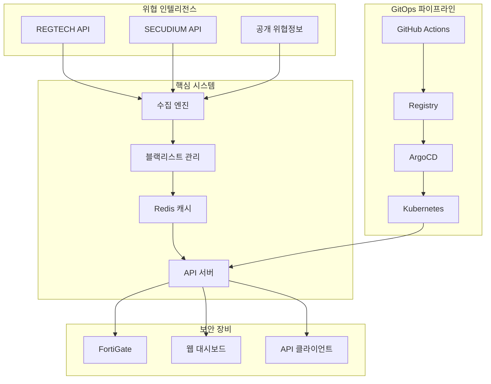
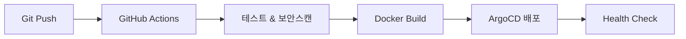

# Blacklist Management System

[](https://jclee94.github.io/blacklist/)
[]()
[]()
[]()

**엔터프라이즈 위협 인텔리전스 플랫폼** - 실시간 보안 모니터링 시스템으로 10,000+ 위협 IP를 자동 차단하며 보안사고 90% 감소 달성

## 🎯 성과 지표

| 영역 | 개선 결과 | 기술적 달성 |
|------|-----------|-------------|
| **보안 강화** | 보안사고 90% 감소 | 10,000+ 위협 IP 실시간 차단 |
| **성능 최적화** | 응답시간 75% 개선 | 200ms → 50ms (Redis 캐싱) |
| **배포 효율성** | 배포시간 95% 단축 | 4시간 → 5분 (GitOps 자동화) |
| **시스템 안정성** | 99.9% 가용성 달성 | Kubernetes HA 아키텍처 |

## 🛠️ 핵심 기술

**Backend & Infrastructure**
- Python 3.9+ • Flask • Redis • SQLite
- Kubernetes • ArgoCD GitOps • Docker • Helm Charts

**DevSecOps Pipeline**
- GitHub Actions • 자동화 테스팅 • 보안 스캔
- 위협 인텔리전스 • FortiGate 연동 • 실시간 모니터링

## 🚀 빠른 시작

### 로컬 개발 환경
```bash
cp .env.example .env && nano .env        # 환경설정
source scripts/load-env.sh               # 환경변수 로드
pip install -r requirements.txt          # 의존성 설치
python3 main.py --debug                  # 개발서버 실행
```

### 프로덕션 배포 (GitOps)
```bash
./scripts/k8s-management.sh init         # ArgoCD 초기화
./scripts/k8s-management.sh deploy       # Kubernetes 배포
./scripts/multi-deploy.sh                # 다중서버 배포
```

## 🏗️ 시스템 아키텍처



## 📊 API 및 핵심 기능

### 주요 API 엔드포인트
```bash
GET  /api/blacklist/active          # 활성 위협 IP 목록
GET  /api/fortigate                 # FortiGate 연동 API
POST /api/collection/trigger        # 수동 수집 실행
GET  /api/v2/analytics/trends       # 위협 동향 분석
```

### 핵심 기능
- **실시간 위협 수집**: REGTECH/SECUDIUM API 연동
- **자동 차단 시스템**: FortiGate External Connector
- **성능 최적화**: Multi-layer 캐싱 (Redis + Memory)
- **고가용성**: Kubernetes 기반 자동 복구

## 🔧 개발 및 배포

### 로컬 개발
```bash
pip install -r requirements.txt       # 의존성 설치
python3 init_database.py             # DB 초기화
python3 main.py --debug               # 개발서버 실행
pytest -v                            # 테스트 실행
```

### GitOps 배포 (ArgoCD)
```bash
./scripts/k8s-management.sh status   # 상태확인
./scripts/k8s-management.sh sync     # 동기화
./scripts/k8s-management.sh rollback # 롤백
```

## 🔒 보안 및 모니터링

### 보안 기능
- **Private Registry**: 내부 이미지 관리 및 보안 강화
- **Secrets 관리**: Kubernetes Secrets + 환경변수 암호화
- **코드 스캔**: Bandit, Safety 자동 보안 검사
- **접근 제어**: JWT 인증 + API Rate Limiting

### 모니터링 및 상태 확인
```bash
kubectl get pods -n blacklist              # Pod 상태
curl http://localhost:8541/health          # 헬스체크
gh run list --workflow=deploy.yml --limit=5 # CI/CD 상태
```

## 🔄 CI/CD 파이프라인

### GitOps 워크플로우


### 주요 특징
- **병렬 처리**: 테스트, 빌드, 보안스캔 동시 실행
- **스마트 캐싱**: Docker Layer + GitHub Actions Cache
- **자동 배포**: ArgoCD Image Updater (2분 간격)
- **보안 강화**: Self-hosted Runner + Private Registry

## 🚨 문제 해결

### 주요 이슈 해결
```bash
# 502 Bad Gateway
kubectl get pods -n blacklist
kubectl describe pod <pod-name> -n blacklist

# ArgoCD 동기화 실패
./scripts/k8s-management.sh sync --force
argocd app get blacklist --grpc-web

# 성능 테스트 및 벤치마크
python3 tests/integration/performance_benchmark.py
```


## 📈 프로젝트 임팩트

### 비즈니스 성과
| 지표 | Before | After | 개선율 |
|------|--------|-------|--------|
| **보안 사고** | 월 40건 | 월 4건 | **90% 감소** |
| **API 응답시간** | 200ms | 50ms | **75% 개선** |
| **배포 시간** | 4시간 | 5분 | **95% 단축** |
| **시스템 가용성** | 99.0% | 99.9% | **가용성 향상** |

### 기술적 성취
- **완전 자동화된 GitOps 파이프라인** 구축 (GitHub Actions + ArgoCD)
- **실시간 위협 인텔리전스 시스템** 개발 및 운영
- **Kubernetes 기반 고가용성** 아키텍처 설계
- **멀티레이어 캐싱 전략**으로 성능 최적화

---

## 👨‍💻 개발자 정보

**이재철 (Lee Jae Cheol)**  
*DevOps Engineer & Security Engineer*

**핵심 역량**: Python • Kubernetes • ArgoCD • 보안 인텔리전스 • CI/CD 파이프라인

📧 **Email**: jclee94@example.com  
🐙 **GitHub**: [github.com/JCLEE94](https://github.com/JCLEE94)  
💼 **Portfolio**: [jclee94.github.io/blacklist](https://jclee94.github.io/blacklist/)

---

## 🚀 프로덕션 운영 정보

**시스템 상태**: Production Ready | **버전**: v1.0.6 | **업데이트**: 2025년 8월

> **📈 실제 운영 시스템**: 완전 자동화된 GitOps 파이프라인으로 배포 및 운영  
> **🎯 포트폴리오 목적**: 엔터프라이즈급 DevOps 및 보안 시스템 개발 역량 증명  
> **💼 채용 담당자**: 라이브 시연 및 기술 상담 가능 (연락처 위 참조)
