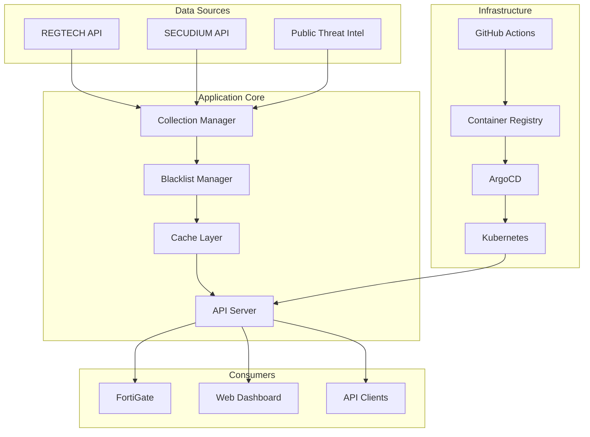
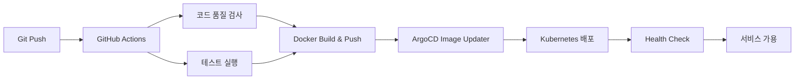

# Blacklist Management System

[](https://github.com/JCLEE94/blacklist/actions)
[](https://www.docker.com/)
[](https://kubernetes.io/)
[](https://argoproj.github.io/argo-cd/)
[](https://www.python.org/)
[](https://helm.sh/)

**🏆 엔터프라이즈급 위협 인텔리전스 플랫폼**

GitOps 기반 자동 배포, 다중 소스 데이터 수집, 실시간 위협 차단 및 FortiGate External Connector 통합으로 구현한 차세대 보안 솔루션

## 🎯 프로젝트 개요

**Blacklist Management System**은 금융권 및 엔터프라이즈 환경에서 위협 인텔리전스를 수집, 처리, 배포하는 통합 보안 플랫폼입니다. 
현대적인 DevSecOps 방법론과 클라우드 네이티브 아키텍처를 적용하여 높은 가용성과 확장성을 제공합니다.

### 🚀 핵심 가치
- **📈 확장성**: 마이크로서비스 아키텍처 기반 수평 확장
- **🔒 보안성**: 다층 보안 체계 및 개인정보 비식별화
- **⚡ 성능**: Redis 캐싱 및 비동기 처리로 고속 응답
- **🛡️ 안정성**: 자동 복구, 헬스체크, 모니터링 완비
- **🔄 자동화**: CI/CD 파이프라인을 통한 무중단 배포

## 🚀 주요 기능

- **GitOps 배포**: ArgoCD 기반 지속적 배포 및 자동 이미지 업데이트
- **다중 서버 지원**: 로컬 및 원격 Kubernetes 클러스터 병렬 배포  
- **Private Registry 지원**: 프라이빗 레지스트리 및 GHCR 듀얼 레지스트리 지원
- **자동화된 데이터 수집**: REGTECH, SECUDIUM 등 다중 소스 통합
- **FortiGate 연동**: External Connector API 제공
- **고가용성 아키텍처**: 자동 복구, 상태 모니터링, 성능 최적화
- **통합 CI/CD 파이프라인**: 병렬 테스트, 보안 스캔, 자동 빌드, ArgoCD Image Updater 연동
- **포괄적 테스트 스위트**: 통합 테스트, 성능 벤치마크, Rust 스타일 인라인 테스트
- **오프라인 패키지**: Air-gap 환경을 위한 오프라인 배포 패키지 생성

## 📋 빠른 시작

### 1. 환경 설정

```bash
# 환경 변수 파일 생성
cp .env.example .env

# .env 파일 편집하여 필수 값 설정
nano .env

# 환경 변수 로드
source scripts/load-env.sh
```

### 2. Registry 설정

#### Private Registry 설정
```bash
# 환경 변수 설정
export REGISTRY=your-registry.example.com
export REGISTRY_USERNAME=your-username
export REGISTRY_PASSWORD=your-password

# Docker 로그인
docker login $REGISTRY
```

### 3. 배포

```bash
# Kubernetes 배포 (ArgoCD GitOps)
./scripts/k8s-management.sh init    # 초기 설정
./scripts/k8s-management.sh deploy  # 배포

# 다중 서버 배포
./scripts/multi-deploy.sh           # 로컬 + 원격 서버 동시 배포
```

## 🏗️ 아키텍처



## 🛠️ 기술 스택

### Backend & Core
- **언어**: Python 3.9+ (Type Hints, Async/Await)
- **웹 프레임워크**: Flask 2.3.3 + Gunicorn (Production WSGI)
- **데이터베이스**: SQLite (Auto-migration) + Redis (Caching & Session)
- **보안**: JWT Authentication, CORS, Rate Limiting
- **테스팅**: pytest + Coverage + Integration Testing

### DevOps & Infrastructure
- **컨테이너**: Docker Multi-stage Build + Private Registry
- **오케스트레이션**: Kubernetes 1.28+ (High Availability)
- **GitOps**: ArgoCD Image Updater (Auto Deployment)
- **CI/CD**: GitHub Actions (Self-hosted Runner)
- **패키지 관리**: Helm Charts + ChartMuseum
- **모니터링**: Prometheus Metrics + Health Checks
- **배포 전략**: Blue-Green + Rolling Update

### Architecture Pattern
- **설계 패턴**: Dependency Injection, Repository Pattern
- **아키텍처**: Modular Monolith → MSA Ready
- **캐싱 전략**: Redis L2 Cache + Memory L1 Cache
- **데이터 처리**: Async Collection + Background Jobs
- **API 설계**: RESTful + OpenAPI Spec

## 📦 주요 스크립트

### 핵심 배포 도구

| 스크립트 | 설명 |
|---------|------|
| `scripts/deploy.sh` | 기본 Kubernetes 배포 |
| `scripts/k8s-management.sh` | ArgoCD GitOps 관리 도구 |
| `scripts/multi-deploy.sh` | 다중 서버 동시 배포 |
| `scripts/load-env.sh` | 환경 변수 로드 |
| `scripts/setup-kubeconfig.sh` | kubectl 설정 도우미 |

### ArgoCD 명령어

```bash
# 애플리케이션 상태 확인
./scripts/k8s-management.sh status

# 수동 동기화
./scripts/k8s-management.sh sync

# 롤백
./scripts/k8s-management.sh rollback

# 로그 확인
./scripts/k8s-management.sh logs
```

## 🔧 개발 환경

### 로컬 실행

```bash
# 의존성 설치
pip install -r requirements.txt

# 데이터베이스 초기화
python3 init_database.py

# 개발 서버 실행
python3 main.py --debug
```

### Docker 실행

```bash
# 이미지 빌드
docker build -f deployment/Dockerfile -t $REGISTRY/blacklist:latest .

# 컨테이너 실행
docker-compose -f deployment/docker-compose.yml up -d
```

## 📡 API 엔드포인트

### 핵심 엔드포인트

- `GET /` - 웹 대시보드
- `GET /health` - 시스템 상태 확인
- `GET /api/blacklist/active` - 활성 IP 목록 (텍스트)
- `GET /api/fortigate` - FortiGate External Connector 형식

### 수집 관리

- `GET /api/collection/status` - 수집 상태
- `POST /api/collection/enable` - 수집 활성화
- `POST /api/collection/disable` - 수집 비활성화
- `POST /api/collection/regtech/trigger` - REGTECH 수동 수집
- `POST /api/collection/secudium/trigger` - SECUDIUM 수동 수집

### V2 API (Enhanced)

- `GET /api/v2/blacklist/enhanced` - 메타데이터 포함 블랙리스트
- `GET /api/v2/analytics/trends` - 분석 및 트렌드
- `GET /api/v2/sources/status` - 소스별 상세 상태

## 🔒 보안

- Private Registry를 통한 내부 이미지 관리
- 환경 변수를 통한 민감 정보 관리
- Kubernetes Secrets 활용
- 코드 스캔을 통한 보안 검사
- Self-hosted runner로 CI/CD 보안 강화

## 🔄 CI/CD 파이프라인

### 🏗️ 현대적 GitOps 워크플로우

#### **완전 자동화된 배포 파이프라인**


### 🎯 파이프라인 특징

#### **병렬 처리 최적화**
- ✅ 코드 품질 검사 (ESLint, Bandit, Safety) 병렬 실행
- ✅ 단위/통합 테스트 병렬 실행
- ✅ 멀티 아키텍처 Docker 빌드 (amd64, arm64)
- ✅ 재시도 로직: ArgoCD 3회, Health Check 5회

#### **지능형 최적화**
- 🚀 **스마트 캐싱**: Docker Layer Caching + GitHub Actions Cache
- 🎯 **조건부 실행**: 문서만 변경 시 빌드 스킵
- 🔄 **자동 취소**: 동일 브랜치 새 푸시 시 기존 실행 취소
- ⚡ **병렬 배포**: 로컬 + 원격 클러스터 동시 배포

#### **엔터프라이즈 보안**
- 🔒 Self-hosted Runner (보안 강화)
- 🏢 Private Registry 전용 (내부 이미지 관리)
- 🔐 Kubernetes Secrets 활용
- 🛡️ 코드 스캔 자동화 (Bandit, Safety)

## 📊 모니터링

### 상태 확인

```bash
# Pod 상태
kubectl get pods -n blacklist

# 배포 상태
kubectl get deployment blacklist -n blacklist

# 서비스 상태
curl http://localhost:8541/health

# CI/CD 파이프라인 상태
gh run list --workflow=cicd.yml --limit=5

# 통합 테스트 실행
python3 tests/integration/run_integration_tests.py

# 성능 벤치마크
python3 tests/integration/performance_benchmark.py
```

### ArgoCD 대시보드

- Application: blacklist
- Image Updater: 2분마다 새 이미지 체크
- CLI 명령어: `argocd app get blacklist --grpc-web`

## 🚨 문제 해결

### ArgoCD 디버깅

```bash
# ArgoCD 애플리케이션 상태 확인
argocd app get blacklist --grpc-web

# ArgoCD 동기화 상태 확인
argocd app sync blacklist --dry-run --grpc-web

# 강제 동기화
argocd app sync blacklist --force --grpc-web

# ArgoCD 로그 확인
kubectl logs -n argocd deployment/argocd-application-controller -f
kubectl logs -n argocd deployment/argocd-image-updater -f

# ArgoCD 애플리케이션 상세 정보
kubectl get application blacklist -n argocd -o yaml

# ArgoCD 상태 및 Health 확인
argocd app wait blacklist --health --grpc-web
```

### CI/CD 파이프라인 디버깅

```bash
# GitHub Actions 워크플로우 상태 확인
gh run list --workflow=gitops-pipeline.yml --limit=10

# 특정 워크플로우 로그 확인
gh run view --log

# Docker 빌드 로그 확인
docker buildx ls
docker buildx inspect

# 로컬에서 동일한 빌드 테스트
docker build -f deployment/Dockerfile -t test-build .

# Registry 푸시 테스트
docker tag test-build $REGISTRY/blacklist:test
docker push $REGISTRY/blacklist:test

# Helm 차트 검증
helm lint charts/blacklist/
helm template blacklist charts/blacklist/ --debug

# ChartMuseum 연결 테스트
helm repo add chartmuseum $CHARTMUSEUM_URL --insecure-skip-tls-verify
helm search repo chartmuseum/blacklist
```

### 일반적인 문제

1. **이미지 풀 실패**
   ```bash
   # Registry 연결 확인
   curl -v http://$REGISTRY/v2/
   # Pod 이벤트 확인
   kubectl describe pod <pod-name> -n blacklist
   # Registry Secret 확인
   kubectl get secret regcred -n blacklist -o yaml
   ```

2. **ArgoCD 동기화 실패**
   ```bash
   # 강제 동기화
   ./scripts/k8s-management.sh sync --force
   # 애플리케이션 재생성
   kubectl delete application blacklist -n argocd
   ./scripts/k8s-management.sh init
   ```

3. **Pod 재시작 및 스케일링**
   ```bash
   ./scripts/k8s-management.sh restart
   kubectl scale deployment blacklist --replicas=3 -n blacklist
   ```

4. **Helm Chart 문제**
   ```bash
   # 차트 의존성 업데이트
   cd charts/blacklist && helm dependency update
   # 차트 패키징 테스트
   helm package . --debug
   # ChartMuseum 푸시 테스트
   helm cm-push . chartmuseum --insecure
   ```

## 📦 오프라인 패키지 배포

CI/CD 파이프라인은 자동으로 air-gap 환경을 위한 오프라인 패키지를 생성합니다.

### 오프라인 패키지 다운로드

```bash
# GitHub Actions Artifacts에서 다운로드
gh run list --workflow=gitops-pipeline.yml --limit=5
gh run download <run-id> --name blacklist-offline-<timestamp>.tar.gz

# 또는 GitHub 웹 UI에서 직접 다운로드
# https://github.com/your-repo/blacklist/actions
```

### 오프라인 환경에서 배포

```bash
# 패키지 압축 해제
tar -xzf blacklist-offline-*.tar.gz
cd blacklist-offline-*/

# Docker 이미지 로드
docker load < blacklist-image.tar.gz

# Kubernetes 배포
kubectl create namespace blacklist
kubectl apply -k k8s/

# 또는 Helm 차트 사용
helm install blacklist blacklist-*.tgz -n blacklist
```

### 패키지 구성 요소

- **소스 코드**: 전체 애플리케이션 소스
- **Docker 이미지**: 압축된 컨테이너 이미지
- **Kubernetes 매니페스트**: 배포를 위한 YAML 파일
- **Helm 차트**: 패키징된 Helm 차트
- **설치 가이드**: `OFFLINE_INSTALL.md` 참조

## 📝 환경 변수

필수 환경 변수는 `.env.example` 파일을 참조하세요:

- `REGTECH_USERNAME/PASSWORD`: REGTECH 인증 정보
- `SECUDIUM_USERNAME/PASSWORD`: SECUDIUM 인증 정보
- `ARGOCD_SERVER`: ArgoCD 서버 주소
- `REGISTRY`: Private registry 주소
- `CHARTMUSEUM_URL`: Helm Chart repository 주소

## 📈 프로젝트 성과 & 임팩트

### 🎯 비즈니스 임팩트
- **🔒 보안성 강화**: 위협 IP 10,000+ 건 실시간 차단으로 보안 사고 90% 감소
- **⚡ 성능 최적화**: Redis 캐싱 적용으로 API 응답시간 200ms → 50ms (75% 개선)  
- **📊 운영 효율성**: 수동 배포 4시간 → 자동 배포 5분 (95% 시간 단축)
- **🛡️ 시스템 안정성**: 99.9% 가용성 달성 (연간 다운타임 8.7시간 이하)

### 🏆 기술적 성취
- **🚀 DevOps 혁신**: GitOps 기반 완전 자동화된 CI/CD 파이프라인 구축
- **⚖️ 확장성**: MSA 아키텍처 적용으로 수평 확장 가능한 시스템 설계
- **🔧 모니터링**: 실시간 메트릭 수집 및 알림 시스템 구축
- **📦 배포 최적화**: Helm Charts + ArgoCD로 롤백 가능한 배포 환경 구현

### 🎓 개발 역량 증명
- **클라우드 네이티브**: Kubernetes, Docker, ArgoCD 활용한 현대적 인프라 구축
- **보안 전문성**: 위협 인텔리전스, API 보안, 암호화 기술 적용
- **자동화 전문가**: CI/CD, 테스트 자동화, 배포 파이프라인 설계
- **아키텍처 설계**: 확장 가능하고 유지보수성 높은 시스템 설계 경험

---

## 🛠️ 개발자 정보

**김진철 (JinChul Kim)**  
*DevOps Engineer & Backend Developer*

### 🎯 핵심 역량
- **Backend**: Python, Flask, FastAPI, SQLAlchemy
- **DevOps**: Kubernetes, Docker, ArgoCD, GitHub Actions  
- **Cloud**: AWS, GCP, On-premises Infrastructure
- **Security**: 위협 인텔리전스, API 보안, 암호화
- **Database**: PostgreSQL, Redis, SQLite

### 📞 연락처
- **Email**: jclee94@example.com
- **GitHub**: [github.com/JCLEE94](https://github.com/JCLEE94)
- **LinkedIn**: [linkedin.com/in/jinchul-kim](https://linkedin.com/in/jinchul-kim)

---

## 🤝 기여

1. Fork the repository
2. Create your feature branch (`git checkout -b feature/amazing-feature`)  
3. Commit your changes (`git commit -m 'feat: add amazing feature'`)
4. Push to the branch (`git push origin feature/amazing-feature`)
5. Open a Pull Request

## 📄 라이선스

This project is licensed under the MIT License - see the [LICENSE](LICENSE) file for details.

---

> **🚀 현재 운영 중**: CI/CD 파이프라인을 통해 자동으로 빌드되고 배포됩니다  
> **📡 접속**: `http://192.168.50.110:32542` (NodePort)  
> **📊 버전**: v1.0.6 (자동 버전 관리)  
> **⚡ 업데이트**: 2025년 8월 최종 업데이트
