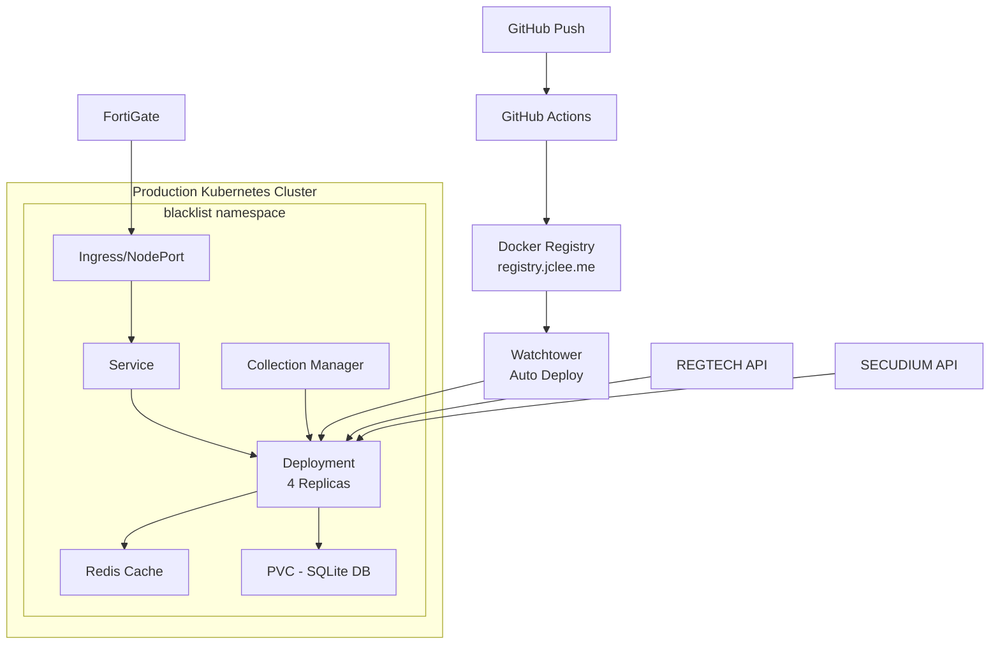

# Blacklist Management System

(https://github.com/jclee/blacklist/actions/workflows/build-deploy.yml/badge.svg)](https://github.com/jclee/blacklist/actions)
[](https://kubernetes.io/)
[](https://registry.jclee.me)

통합 위협 정보 관리 플랫폼 - Kubernetes 네이티브 아키텍처, 다중 소스 데이터 수집, FortiGate External Connector 연동 지원

## 🏗️ Architecture



## 🚀 Quick Start

### Prerequisites

- Kubernetes cluster (k3s/k8s v1.24+)
- kubectl 설정 완료
- Docker 및 registry 접근 권한
- 오프라인 환경의 경우 이미지 사전 준비

### Kubernetes 배포

```bash
# 1. 저장소 클론
git clone https://github.com/jclee/blacklist.git
cd blacklist

# 2. Namespace 생성
kubectl create namespace blacklist

# 3. Registry Secret 생성 (Private Registry 사용 시)
kubectl create secret docker-registry regcred \
  --docker-server=registry.jclee.me \
  --docker-username=<username> \
  --docker-password=<password> \
  -n blacklist

# 4. 환경 변수 및 시크릿 설정
kubectl apply -f k8s/configmap.yaml
kubectl apply -f k8s/secret.yaml

# 5. 애플리케이션 배포
kubectl apply -f k8s/

# 6. 배포 확인
kubectl get all -n blacklist
kubectl get ingress -n blacklist
```

### 오프라인 환경 배포

```bash
# 1. 온라인 환경에서 이미지 준비
docker pull registry.jclee.me/blacklist:latest
docker pull redis:7-alpine
docker pull busybox:latest

# 2. 이미지 저장
docker save -o blacklist-images.tar \
  registry.jclee.me/blacklist:latest \
  redis:7-alpine \
  busybox:latest

# 3. 오프라인 환경으로 전송
scp blacklist-images.tar user@offline-server:/tmp/

# 4. 오프라인 환경에서 이미지 로드
docker load -i /tmp/blacklist-images.tar

# 5. 로컬 레지스트리에 푸시 (있는 경우)
docker tag registry.jclee.me/blacklist:latest localhost:5000/blacklist:latest
docker push localhost:5000/blacklist:latest

# 6. k8s 매니페스트 이미지 경로 수정
sed -i 's|registry.jclee.me|localhost:5000|g' k8s/deployment.yaml
sed -i 's|registry.jclee.me|localhost:5000|g' k8s/redis.yaml

# 7. 배포
kubectl apply -f k8s/
```

## 📦 주요 기능

### 핵심 기능
- **다중 소스 IP 수집**: REGTECH(금융보안원), SECUDIUM, 공개 위협 정보
- **FortiGate 연동**: External Connector API 완벽 지원
- **자동 수집**: 매일 자동 수집 및 업데이트
- **고가용성**: 멀티 레플리카 구성 지원
- **데이터 영속성**: PVC 기반 SQLite 데이터베이스
- **통합 관리**: 웹 기반 대시보드 및 제어판

### API 엔드포인트
- `GET /health` - 상태 확인 및 상세 진단
- `GET /api/fortigate` - FortiGate External Connector 형식
- `GET /api/blacklist/active` - 활성 IP 목록 (텍스트)
- `GET /api/collection/status` - 수집 서비스 상태
- `POST /api/collection/enable` - 수집 활성화
- `POST /api/collection/disable` - 수집 비활성화
- `POST /api/collection/{source}/trigger` - 수동 수집 트리거
- `GET /unified-control` - 통합 관리 웹 UI

### 보안
- TLS/HTTPS (Ingress 또는 NodePort)
- Kubernetes Secrets 기반 인증 정보 관리
- 환경 변수 분리 (ConfigMap/Secret)
- 컨테이너 권한 최소화

## 🛠️ 구성

### ConfigMap (환경 변수)
```yaml
apiVersion: v1
kind: ConfigMap
metadata:
  name: blacklist-config
  namespace: blacklist
data:
  PORT: "2541"
  FLASK_ENV: "production"
  TZ: "Asia/Seoul"
  REDIS_URL: "redis://blacklist-redis:6379/0"
  LOG_LEVEL: "INFO"
```

### Secret (인증 정보)
```yaml
apiVersion: v1
kind: Secret
metadata:
  name: blacklist-secret
  namespace: blacklist
type: Opaque
stringData:
  REGTECH_USERNAME: "your-username"
  REGTECH_PASSWORD: "your-password"
  SECUDIUM_USERNAME: "your-username"
  SECUDIUM_PASSWORD: "your-password"
  SECRET_KEY: "your-flask-secret-key"
```

## 📊 모니터링

### Pod 및 리소스 확인
```bash
# Pod 상태
kubectl get pods -n blacklist

# 리소스 사용량
kubectl top pods -n blacklist

# 로그 확인
kubectl logs -f deployment/blacklist -n blacklist

# 이벤트 확인
kubectl get events -n blacklist --sort-by='.lastTimestamp'
```

### 수집 상태 모니터링
```bash
# API를 통한 상태 확인
curl http://<node-ip>:32541/api/collection/status

# 통계 확인
curl http://<node-ip>:32541/api/stats
```

## 🔄 CI/CD 파이프라인

### GitHub Actions → Watchtower 자동 배포
1. **코드 푸시**: main 브랜치에 푸시
2. **GitHub Actions**: 
   - 테스트 실행
   - Docker 이미지 빌드
   - registry.jclee.me에 푸시
3. **Watchtower**: 
   - 새 이미지 감지
   - 자동으로 컨테이너 업데이트
   - 무중단 배포

### 수동 배포
```bash
# 이미지 빌드 및 푸시
docker build -f deployment/Dockerfile -t registry.jclee.me/blacklist:latest .
docker push registry.jclee.me/blacklist:latest

# Kubernetes 업데이트
kubectl rollout restart deployment/blacklist -n blacklist
kubectl rollout status deployment/blacklist -n blacklist
```

## 🧪 테스트

### 통합 테스트
```bash
# 클러스터 내부에서 실행
kubectl apply -f k8s/test-job.yaml
kubectl logs job/blacklist-integration-test -n blacklist

# 로컬 테스트
python3 scripts/integration_test_comprehensive.py
```

### 단위 테스트
```bash
pytest tests/
pytest --cov=src tests/
```

## 📁 프로젝트 구조

```
blacklist/
├── k8s/                    # Kubernetes 매니페스트
│   ├── namespace.yaml      # 네임스페이스
│   ├── configmap.yaml      # 환경 설정
│   ├── secret.yaml         # 민감 정보
│   ├── pvc.yaml           # 영구 스토리지
│   ├── deployment.yaml     # 메인 애플리케이션
│   ├── service.yaml       # 서비스 정의
│   ├── ingress.yaml       # 인그레스 설정 (선택)
│   ├── redis.yaml         # Redis 캐시
│   └── test-job.yaml      # 테스트 Job
│
├── deployment/            # 컨테이너 설정
│   ├── Dockerfile        # 멀티스테이지 빌드
│   └── docker-compose.yml # 로컬 개발용
│
├── .github/workflows/    # CI/CD 파이프라인
│   └── build-deploy.yml  # GitHub Actions
│
├── src/                  # 애플리케이션 소스
│   ├── core/            # 핵심 비즈니스 로직
│   │   ├── app_compact.py     # 메인 Flask 앱
│   │   ├── unified_service.py # 통합 서비스
│   │   ├── regtech_collector.py # REGTECH 수집기
│   │   └── secudium_collector.py # SECUDIUM 수집기
│   └── utils/           # 유틸리티
│
├── scripts/             # 유틸리티 스크립트
├── tests/              # 테스트 코드
├── main.py            # 엔트리 포인트
├── requirements.txt   # Python 의존성
├── CLAUDE.md         # AI 어시스턴트 가이드
└── README.md         # 이 파일
```

## 🛠️ 기술 스택 (오프라인 환경 기준)

### 런타임 환경
- **Python 3.9**: 안정성과 성능의 균형점
  - 오프라인 환경에서 추가 패키지 설치 불필요
  - Alpine 기반 경량 이미지 사용 (python:3.9-slim)
- **Gunicorn**: Production WSGI 서버
  - 멀티 워커 지원 (기본 4 workers)
  - 타임아웃 120초 설정
  - --reload 옵션 제거로 안정성 확보

### 웹 프레임워크
- **Flask 2.3.3**: 경량 웹 프레임워크
  - 의존성 최소화로 오프라인 환경 적합
  - Flask-CORS, Flask-Compress 포함
  - 보안 헤더 자동 설정

### 데이터베이스
- **SQLite 3**: 파일 기반 임베디드 DB
  - 별도 DB 서버 불필요 (오프라인 환경 최적)
  - WAL 모드로 동시성 향상
  - 자동 백업 및 복구 지원
  - 3개월 데이터 자동 정리

### 캐싱
- **Redis 7-alpine**: 인메모리 캐시
  - 컨테이너 내장으로 외부 의존성 없음
  - 메모리 캐시 폴백 지원
  - TTL 기반 자동 만료

### 컨테이너 기술
- **Docker 20.10+**: 컨테이너화
  - 멀티스테이지 빌드로 이미지 크기 최적화 (~150MB)
  - 레이어 캐싱으로 빌드 시간 단축
  - 루트리스 컨테이너 실행 지원

### 오케스트레이션
- **Kubernetes 1.24+**: 컨테이너 오케스트레이션
  - k3s 지원 (경량 Kubernetes)
  - PVC로 데이터 영속성 보장
  - ConfigMap/Secret으로 설정 관리
  - 자동 재시작 및 헬스체크

### 필수 Python 패키지 (requirements.txt)
```text
# 웹 프레임워크
Flask==2.3.3
Flask-CORS==4.0.0
Flask-Compress==1.14
gunicorn==21.2.0

# 데이터 처리
pandas==2.1.1
openpyxl==3.1.2  # Excel 파일 처리
xlrd==2.0.1      # 구형 Excel 지원

# HTTP 통신
requests==2.31.0
urllib3==2.0.7

# 캐싱
redis==5.0.1
cachetools==5.3.1

# JSON 처리
orjson==3.9.10  # 고성능 JSON

# 유틸리티
python-dateutil==2.8.2
pytz==2023.3
Werkzeug==2.3.7

# 보안
cryptography==41.0.7
certifi==2023.7.22
```

### 오프라인 패키지 준비
```bash
# 1. 온라인 환경에서 패키지 다운로드
pip download -r requirements.txt -d offline-packages/

# 2. 패키지 파일 압축
tar czf python-packages.tar.gz offline-packages/

# 3. 오프라인 환경으로 전송
scp python-packages.tar.gz user@offline-server:/tmp/

# 4. 오프라인 환경에서 설치
tar xzf python-packages.tar.gz
pip install --no-index --find-links offline-packages/ -r requirements.txt
```

### 시스템 의존성 (Alpine Linux)
```dockerfile
# Dockerfile에 포함된 시스템 패키지
RUN apk add --no-cache \
    gcc \
    musl-dev \
    linux-headers \
    libffi-dev \
    openssl-dev \
    python3-dev \
    libxml2-dev \
    libxslt-dev \
    jpeg-dev \
    zlib-dev
```

### 네트워크 구성
- **서비스 타입**
  - ClusterIP: 클러스터 내부 통신
  - NodePort: 외부 접근 (32541)
  - LoadBalancer/Ingress: 프로덕션 환경
  
### 보안 강화
- **이미지 스캔**: Trivy로 취약점 사전 검사
- **시크릿 관리**: Kubernetes Secrets 사용
- **최소 권한**: non-root 사용자 실행
- **네트워크 정책**: 필요 최소한의 포트만 개방

### 모니터링 (오프라인)
- **내장 헬스체크**: /health 엔드포인트
- **메트릭 수집**: /api/stats 제공
- **로그 수집**: stdout/stderr → kubectl logs
- **리소스 모니터링**: kubectl top

### 백업 및 복구
- **SQLite 백업**: 파일 단위 백업
- **설정 백업**: ConfigMap/Secret YAML 저장
- **전체 백업**: namespace 단위 YAML export
- **자동화 스크립트**: 크론잡으로 정기 백업

## 🔧 문제 해결 (오프라인 환경 특화)

### 이미지 Pull 실패
```bash
# 증상: ImagePullBackOff 에러
# 원인: 로컬 레지스트리 접근 실패

# 1. 로컬 레지스트리 상태 확인
docker ps | grep registry
curl http://localhost:5000/v2/_catalog

# 2. k3s/k8s 레지스트리 설정 확인
cat /etc/rancher/k3s/registries.yaml
# 또는
cat /etc/containerd/config.toml

# 3. 이미지 태그 확인
docker images | grep blacklist
kubectl describe pod <pod-name> -n blacklist | grep Image

# 4. 수동으로 이미지 로드
docker load -i blacklist.tar
docker tag <image-id> localhost:5000/blacklist:latest
docker push localhost:5000/blacklist:latest
```

### Pod 메모리 부족
```bash
# 증상: OOMKilled 상태

# 1. 현재 메모리 사용량 확인
kubectl top pods -n blacklist
kubectl describe pod <pod-name> -n blacklist | grep -A5 "Limits:"

# 2. 메모리 한계 증가
kubectl edit deployment blacklist -n blacklist
# resources.limits.memory: "2Gi"로 수정

# 3. 대량 데이터 처리 시 배치 크기 조정
kubectl set env deployment/blacklist BATCH_SIZE=1000 -n blacklist
```

### 데이터베이스 손상
```bash
# 증상: database disk image is malformed

# 1. 백업에서 복구
kubectl exec deployment/blacklist -n blacklist -- rm /app/instance/blacklist.db
kubectl cp backup/db-20250630.db blacklist/<pod-name>:/app/instance/blacklist.db -n blacklist

# 2. SQLite 무결성 검사
kubectl exec deployment/blacklist -n blacklist -- \
  sqlite3 /app/instance/blacklist.db "PRAGMA integrity_check;"

# 3. 데이터 재구축
kubectl exec deployment/blacklist -n blacklist -- \
  python3 init_database.py --force
```

### 오프라인 환경 네트워크 이슈
```bash
# 증상: 외부 API 접근 시도로 타임아웃

# 1. 환경 변수로 오프라인 모드 설정
kubectl set env deployment/blacklist OFFLINE_MODE=true -n blacklist

# 2. 사전 수집된 데이터 마운트
kubectl cp offline-data/ blacklist/<pod-name>:/app/offline-data -n blacklist

# 3. hosts 파일 수정으로 외부 접근 차단
kubectl exec deployment/blacklist -n blacklist -- \
  sh -c 'echo "127.0.0.1 www.krcert.or.kr" >> /etc/hosts'
```

### 성능 저하 문제
```bash
# 증상: API 응답 시간 증가

# 1. Redis 캐시 상태 확인
kubectl exec deployment/blacklist-redis -n blacklist -- redis-cli INFO stats

# 2. 캐시 초기화
kubectl exec deployment/blacklist-redis -n blacklist -- redis-cli FLUSHALL

# 3. DB 인덱스 재구축
kubectl exec deployment/blacklist -n blacklist -- \
  sqlite3 /app/instance/blacklist.db "REINDEX;"

# 4. 불필요한 로그 정리
kubectl exec deployment/blacklist -n blacklist -- \
  find /app/logs -name "*.log" -mtime +7 -delete
```

### 롤백 절차 (오프라인)
```bash
# 1. 현재 버전 백업
docker save localhost:5000/blacklist:current -o blacklist-backup.tar

# 2. 이전 버전 복구
docker load -i blacklist-previous.tar
docker tag <previous-image> localhost:5000/blacklist:rollback
docker push localhost:5000/blacklist:rollback

# 3. Deployment 업데이트
kubectl set image deployment/blacklist \
  blacklist=localhost:5000/blacklist:rollback -n blacklist

# 4. 롤백 확인
kubectl rollout status deployment/blacklist -n blacklist
kubectl logs deployment/blacklist -n blacklist | tail -50
```

## 🏭 프로덕션 운영

### 최소 시스템 요구사항
```yaml
# 단일 노드 환경
CPU: 2 cores (4 cores 권장)
Memory: 4GB (8GB 권장)
Storage: 20GB SSD (데이터 증가 고려)

# Kubernetes 클러스터
Master Node: 2 cores, 4GB RAM
Worker Node: 2 cores, 4GB RAM (최소 2개)
Storage: NFS 또는 Local PV 20GB+
```

### 리소스 할당 가이드
```yaml
# Pod 리소스 (k8s/deployment.yaml)
resources:
  requests:
    memory: "512Mi"
    cpu: "250m"
  limits:
    memory: "1Gi"
    cpu: "1000m"

# Redis 리소스
resources:
  requests:
    memory: "128Mi"
    cpu: "100m"
  limits:
    memory: "256Mi"
    cpu: "200m"
```

### 성능 특성
- **최대 IP 처리 용량**: 100만개 이상
- **API 응답 시간**: 
  - 캐시 히트: < 10ms
  - 캐시 미스: < 100ms
  - 대량 조회: < 500ms
- **메모리 사용량**:
  - 기본 상태: ~300MB
  - 10만 IP: ~800MB
  - 100만 IP: ~2GB

### 백업 및 복구
```bash
# 데이터베이스 백업
kubectl exec deployment/blacklist -n blacklist -- \
  tar czf - /app/instance/blacklist.db > backup-$(date +%Y%m%d).tar.gz

# 데이터베이스 복구
cat backup-20250630.tar.gz | \
  kubectl exec -i deployment/blacklist -n blacklist -- tar xzf - -C /

# 전체 namespace 백업
kubectl get all,cm,secret,pvc -n blacklist -o yaml > blacklist-backup.yaml
```

### 오프라인 환경 운영 가이드

#### 초기 환경 구축
```bash
# 1. 필수 소프트웨어 사전 준비 (온라인)
## Docker 이미지
docker pull registry.jclee.me/blacklist:latest
docker pull redis:7-alpine
docker pull busybox:latest
docker pull python:3.9-slim  # 베이스 이미지

## Kubernetes 도구
curl -LO https://dl.k8s.io/release/v1.24.0/bin/linux/amd64/kubectl
curl -Lo k3s https://github.com/k3s-io/k3s/releases/download/v1.24.17+k3s1/k3s

## Python 패키지
pip download -r requirements.txt -d offline-packages/
pip download pytest pytest-cov -d offline-packages/  # 테스트용

# 2. 오프라인 전송 패키지 생성
tar czf blacklist-offline-bundle.tar.gz \
  *.tar \
  offline-packages/ \
  kubectl \
  k3s \
  k8s/ \
  deployment/ \
  scripts/

# 3. 오프라인 환경 설치
## k3s 설치 (에어갭 모드)
sudo install -m 755 k3s /usr/local/bin/k3s
sudo k3s server --disable-agent &

## 로컬 레지스트리 구성
docker run -d -p 5000:5000 --name registry registry:2
docker load -i blacklist-images.tar
docker tag registry.jclee.me/blacklist:latest localhost:5000/blacklist:latest
docker push localhost:5000/blacklist:latest
```

#### 데이터 소스 오프라인 처리
```python
# 오프라인 환경용 설정 (src/config/offline.py)
OFFLINE_MODE = True
OFFLINE_DATA_PATH = "/app/offline-data"

# IP 데이터 사전 수집 및 저장
# 온라인 환경에서 실행
python scripts/export_offline_data.py

# 오프라인 환경으로 데이터 전송
scp offline-ip-data-*.json user@offline-server:/data/
```

#### 업데이트 및 패치 절차
```bash
# 1. 온라인 환경에서 패치 준비
## 변경된 이미지만 export
docker save registry.jclee.me/blacklist:v2.0 -o blacklist-v2.0.tar

## 변경된 파일만 패치 생성
git diff v1.0..v2.0 > patch-v1.0-to-v2.0.diff

## 패치 번들 생성
tar czf patch-bundle-v2.0.tar.gz \
  blacklist-v2.0.tar \
  patch-v1.0-to-v2.0.diff \
  CHANGELOG.md

# 2. 오프라인 환경 적용
## 이미지 업데이트
docker load -i blacklist-v2.0.tar
docker tag registry.jclee.me/blacklist:v2.0 localhost:5000/blacklist:v2.0
docker push localhost:5000/blacklist:v2.0

## 롤링 업데이트
kubectl set image deployment/blacklist \
  blacklist=localhost:5000/blacklist:v2.0 \
  -n blacklist

## 업데이트 검증
kubectl rollout status deployment/blacklist -n blacklist
```

#### 오프라인 모니터링 도구
```yaml
# monitoring.yaml - 오프라인 환경용 간단한 모니터링
apiVersion: v1
kind: ConfigMap
metadata:
  name: monitoring-script
  namespace: blacklist
data:
  monitor.sh: |
    #!/bin/bash
    while true; do
      echo "=== $(date) ==="
      kubectl top pods -n blacklist
      curl -s http://blacklist:2541/health | jq .
      sleep 300
    done
---
apiVersion: batch/v1
kind: CronJob
metadata:
  name: health-monitor
  namespace: blacklist
spec:
  schedule: "*/5 * * * *"
  jobTemplate:
    spec:
      template:
        spec:
          containers:
          - name: monitor
            image: busybox
            command: ["/bin/sh", "/scripts/monitor.sh"]
            volumeMounts:
            - name: script
              mountPath: /scripts
          volumes:
          - name: script
            configMap:
              name: monitoring-script
          restartPolicy: OnFailure
```

#### 오프라인 백업 자동화
```bash
#!/bin/bash
# backup.sh - 일일 자동 백업 스크립트
BACKUP_DIR="/backup/blacklist"
DATE=$(date +%Y%m%d)

# DB 백업
kubectl exec deployment/blacklist -n blacklist -- \
  sqlite3 /app/instance/blacklist.db ".backup /tmp/backup.db"
kubectl cp blacklist/deployment/blacklist:/tmp/backup.db \
  $BACKUP_DIR/db-$DATE.db

# 설정 백업
kubectl get cm,secret -n blacklist -o yaml > $BACKUP_DIR/config-$DATE.yaml

# 로그 백업
kubectl logs deployment/blacklist -n blacklist --since=24h \
  > $BACKUP_DIR/logs-$DATE.log

# 7일 이상 된 백업 삭제
find $BACKUP_DIR -mtime +7 -delete
```

## 🤝 Contributing

1. Fork 저장소
2. Feature 브랜치 생성 (`git checkout -b feature/amazing`)
3. 변경사항 커밋 (`git commit -m 'Add amazing feature'`)
4. 브랜치 푸시 (`git push origin feature/amazing`)
5. Pull Request 생성

## 📝 License

이 프로젝트는 독점 소프트웨어입니다.

## 🔗 Links

- Production: https://blacklist.jclee.me
- Registry: https://registry.jclee.me
- 상세 문서: [CLAUDE.md](./CLAUDE.md)
- 온라인 대시보드: http://192.168.50.215:32541

---

Built with ❤️ for enterprise security
