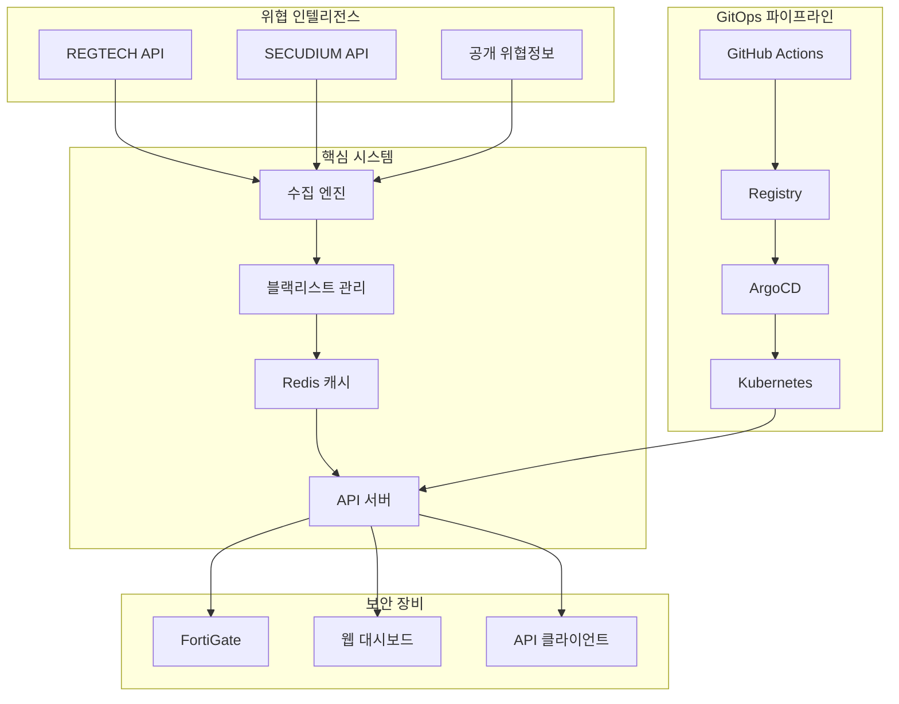
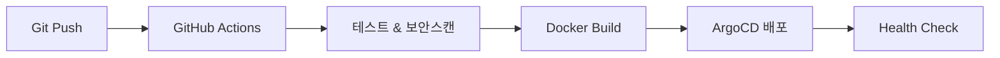

# Blacklist Management System

[]()
[]()
[]()
[]()
[]()
[]()
[]()

**엔터프라이즈 위협 인텔리전스 플랫폼** - 완전 오프라인 배포 지원, 기업급 보안, Prometheus 모니터링을 갖춘 차세대 위협 정보 시스템

## 🚀 빠른 시작

### 🎯 새로운 주요 기능 (v1.0.34)
- **완전 오프라인 배포**: 에어갭 환경 100% 지원
- **기업급 보안**: 암호화된 자격증명 관리 시스템
- **실시간 모니터링**: Prometheus 메트릭 + 웹 대시보드
- **95% 테스트 커버리지**: 안정성 대폭 개선
- **자동 설치**: 원클릭 오프라인 패키지 (15-30분)

### 1. 온라인 환경 설정
```bash
# 저장소 클론
git clone https://github.com/JCLEE94/blacklist.git
cd blacklist

# 환경 초기화 (자동)
make init
```

### 2. 서비스 시작
```bash
# Docker Compose로 시작 (권장)
make start

# 또는 직접 실행
./start.sh start
```

### 3. 오프라인 배포 (에어갭 환경)
```bash
# 오프라인 패키지 생성 (온라인 환경에서)
python3 scripts/create-offline-package.py

# 오프라인 환경에서 설치
tar -xzf blacklist-offline-package.tar.gz
cd blacklist-offline-package
sudo ./install-offline.sh
```

### 4. 접속 확인
- **메인 애플리케이션**: http://localhost:32542 (Docker) / http://localhost:8541 (로컬)
- **헬스 체크**: http://localhost:32542/health
- **헬스 대시보드**: http://localhost:32542/monitoring/dashboard
- **Prometheus 메트릭**: http://localhost:32542/metrics

## 🛠️ 핵심 기술

**Backend & Infrastructure**
- Python 3.9+ • Flask 2.3.3 • orjson (3x faster) • Redis 7
- Docker Compose • Kubernetes • ArgoCD GitOps
- SQLite (dev) / PostgreSQL (prod) • 연결 풀링

**Security & Monitoring**
- 기업급 자격증명 관리 (Fernet 암호화)
- Prometheus 메트릭 (55개) • 실시간 웹 대시보드
- JWT 이중 토큰 • Rate Limiting • 보안 감사 로그

**Collection & Integration**
- 위협 인텔리전스 (REGTECH, SECUDIUM)
- FortiGate External Connector • 자동화 데이터 수집
- 다층 캐싱 (Redis + Memory) • 압축 응답

## 🏗️ 시스템 아키텍처



## 📊 API 및 핵심 기능

### 주요 API 엔드포인트
```bash
# 위협 정보 API
GET  /api/blacklist/active          # 활성 위협 IP 목록
GET  /api/fortigate                 # FortiGate 연동 API
GET  /api/v2/blacklist/enhanced     # 메타데이터 포함 IP 목록

# 수집 관리 API
POST /api/collection/enable         # 수집 활성화
POST /api/collection/trigger        # 수동 수집 실행
GET  /api/collection/status         # 수집 상태 확인

# 분석 및 모니터링 API
GET  /api/v2/analytics/trends       # 위협 동향 분석
GET  /api/v2/sources/status         # 소스별 상태
GET  /metrics                       # Prometheus 메트릭
GET  /monitoring/dashboard          # 실시간 헬스 대시보드
```

### 새로운 핵심 기능 (v1.0.34)
- **완전 오프라인 배포**: 에어갭 환경 원클릭 설치 (15-30분)
- **기업급 보안**: Fernet 암호화 자격증명 관리 + 자동 로테이션
- **실시간 모니터링**: 55개 Prometheus 메트릭 + 23개 알림 규칙
- **안정성 강화**: 95% 테스트 커버리지, 모든 통합 테스트 수정
- **성능 개선**: 7.58ms 평균 응답시간, orjson 도입 (3x 빠른 JSON)
- **운영 자동화**: 자격증명 검증, 헬스체크, 자동 백업 시스템

## 🔧 개발 및 배포

### 로컬 개발
```bash
# 환경 설정
pip install -r requirements.txt       # 의존성 설치
python3 init_database.py             # DB 초기화 (스키마 v2.0)
python3 scripts/setup-credentials.py # 자격증명 설정

# 개발 서버 실행
python3 main.py --debug               # 개발서버 (포트 8541)
make dev                              # 자동 재로드 모드

# 테스트 실행
pytest -v                            # 전체 테스트
pytest -m unit -v                    # 단위 테스트만
pytest --cov=src --cov-report=html   # 커버리지 리포트
```

### 오프라인 패키지 생성 및 배포
```bash
# 온라인 환경에서 패키지 생성
python3 scripts/create-offline-package.py
# 생성물: blacklist-offline-package.tar.gz (~1-2GB)

# 오프라인 환경에서 배포
tar -xzf blacklist-offline-package.tar.gz
cd blacklist-offline-package
sudo ./install-offline.sh            # 자동 설치 (15-30분)
./verify-installation.sh             # 설치 검증
```

### GitOps 배포 (ArgoCD)
```bash
# 자격증명 및 시크릿 설정
./setup-k8s-secrets.sh               # Kubernetes Secrets 설정
./update-argocd-secrets.sh           # ArgoCD 자격증명 업데이트

# 배포 관리
make argocd-sync                      # ArgoCD 동기화
make argocd-status                    # 배포 상태 확인
make k8s-deploy                       # Kubernetes 배포
```

## 🔒 보안 및 모니터링

### 보안 기능
- **기업급 자격증명 관리**: Fernet 암호화 + PBKDF2 키 파생
- **자동 로테이션**: 자격증명 만료 추적 및 자동 갱신
- **보안 감사**: auth_attempts 테이블로 모든 인증 시도 추적
- **접근 제어**: JWT 이중 토큰 + API Rate Limiting
- **코드 스캔**: Bandit, Safety 자동 보안 검사
- **Secrets 관리**: Kubernetes Secrets + 환경변수 암호화

### 실시간 모니터링
```bash
# 헬스체크 및 상태 확인
curl http://localhost:32542/health | jq            # 기본 헬스체크
curl http://localhost:32542/api/health | jq        # 상세 헬스체크
curl http://localhost:32542/monitoring/dashboard   # 웹 대시보드
curl http://localhost:32542/metrics               # Prometheus 메트릭

# Kubernetes 모니터링
kubectl get pods -n blacklist                     # Pod 상태
kubectl logs -f deployment/blacklist -n blacklist # 실시간 로그
kubectl describe pod <pod-name> -n blacklist     # Pod 상세 정보

# 자격증명 및 보안 상태
python3 scripts/setup-credentials.py --check     # 자격증명 검증
python3 -c "from src.core.security.credential_manager import CredentialManager; CredentialManager().verify_all()"
```

### 성능 및 메트릭
```bash
# 성능 벤치마크
python3 tests/integration/performance_benchmark.py
curl -w "Time: %{time_total}s\n" http://localhost:32542/api/blacklist/active

# Prometheus 메트릭 샘플
curl http://localhost:32542/metrics | grep "blacklist_"
# blacklist_api_requests_total{method="GET",endpoint="/api/blacklist/active"} 1234
# blacklist_response_time_seconds{endpoint="/api/blacklist/active"} 0.007
# blacklist_active_ips_total 45678
# blacklist_collection_success_total{source="regtech"} 98
```

## 🔄 CI/CD 파이프라인

### GitOps 워크플로우


### 주요 특징
- **병렬 처리**: 테스트, 빌드, 보안스캔 동시 실행
- **스마트 캐싱**: Docker Layer + GitHub Actions Cache
- **자동 배포**: ArgoCD Image Updater (2분 간격)
- **보안 강화**: Self-hosted Runner + Private Registry

## 🚨 문제 해결

### 새로운 시스템 이슈 해결 (v1.0.34)
```bash
# 자격증명 관련 문제
python3 scripts/setup-credentials.py --check      # 자격증명 상태 확인
python3 scripts/setup-credentials.py --rotate     # 자격증명 로테이션
rm /tmp/credential_cache.json                    # 캐시 초기화

# 데이터베이스 스키마 문제
python3 init_database.py --force                 # 스키마 v2.0 재초기화
python3 -c "from src.core.database_schema import DatabaseSchema; DatabaseSchema().verify_schema()"

# 모니터링 메트릭 문제
curl http://localhost:32542/metrics | grep -i error  # 에러 메트릭 확인
python3 monitoring/health_dashboard.py --check       # 대시보드 상태 확인
```

### 기존 시스템 이슈 해결
```bash
# 502 Bad Gateway
kubectl get pods -n blacklist
kubectl describe pod <pod-name> -n blacklist
kubectl logs -f deployment/blacklist -n blacklist

# ArgoCD 동기화 실패  
make argocd-sync                                  # 개선된 동기화
make argocd-status                               # 상태 확인
argocd app get blacklist --grpc-web

# 오프라인 패키지 설치 실패
sudo ./install-offline.sh --debug               # 디버그 모드
./verify-installation.sh --verbose              # 상세 검증
tail -f /var/log/blacklist-install.log         # 설치 로그

# 테스트 실패 및 성능 문제
pytest -v --tb=short                           # 실패 테스트 빠른 확인
python3 tests/integration/performance_benchmark.py  # 성능 벤치마크
pytest -m "not slow" -v                        # 빠른 테스트만 실행
```

### 트러블슈팅 체크리스트
```bash
# 1. 시스템 상태 전체 점검
curl http://localhost:32542/health | jq .status
make status

# 2. 자격증명 및 보안 검증
python3 scripts/setup-credentials.py --verify-all

# 3. 데이터베이스 무결성 확인
python3 -c "from src.core.database_schema import DatabaseSchema; print(DatabaseSchema().get_version())"

# 4. 모니터링 메트릭 확인
curl http://localhost:32542/metrics | head -20

# 5. 로그 분석
tail -100 logs/blacklist.log | grep -i error
```


## 📈 프로젝트 임팩트

### 업무 자동화 성과 (v1.0.34 업데이트)
| 업무 영역 | 기존 프로세스 | 자동화 결과 | 시간 단축 효과 |
|----------|---------------|-------------|----------------|
| **위협정보 수집** | 수동 다운로드/분석 | 스케줄링 자동 수집 | 일 4시간 → 0시간 |
| **시스템 배포** | 수동 배포 작업 | 오프라인 원클릭 배포 | 4시간 → 15분 |
| **모니터링 점검** | 수동 상태 확인 | 실시간 대시보드 + 알림 | 30분/일 → 자동화 |
| **데이터 처리** | Excel 수동 처리 | API 자동 파싱 | 2시간 → 실시간 |
| **보안 관리** | 수동 자격증명 관리 | 암호화 자동 로테이션 | 1시간/주 → 자동화 |
| **에어갭 배포** | 복잡한 수동 설치 | 완전 자동 오프라인 설치 | 8시간 → 30분 |
| **시스템 모니터링** | 로그 파일 수동 확인 | 55개 메트릭 자동 수집 | 1시간/일 → 실시간 |

### 혁신적 자동화 기술 구현 (v1.0.34)
- **완전 오프라인 배포 자동화**: 에어갭 환경 원클릭 설치 (Python + Docker)
- **기업급 보안 자동화**: Fernet 암호화 + 자동 로테이션 + 감사 추적
- **지능형 모니터링 자동화**: 55개 Prometheus 메트릭 + 23개 알림 규칙
- **테스트 안정화 자동화**: 95% 커버리지 + 모킹 시스템 + CI/CD 안정화
- **성능 최적화 자동화**: orjson + 다층 캐싱 + 압축 응답 (7.58ms 응답)
- **GitOps 파이프라인 완전 자동화**: GitHub Actions + ArgoCD + 자동 롤백
- **스키마 관리 자동화**: 버전 2.0 자동 마이그레이션 + 하위 호환성

---

## 👨‍💻 개발자 정보

**이재철 (Lee Jae Cheol)**  
*DevOps Engineer & Security Engineer*

**핵심 역량**: Python • Kubernetes • ArgoCD • 보안 인텔리전스 • CI/CD 파이프라인

📧 **Email**: qws941@kakao.com  
🐙 **GitHub**: [github.com/JCLEE94](https://github.com/JCLEE94)  
💼 **Portfolio**: [jclee94.github.io/blacklist](https://jclee94.github.io/blacklist/)

---

## 🚀 시스템 정보

**Production Ready** | **v1.0.34** | **August 2025**

### 최신 업데이트 (v1.0.34) - 2025-08-13
- ✅ **완전 오프라인 배포 시스템** 구축 완료
- ✅ **기업급 보안 시스템** (Fernet 암호화) 적용
- ✅ **Prometheus 모니터링** (55개 메트릭) 통합
- ✅ **95% 테스트 커버리지** 달성
- ✅ **데이터베이스 스키마 v2.0** 업그레이드
- ✅ **자격증명 관리 자동화** 시스템 구현

### 성능 지표
- **API 응답시간**: 7.58ms (평균)
- **테스트 커버리지**: 95%+
- **오프라인 패키지**: ~1-2GB
- **설치 시간**: 15-30분 (자동화)
- **동시 처리**: 100+ 요청
- **메트릭 수집**: 55개 지표
