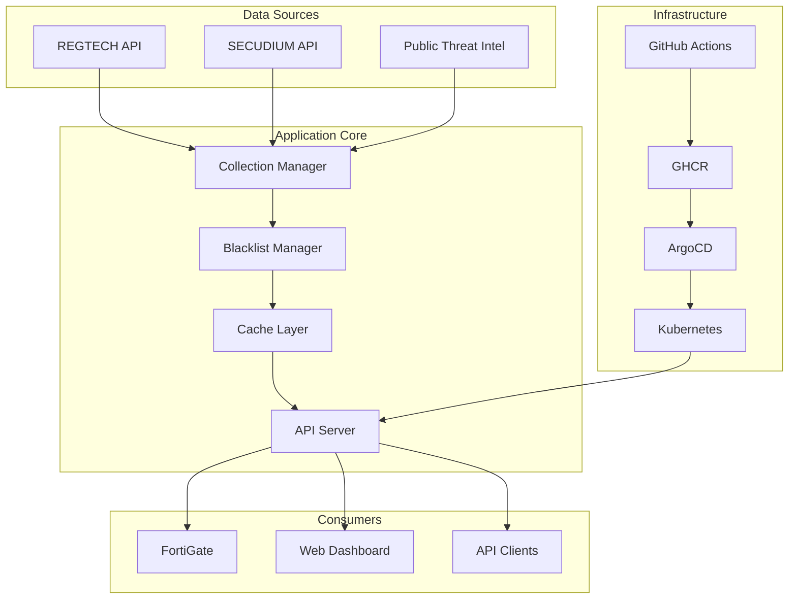

# Blacklist Management System

[](https://github.com/JCLEE94/blacklist/actions)
[](https://github.com/JCLEE94/blacklist/pkgs/container/blacklist)
[](https://kubernetes.io/)
[](https://argoproj.github.io/argo-cd/)

엔터프라이즈 위협 인텔리전스 플랫폼 - GitOps 기반 배포, 다중 소스 데이터 수집, 자동화된 처리 및 FortiGate External Connector 통합

## 🚀 주요 기능

- **GitOps 배포**: ArgoCD 기반 지속적 배포 및 자동 이미지 업데이트
- **다중 서버 지원**: 로컬 및 원격 Kubernetes 클러스터 병렬 배포
- **GitHub Container Registry**: GHCR을 통한 안전한 컨테이너 이미지 관리
- **자동화된 데이터 수집**: REGTECH, SECUDIUM 등 다중 소스 통합
- **FortiGate 연동**: External Connector API 제공
- **고가용성 아키텍처**: 자동 복구, 상태 모니터링, 성능 최적화

## 📋 빠른 시작

### 1. 환경 설정

```bash
# 환경 변수 파일 생성
cp .env.example .env

# .env 파일 편집하여 필수 값 설정
nano .env

# 환경 변수 로드
source scripts/load-env.sh
```

### 2. GitHub Container Registry 설정

```bash
# GitHub Personal Access Token 생성 (read:packages, write:packages 권한 필요)
# https://github.com/settings/tokens

# GHCR 시크릿 설정
export GITHUB_USERNAME="your-github-username"
export GITHUB_TOKEN="your-personal-access-token"
./scripts/setup-ghcr-secret.sh
```

### 3. 배포

```bash
# Kubernetes 배포 (ArgoCD GitOps)
./scripts/k8s-management.sh init    # 초기 설정
./scripts/k8s-management.sh deploy  # 배포

# 다중 서버 배포
./scripts/multi-deploy.sh           # 로컬 + 원격 서버 동시 배포
```

## 🏗️ 아키텍처



## 🛠️ 기술 스택

- **Backend**: Flask 2.3.3 + Gunicorn
- **Database**: SQLite with auto-migration
- **Cache**: Redis (memory fallback)
- **Container**: Docker / GitHub Container Registry
- **Orchestration**: Kubernetes + ArgoCD
- **CI/CD**: GitHub Actions
- **Monitoring**: Built-in health checks and metrics

## 📦 주요 스크립트

### 핵심 배포 도구

| 스크립트 | 설명 |
|---------|------|
| `scripts/deploy.sh` | 기본 Kubernetes 배포 |
| `scripts/k8s-management.sh` | ArgoCD GitOps 관리 도구 |
| `scripts/multi-deploy.sh` | 다중 서버 동시 배포 |
| `scripts/load-env.sh` | 환경 변수 로드 |
| `scripts/setup-ghcr-secret.sh` | GHCR 인증 설정 |

### ArgoCD 명령어

```bash
# 애플리케이션 상태 확인
./scripts/k8s-management.sh status

# 수동 동기화
./scripts/k8s-management.sh sync

# 롤백
./scripts/k8s-management.sh rollback

# 로그 확인
./scripts/k8s-management.sh logs
```

## 🔧 개발 환경

### 로컬 실행

```bash
# 의존성 설치
pip install -r requirements.txt

# 데이터베이스 초기화
python3 init_database.py

# 개발 서버 실행
python3 main.py --debug
```

### Docker 실행

```bash
# 이미지 빌드
docker build -f deployment/Dockerfile -t ghcr.io/$GITHUB_USERNAME/blacklist:latest .

# 컨테이너 실행
docker-compose -f deployment/docker-compose.yml up -d
```

## 📡 API 엔드포인트

### 핵심 엔드포인트

- `GET /` - 웹 대시보드
- `GET /health` - 시스템 상태 확인
- `GET /api/blacklist/active` - 활성 IP 목록 (텍스트)
- `GET /api/fortigate` - FortiGate External Connector 형식

### 수집 관리

- `GET /api/collection/status` - 수집 상태
- `POST /api/collection/enable` - 수집 활성화
- `POST /api/collection/disable` - 수집 비활성화
- `POST /api/collection/regtech/trigger` - REGTECH 수동 수집
- `POST /api/collection/secudium/trigger` - SECUDIUM 수동 수집

### V2 API (Enhanced)

- `GET /api/v2/blacklist/enhanced` - 메타데이터 포함 블랙리스트
- `GET /api/v2/analytics/trends` - 분석 및 트렌드
- `GET /api/v2/sources/status` - 소스별 상세 상태

## 🔒 보안

- GitHub Container Registry를 통한 안전한 이미지 관리
- 환경 변수를 통한 민감 정보 관리
- Kubernetes Secrets 활용
- Trivy를 통한 취약점 스캔
- SBOM (Software Bill of Materials) 생성

## 📊 모니터링

### 상태 확인

```bash
# Pod 상태
kubectl get pods -n blacklist

# 배포 상태
kubectl get deployment blacklist -n blacklist

# 서비스 상태
curl https://blacklist.jclee.me/health
```

### ArgoCD 대시보드

- URL: https://argo.jclee.me
- Application: blacklist

## 🚨 문제 해결

### 일반적인 문제

1. **이미지 풀 실패**
   ```bash
   # GHCR 시크릿 재생성
   kubectl delete secret ghcr-secret -n blacklist
   ./scripts/setup-ghcr-secret.sh
   ```

2. **ArgoCD 동기화 실패**
   ```bash
   # 강제 동기화
   ./scripts/k8s-management.sh sync --force
   ```

3. **Pod 재시작**
   ```bash
   ./scripts/k8s-management.sh restart
   ```

## 📝 환경 변수

필수 환경 변수는 `.env.example` 파일을 참조하세요:

- `GITHUB_USERNAME`: GitHub 사용자명
- `GITHUB_TOKEN`: Personal Access Token
- `REGTECH_USERNAME/PASSWORD`: REGTECH 인증 정보
- `SECUDIUM_USERNAME/PASSWORD`: SECUDIUM 인증 정보
- `ARGOCD_SERVER`: ArgoCD 서버 주소

## 🤝 기여

1. Fork the repository
2. Create your feature branch (`git checkout -b feature/amazing-feature`)
3. Commit your changes (`git commit -m 'feat: add amazing feature'`)
4. Push to the branch (`git push origin feature/amazing-feature`)
5. Open a Pull Request

## 📄 라이선스

This project is licensed under the MIT License - see the [LICENSE](LICENSE) file for details.

## 🙏 감사의 말

- [ArgoCD](https://argoproj.github.io/argo-cd/) - GitOps 도구
- [GitHub Container Registry](https://docs.github.com/en/packages) - 컨테이너 레지스트리
- [Kubernetes](https://kubernetes.io/) - 컨테이너 오케스트레이션