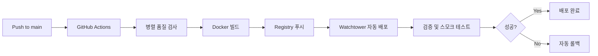

# Blacklist Management System

엔터프라이즈급 위협 인텔리전스 플랫폼 - 다중 소스 데이터 수집, 자동화된 처리 및 FortiGate External Connector 통합

## 🚀 주요 기능

- **다중 소스 통합**: REGTECH, SECUDIUM 등 여러 위협 인텔리전스 소스 통합
- **실제 탐지일 기반**: 엑셀 데이터에서 추출한 원본 탐지일 저장 및 표시
- **데이터베이스 기반 설정**: 동적 설정 관리 시스템으로 실시간 설정 변경
- **자동화된 수집**: 예약된 수집 및 실시간 업데이트
- **FortiGate 연동**: External Connector API를 통한 직접 통합
- **성능 최적화**: Redis 캐싱, 비동기 처리, orjson 고속 JSON 처리
- **컨테이너화**: Docker 기반 배포 및 Watchtower 자동 업데이트
- **웹 대시보드**: 실시간 모니터링 및 관리 인터페이스
- **Docker 로그 모니터링**: 컨테이너 로그 스트리밍 인터페이스
- **HAR 기반 수집**: 안정적인 웹 수집을 위한 HTTP Archive 기반 컬렉터

## 📋 요구사항

- Python 3.9+
- Docker & Docker Compose
- Redis (선택사항 - 없을 경우 메모리 캐시로 대체)
- Git

## 🛠️ 빠른 시작

### 1. 환경 설정

```bash
# 저장소 클론
git clone https://github.com/JCLEE94/blacklist.git
cd blacklist

# 환경변수 설정
cp .env.example .env
# .env 파일을 편집하여 실제 값으로 수정
```

### 2. 로컬 개발

```bash
# 의존성 설치
pip install -r requirements.txt

# 데이터베이스 초기화
python3 init_database.py

# 개발 서버 실행 (기본 포트: 8541)
python3 main.py

# 옵션과 함께 실행
python3 main.py --port 8080 --debug
```

### 3. Docker 배포

```bash
# Docker Compose로 실행
docker-compose -f deployment/docker-compose.yml up -d --build

# 상태 확인
docker-compose -f deployment/docker-compose.yml ps
docker-compose -f deployment/docker-compose.yml logs -f

# 컨테이너 재시작
docker-compose -f deployment/docker-compose.yml restart
```

### 4. 프로덕션 배포

```bash
# 자동 배포 스크립트 사용
./manual-deploy.sh

# 또는 GitHub Actions를 통한 자동 배포
# main 브랜치에 푸시하면 자동으로 배포됨
git push origin main
```

## 🔧 환경 변수

주요 환경 변수 설정 (`.env` 파일):

```bash
# Docker Registry
DOCKER_REGISTRY=registry.jclee.me
IMAGE_NAME=blacklist
APP_PORT=2541

# 외부 서비스 인증
REGTECH_USERNAME=your_regtech_username
REGTECH_PASSWORD=your_regtech_password
SECUDIUM_USERNAME=your_secudium_username
SECUDIUM_PASSWORD=your_secudium_password

# Redis (선택사항)
REDIS_URL=redis://redis:6379/0

# 애플리케이션 설정
SECRET_KEY=your-secret-key
JWT_SECRET_KEY=your-jwt-secret
API_SECRET_KEY=your-api-secret
```

전체 환경 변수 목록은 [.env.example](.env.example) 참조

## 📦 프로젝트 구조

```
blacklist/
├── src/                         # 소스 코드
│   ├── core/                   # 핵심 비즈니스 로직
│   │   ├── container.py        # 의존성 주입 컨테이너
│   │   ├── app_compact.py      # 메인 애플리케이션 (진입점)
│   │   ├── unified_routes.py   # 통합 라우트 (모든 API 엔드포인트)
│   │   ├── unified_service.py  # 통합 서비스 (비즈니스 로직)
│   │   ├── collection_manager.py # 수집 관리
│   │   ├── settings_routes.py  # 설정 관리 API
│   │   ├── v2_routes.py       # V2 고급 API
│   │   ├── *_collector.py     # 소스별 수집기 (REGTECH, SECUDIUM)
│   │   └── ip_sources/        # IP 소스 플러그인 시스템
│   ├── models/                # 데이터 모델
│   │   └── settings.py        # 설정 데이터 모델
│   ├── config/                # 설정 관리
│   │   ├── settings.py        # 기본 설정
│   │   └── sources.json       # IP 소스 설정
│   ├── utils/                 # 유틸리티 함수
│   │   ├── advanced_cache.py  # 고급 캐싱 시스템
│   │   ├── performance.py     # 성능 최적화
│   │   └── structured_logging.py # 구조화된 로깅
│   └── services/              # 서비스 레이어
├── deployment/                # 배포 관련 파일
│   ├── docker-compose.yml     # 프로덕션 Docker Compose
│   ├── Dockerfile             # 멀티스테이지 Docker 빌드
│   └── docker-compose.watchtower.yml # Watchtower 자동 배포
├── templates/                 # HTML 템플릿
│   ├── settings/              # 설정 관리 UI
│   └── *.html                 # 각종 대시보드 템플릿
├── static/                    # 정적 파일 (CSS, JS)
├── scripts/                   # 유틸리티 스크립트
│   ├── collection/            # 수집 관련 스크립트
│   └── deployment/            # 배포 스크립트
├── tests/                     # 테스트 코드
├── .github/workflows/         # CI/CD 파이프라인
├── main.py                    # 진입점 (app_compact.py로 위임)
├── init_database.py           # 데이터베이스 초기화
└── CLAUDE.md                  # Claude Code 개발자 가이드
```

## 🚢 배포 방식

### GitHub Actions CI/CD 파이프라인



### Watchtower 자동 배포

이 프로젝트는 Watchtower를 통한 무중단 자동 배포를 사용합니다:

1. **이미지 푸시**: GitHub Actions가 새 Docker 이미지를 `registry.jclee.me`에 푸시
2. **자동 감지**: Watchtower가 30초마다 새 이미지 확인
3. **자동 업데이트**: 새 이미지 발견 시 자동으로 컨테이너 재시작
4. **헬스체크**: 배포 후 자동 헬스체크 및 검증

### 수동 배포 (백업 옵션)

```bash
# 수동 배포 스크립트
./manual-deploy.sh

# 또는 직접 Docker 명령어 사용
docker build -f deployment/Dockerfile -t registry.jclee.me/blacklist:latest .
docker push registry.jclee.me/blacklist:latest
```

## 📊 API 엔드포인트

### 웹 인터페이스

- `GET /` - 메인 대시보드
- `GET /docker-logs` - Docker 컨테이너 로그 뷰어

### 핵심 엔드포인트

- `GET /health` - 시스템 헬스 체크 (상세 진단 정보 포함)
- `GET /api/blacklist/active` - 활성 IP 목록 (텍스트 형식)
- `GET /api/fortigate` - FortiGate External Connector JSON 형식
- `GET /api/stats` - 시스템 통계 및 메트릭

### 수집 관리

- `GET /api/collection/status` - 수집 서비스 상태 및 설정
- `POST /api/collection/enable` - 수집 활성화 (기존 데이터 삭제)
- `POST /api/collection/disable` - 모든 수집 소스 비활성화
- `POST /api/collection/regtech/trigger` - REGTECH 수동 수집
- `POST /api/collection/secudium/trigger` - SECUDIUM 수동 수집

### 검색 및 분석

- `GET /api/search/{ip}` - 단일 IP 조회 (이력 포함)
- `POST /api/search` - 배치 IP 검색 (JSON 페이로드)
- `GET /api/stats/detection-trends` - 탐지 동향 분석
- `GET /api/raw-data` - 전체 블랙리스트 데이터 (페이지네이션, 필터링 지원)

### 설정 관리

- `GET /api/settings` - 모든 설정 조회 (카테고리별 그룹화)
- `POST /api/settings` - 설정 일괄 저장
- `PUT /api/settings/{key}` - 개별 설정 업데이트
- `POST /api/settings/reset` - 모든 설정을 기본값으로 리셋

### V2 고급 API

- `GET /api/v2/blacklist/enhanced` - 메타데이터 포함 고급 블랙리스트
- `GET /api/v2/analytics/trends` - 고급 분석 및 트렌드
- `GET /api/v2/sources/status` - 다중 소스 상세 상태

### Docker 모니터링

- `GET /api/docker/containers` - Docker 컨테이너 목록
- `GET /api/docker/container/{name}/logs` - 컨테이너 로그 (스트리밍 지원)

## 🛡️ FortiGate 설정

### External Connector 설정
1. **Connector Type**: `HTTP`
2. **URL**: `http://your-server:2541/api/fortigate`
3. **Update Interval**: `5분`
4. **Format**: `JSON`

### 기존 텍스트 연동
- **URL**: `http://your-server:2541/api/blacklist/active`
- **Format**: `Text (one IP per line)`

## 🔒 보안

- 모든 민감한 정보는 환경 변수로 관리
- GitHub Secrets를 통한 CI/CD 인증 정보 보호
- Docker 레지스트리 인증 필수
- 비root 사용자로 컨테이너 실행
- Rate Limiting 및 보안 헤더 적용
- 프로덕션 환경에서 HTTPS 사용 권장

## 🛠️ 개발

### 테스트 실행

```bash
# 전체 테스트
pytest

# 단위 테스트만
pytest -m "not slow and not integration"

# 특정 모듈 테스트
pytest tests/test_blacklist_unified.py

# 커버리지 포함
pytest -v --cov=src
```

### 디버깅

```bash
# REGTECH 인증 디버깅
python3 scripts/debug_regtech_advanced.py

# 통합 테스트
python3 scripts/integration_test_comprehensive.py

# 컨테이너 로그 확인
docker logs blacklist -f
```

### 코드 품질

```bash
# 포맷팅
black src/

# 린팅
flake8 src/

# 보안 검사
bandit -r src/
```

## 📈 성능 및 확장성

### 기술 스택
- **Backend**: Flask 2.3.3 + Gunicorn
- **Database**: SQLite (자동 마이그레이션 지원)
- **Cache**: Redis (메모리 캐시 폴백)
- **Container**: Docker/Podman
- **CI/CD**: GitHub Actions + Self-hosted Runner
- **모니터링**: 내장 성능 메트릭 및 헬스체크

### 성능 최적화
- **JSON 처리**: orjson을 통한 고속 JSON 직렬화
- **압축**: Flask-Compress를 통한 gzip 응답 압축
- **캐싱**: Redis TTL 기반 캐싱 및 태그 기반 무효화
- **Rate Limiting**: Flask-Limiter를 통한 엔드포인트별 제한
- **Connection Pooling**: 데이터베이스 연결 풀링
- **비동기 처리**: 백그라운드 작업 큐

### 확장성 특징
- **플러그인 아키텍처**: 새로운 IP 소스 쉽게 추가 가능
- **의존성 주입**: 컨테이너 기반 서비스 관리
- **다중 진입점**: 폴백 체인을 통한 안정성
- **수평 확장**: 컨테이너 복제를 통한 스케일링

## 🔄 데이터 관리

- **자동 정리**: 3개월 이상 된 데이터 자동 삭제
- **수집 제어**: 중앙 집중식 ON/OFF 제어
- **소스별 트리거**: 개별 소스 수동 실행 가능
- **데이터 동기화**: 트랜잭션 기반 안전한 업데이트

## 📝 라이선스

이 프로젝트는 비공개 소프트웨어입니다. 무단 복제 및 배포를 금지합니다.

## 🤝 기여

1. 이슈를 생성하여 논의
2. 기능 브랜치 생성 (`git checkout -b feature/amazing-feature`)
3. 변경사항 커밋 (`git commit -m 'feat: add amazing feature'`)
4. 브랜치 푸시 (`git push origin feature/amazing-feature`)
5. Pull Request 생성

### 커밋 메시지 규칙
- `feat:` 새로운 기능
- `fix:` 버그 수정
- `docs:` 문서 변경
- `style:` 코드 스타일 변경
- `refactor:` 리팩토링
- `test:` 테스트 추가/수정
- `chore:` 빌드 프로세스 등 기타 변경

## 📞 지원

- 이슈 트래커: [GitHub Issues](https://github.com/JCLEE94/blacklist/issues)
- 문서: [CLAUDE.md](./CLAUDE.md) - 개발자 가이드
- 로그 분석: Docker 로그 웹 인터페이스 (`/docker-logs`)

## 🏗️ 로드맵

- [ ] PostgreSQL 프로덕션 지원
- [ ] 멀티 테넌트 지원
- [ ] REST API v3 (GraphQL 지원)
- [ ] 실시간 알림 시스템
- [ ] 고급 분석 대시보드
- [ ] Kubernetes 배포 지원

---

**현재 버전**: v3.2.0  
**마지막 업데이트**: 2025.06.30  
**유지보수자**: JC Lee
