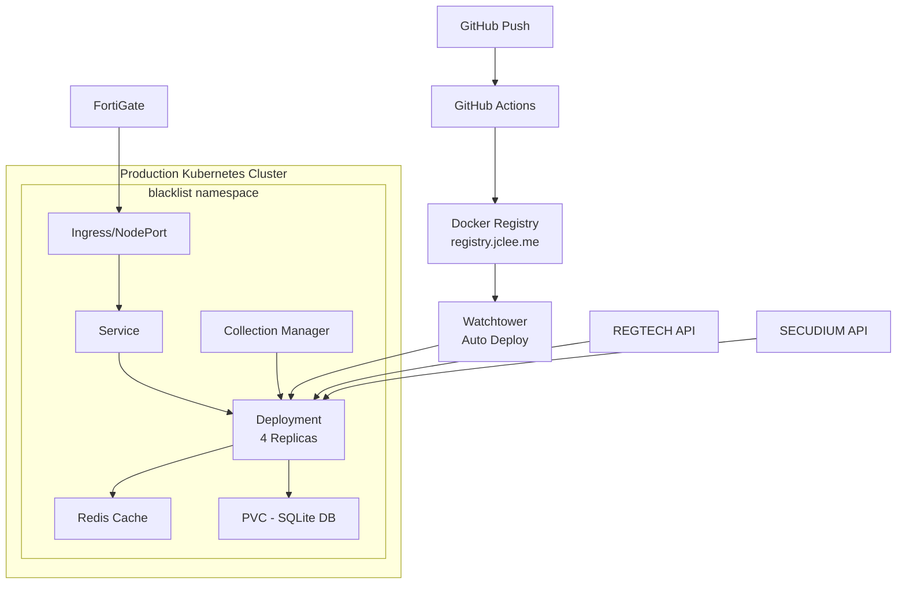

# Blacklist Management System

[](https://github.com/jclee/blacklist/actions)
[](https://kubernetes.io/)
[](https://registry.jclee.me)

통합 위협 정보 관리 플랫폼 - Kubernetes 네이티브 아키텍처, 다중 소스 데이터 수집, FortiGate External Connector 연동 지원

## 🏗️ Architecture



## 🚀 Quick Start

### Prerequisites

- Kubernetes cluster (k3s/k8s v1.24+)
- kubectl 설정 완료
- Docker 및 registry 접근 권한
- 오프라인 환경의 경우 이미지 사전 준비

### Kubernetes 배포

```bash
# 1. 저장소 클론
git clone https://github.com/jclee/blacklist.git
cd blacklist

# 2. Namespace 생성
kubectl create namespace blacklist

# 3. Registry Secret 생성 (Private Registry 사용 시)
kubectl create secret docker-registry regcred \
  --docker-server=registry.jclee.me \
  --docker-username=<username> \
  --docker-password=<password> \
  -n blacklist

# 4. 환경 변수 및 시크릿 설정
kubectl apply -f k8s/configmap.yaml
kubectl apply -f k8s/secret.yaml

# 5. 애플리케이션 배포
kubectl apply -f k8s/

# 6. 배포 확인
kubectl get all -n blacklist
kubectl get ingress -n blacklist
```

### 오프라인 환경 배포

```bash
# 1. 온라인 환경에서 이미지 준비
docker pull registry.jclee.me/blacklist:latest
docker pull redis:7-alpine
docker pull busybox:latest

# 2. 이미지 저장
docker save -o blacklist-images.tar \
  registry.jclee.me/blacklist:latest \
  redis:7-alpine \
  busybox:latest

# 3. 오프라인 환경으로 전송
scp blacklist-images.tar user@offline-server:/tmp/

# 4. 오프라인 환경에서 이미지 로드
docker load -i /tmp/blacklist-images.tar

# 5. 로컬 레지스트리에 푸시 (있는 경우)
docker tag registry.jclee.me/blacklist:latest localhost:5000/blacklist:latest
docker push localhost:5000/blacklist:latest

# 6. k8s 매니페스트 이미지 경로 수정
sed -i 's|registry.jclee.me|localhost:5000|g' k8s/deployment.yaml
sed -i 's|registry.jclee.me|localhost:5000|g' k8s/redis.yaml

# 7. 배포
kubectl apply -f k8s/
```

## 📦 주요 기능

### 핵심 기능
- **다중 소스 IP 수집**: REGTECH(금융보안원), SECUDIUM, 공개 위협 정보
- **FortiGate 연동**: External Connector API 완벽 지원
- **자동 수집**: 매일 자동 수집 및 업데이트
- **고가용성**: 4개 레플리카 기본 구성
- **데이터 영속성**: PVC 기반 SQLite 데이터베이스
- **통합 관리**: 웹 기반 대시보드 및 제어판

### API 엔드포인트
- `GET /health` - 상태 확인 및 상세 진단
- `GET /api/fortigate` - FortiGate External Connector 형식
- `GET /api/blacklist/active` - 활성 IP 목록 (텍스트)
- `GET /api/collection/status` - 수집 서비스 상태
- `POST /api/collection/enable` - 수집 활성화
- `POST /api/collection/disable` - 수집 비활성화
- `POST /api/collection/{source}/trigger` - 수동 수집 트리거
- `GET /unified-control` - 통합 관리 웹 UI

### 보안
- TLS/HTTPS (Ingress 또는 NodePort)
- Kubernetes Secrets 기반 인증 정보 관리
- 환경 변수 분리 (ConfigMap/Secret)
- 컨테이너 권한 최소화

## 🛠️ 구성

### ConfigMap (환경 변수)
```yaml
apiVersion: v1
kind: ConfigMap
metadata:
  name: blacklist-config
  namespace: blacklist
data:
  PORT: "2541"
  FLASK_ENV: "production"
  TZ: "Asia/Seoul"
  REDIS_URL: "redis://blacklist-redis:6379/0"
  LOG_LEVEL: "INFO"
```

### Secret (인증 정보)
```yaml
apiVersion: v1
kind: Secret
metadata:
  name: blacklist-secret
  namespace: blacklist
type: Opaque
stringData:
  REGTECH_USERNAME: "your-username"
  REGTECH_PASSWORD: "your-password"
  SECUDIUM_USERNAME: "your-username"
  SECUDIUM_PASSWORD: "your-password"
  SECRET_KEY: "your-flask-secret-key"
```

## 📊 모니터링

### Pod 및 리소스 확인
```bash
# Pod 상태
kubectl get pods -n blacklist

# 리소스 사용량
kubectl top pods -n blacklist

# 로그 확인
kubectl logs -f deployment/blacklist -n blacklist

# 이벤트 확인
kubectl get events -n blacklist --sort-by='.lastTimestamp'
```

### 수집 상태 모니터링
```bash
# API를 통한 상태 확인
curl http://<node-ip>:32541/api/collection/status

# 통계 확인
curl http://<node-ip>:32541/api/stats
```

## 🔄 CI/CD 파이프라인

### GitHub Actions → Watchtower 자동 배포
1. **코드 푸시**: main 브랜치에 푸시
2. **GitHub Actions**: 
   - 테스트 실행
   - Docker 이미지 빌드
   - registry.jclee.me에 푸시
3. **Watchtower**: 
   - 새 이미지 감지
   - 자동으로 컨테이너 업데이트
   - 무중단 배포

### 수동 배포
```bash
# 이미지 빌드 및 푸시
docker build -f deployment/Dockerfile -t registry.jclee.me/blacklist:latest .
docker push registry.jclee.me/blacklist:latest

# Kubernetes 업데이트
kubectl rollout restart deployment/blacklist -n blacklist
kubectl rollout status deployment/blacklist -n blacklist
```

## 🧪 테스트

### 통합 테스트
```bash
# 클러스터 내부에서 실행
kubectl apply -f k8s/test-job.yaml
kubectl logs job/blacklist-integration-test -n blacklist

# 로컬 테스트
python3 scripts/integration_test_comprehensive.py
```

### 단위 테스트
```bash
pytest tests/
pytest --cov=src tests/
```

## 📁 프로젝트 구조

```
blacklist/
├── k8s/                    # Kubernetes 매니페스트
│   ├── namespace.yaml      # 네임스페이스
│   ├── configmap.yaml      # 환경 설정
│   ├── secret.yaml         # 민감 정보
│   ├── pvc.yaml           # 영구 스토리지
│   ├── deployment.yaml     # 메인 애플리케이션
│   ├── service.yaml       # 서비스 정의
│   ├── ingress.yaml       # 인그레스 설정 (선택)
│   ├── redis.yaml         # Redis 캐시
│   └── test-job.yaml      # 테스트 Job
│
├── deployment/            # 컨테이너 설정
│   ├── Dockerfile        # 멀티스테이지 빌드
│   └── docker-compose.yml # 로컬 개발용
│
├── .github/workflows/    # CI/CD 파이프라인
│   └── build-deploy.yml  # GitHub Actions
│
├── src/                  # 애플리케이션 소스
│   ├── core/            # 핵심 비즈니스 로직
│   │   ├── app_compact.py     # 메인 Flask 앱
│   │   ├── unified_service.py # 통합 서비스
│   │   ├── regtech_collector.py # REGTECH 수집기
│   │   └── secudium_collector.py # SECUDIUM 수집기
│   └── utils/           # 유틸리티
│
├── scripts/             # 유틸리티 스크립트
├── tests/              # 테스트 코드
├── main.py            # 엔트리 포인트
├── requirements.txt   # Python 의존성
├── CLAUDE.md         # AI 어시스턴트 가이드
└── README.md         # 이 파일
```

## 🔧 문제 해결

### Pod 재시작 문제
```bash
# Pod 상태 확인
kubectl describe pod <pod-name> -n blacklist
kubectl logs <pod-name> -n blacklist --previous

# 일반적인 원인:
# - 메모리 부족: limits 증가
# - 데이터베이스 권한: init container 확인
# - 환경 변수 누락: ConfigMap/Secret 확인
```

### 수집 실패
```bash
# 인증 정보 확인
kubectl get secret blacklist-secret -n blacklist -o yaml

# 네트워크 연결 테스트
kubectl exec -it deployment/blacklist -n blacklist -- curl https://www.krcert.or.kr

# 수동 수집 트리거
curl -X POST http://<node-ip>:32541/api/collection/regtech/trigger
```

### 스토리지 문제
```bash
# PVC 상태 확인
kubectl get pvc -n blacklist
kubectl describe pvc blacklist-data -n blacklist

# 데이터베이스 파일 확인
kubectl exec deployment/blacklist -n blacklist -- ls -la /app/instance/
```

### 롤백
```bash
# 배포 히스토리 확인
kubectl rollout history deployment/blacklist -n blacklist

# 이전 버전으로 롤백
kubectl rollout undo deployment/blacklist -n blacklist

# 특정 리비전으로 롤백
kubectl rollout undo deployment/blacklist -n blacklist --to-revision=2
```

## 🏭 프로덕션 운영

### 요구사항
- Kubernetes 1.24+ (k3s/k8s)
- 최소 2GB 메모리
- 10GB 이상 스토리지
- NodePort 또는 Ingress 접근

### 성능
- 10만개 이상 IP 효율적 처리
- API 응답 시간 < 100ms
- Redis 캐싱으로 성능 최적화
- 일일 22,000+ IP 자동 수집

### 백업 및 복구
```bash
# 데이터베이스 백업
kubectl exec deployment/blacklist -n blacklist -- \
  tar czf - /app/instance/blacklist.db > backup-$(date +%Y%m%d).tar.gz

# 데이터베이스 복구
cat backup-20250630.tar.gz | \
  kubectl exec -i deployment/blacklist -n blacklist -- tar xzf - -C /

# 전체 namespace 백업
kubectl get all,cm,secret,pvc -n blacklist -o yaml > blacklist-backup.yaml
```

### 오프라인 환경 운영 가이드

#### 초기 설정
1. 온라인 환경에서 필요한 모든 이미지 다운로드
2. 이미지를 tar 파일로 저장
3. 오프라인 환경으로 전송
4. 로컬 레지스트리 구축 (선택)
5. k8s 매니페스트 수정 및 배포

#### 업데이트 절차
1. 온라인에서 새 버전 이미지 준비
2. 변경사항 문서화
3. 오프라인 환경 이관
4. 점진적 롤링 업데이트
5. 롤백 계획 준비

## 🤝 Contributing

1. Fork 저장소
2. Feature 브랜치 생성 (`git checkout -b feature/amazing`)
3. 변경사항 커밋 (`git commit -m 'Add amazing feature'`)
4. 브랜치 푸시 (`git push origin feature/amazing`)
5. Pull Request 생성

## 📝 License

이 프로젝트는 독점 소프트웨어입니다.

## 🔗 Links

- Production: https://blacklist.jclee.me
- Registry: https://registry.jclee.me
- 상세 문서: [CLAUDE.md](./CLAUDE.md)
- 온라인 대시보드: http://192.168.50.215:32541

---

Built with ❤️ for enterprise security