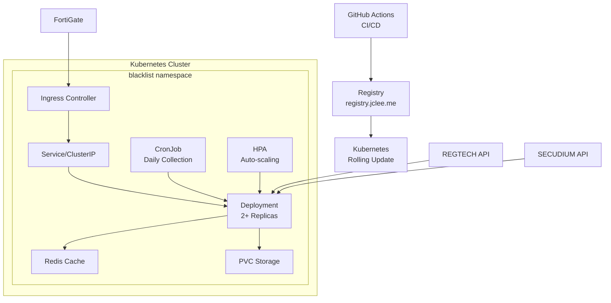

# Blacklist Management System

[](https://github.com/jclee/blacklist/actions)
[](https://kubernetes.io/)
[](https://registry.jclee.me)

Enterprise-grade threat intelligence platform with Kubernetes-native architecture, multi-source data collection, and FortiGate External Connector integration.

## 🏗️ Architecture



## 🚀 Quick Start

### Prerequisites

- Kubernetes cluster (v1.24+)
- kubectl configured
- Helm 3 (optional)
- Docker registry access

### Deployment

```bash
# Clone repository
git clone https://github.com/jclee/blacklist.git
cd blacklist

# Deploy to Kubernetes
kubectl apply -k k8s/

# Verify deployment
kubectl get pods -n blacklist
kubectl get ingress -n blacklist

# Check logs
kubectl logs -f deployment/blacklist -n blacklist
```

### Local Development with Skaffold

```bash
# Install Skaffold
curl -Lo skaffold https://storage.googleapis.com/skaffold/releases/latest/skaffold-linux-amd64
sudo install skaffold /usr/local/bin/

# Run with hot-reload
skaffold dev

# Build and deploy once
skaffold run
```

## 📦 Features

### Core Functionality
- **Multi-source IP Collection**: REGTECH, SECUDIUM, Public feeds
- **FortiGate Integration**: External Connector API support
- **Auto-scaling**: HPA based on CPU/Memory metrics
- **High Availability**: Multi-replica deployment with anti-affinity
- **Data Persistence**: PVC for SQLite database
- **Automated Collection**: Daily CronJob at 02:00 UTC

### APIs
- `/health` - Kubernetes health probes
- `/api/fortigate` - FortiGate External Connector
- `/api/collection/status` - Collection service status
- `/api/v2/blacklist/enhanced` - Enhanced API with metadata
- `/unified-control` - Web management interface

### Security
- TLS/HTTPS via Ingress
- Kubernetes Secrets for credentials
- Network Policies (optional)
- RBAC support

## 🛠️ Configuration

### Environment Variables (ConfigMap)
```yaml
PORT: "2541"
FLASK_ENV: "production"
TZ: "Asia/Seoul"
REDIS_URL: "redis://redis:6379/0"
```

### Secrets
```yaml
REGTECH_USERNAME: <base64>
REGTECH_PASSWORD: <base64>
SECUDIUM_USERNAME: <base64>
SECUDIUM_PASSWORD: <base64>
```

## 📊 Monitoring

### Metrics
```bash
# Pod resources
kubectl top pods -n blacklist

# HPA status
kubectl get hpa -n blacklist

# Events
kubectl get events -n blacklist --sort-by='.lastTimestamp'
```

### Dashboards
- Grafana: `https://grafana.jclee.me/d/blacklist`
- Prometheus: `https://prometheus.jclee.me`

## 🔄 CI/CD Pipeline

### GitHub Actions Workflow
1. **Test**: Run pytest suite
2. **Build**: Multi-stage Docker build
3. **Push**: Registry.jclee.me
4. **Deploy**: Kubernetes rolling update
5. **Verify**: Health checks & smoke tests

### Manual Deployment
```bash
# Build and push
docker build -f deployment/Dockerfile -t registry.jclee.me/blacklist:latest .
docker push registry.jclee.me/blacklist:latest

# Update Kubernetes
kubectl set image deployment/blacklist blacklist=registry.jclee.me/blacklist:latest -n blacklist
kubectl rollout status deployment/blacklist -n blacklist
```

## 🧪 Testing

### Integration Tests
```bash
# Run in cluster
kubectl apply -f k8s/test-job.yaml
kubectl logs job/blacklist-integration-test -n blacklist

# Local testing
python3 tests/test_integration.py http://localhost:2541
```

### Unit Tests
```bash
pytest tests/
pytest --cov=src tests/
```

## 📁 Project Structure

```
blacklist/
├── k8s/                    # Kubernetes manifests
│   ├── namespace.yaml      # Namespace definition
│   ├── configmap.yaml      # Environment configuration
│   ├── secret.yaml         # Sensitive credentials
│   ├── pvc.yaml           # Persistent storage
│   ├── deployment.yaml     # Main application
│   ├── service.yaml       # Network services
│   ├── ingress.yaml       # External access
│   ├── hpa.yaml           # Auto-scaling
│   ├── cronjob.yaml       # Scheduled tasks
│   ├── redis.yaml         # Cache service
│   └── kustomization.yaml # Kustomize config
│
├── deployment/            # Container configuration
│   ├── Dockerfile        # Multi-stage build
│   └── docker-compose.yml # Local development
│
├── .github/workflows/    # CI/CD pipelines
│   └── k8s-deploy.yml   # Kubernetes deployment
│
├── src/                  # Application source
│   ├── core/            # Core business logic
│   ├── utils/           # Utilities
│   └── config/          # Configuration
│
├── tests/               # Test suites
│   └── test_integration.py
│
├── skaffold.yaml       # Skaffold configuration
├── CLAUDE.md          # AI assistant guide
└── README.md          # This file
```

## 🔧 Troubleshooting

### Common Issues

#### Pod CrashLoopBackOff
```bash
kubectl describe pod <pod-name> -n blacklist
kubectl logs <pod-name> -n blacklist --previous
```

#### Collection Failures
```bash
# Check credentials
kubectl get secret blacklist-secret -n blacklist -o yaml

# Test connectivity
kubectl exec -it deployment/blacklist -n blacklist -- curl https://www.krcert.or.kr
```

#### Storage Issues
```bash
# Check PVC
kubectl get pvc -n blacklist
kubectl describe pvc blacklist-data -n blacklist
```

### Rollback
```bash
# View history
kubectl rollout history deployment/blacklist -n blacklist

# Rollback to previous
kubectl rollout undo deployment/blacklist -n blacklist

# Rollback to specific revision
kubectl rollout undo deployment/blacklist -n blacklist --to-revision=2
```

## 🏭 Production

### Requirements
- Kubernetes 1.24+
- 2+ nodes for HA
- Ingress controller (nginx)
- cert-manager for TLS
- Monitoring stack (Prometheus/Grafana)

### Performance
- Handles 100k+ IPs efficiently
- Sub-second API response times
- Auto-scales based on load
- Redis caching for performance

### Backup
```bash
# Backup database
kubectl exec deployment/blacklist -n blacklist -- tar czf - /app/instance/blacklist.db | tar xzf -

# Restore database
cat blacklist.db | kubectl exec -i deployment/blacklist -n blacklist -- tar xzf - -C /
```

## 🤝 Contributing

1. Fork the repository
2. Create feature branch (`git checkout -b feature/amazing`)
3. Commit changes (`git commit -m 'Add amazing feature'`)
4. Push to branch (`git push origin feature/amazing`)
5. Create Pull Request

## 📝 License

This project is proprietary and confidential.

## 🔗 Links

- Production: https://blacklist.jclee.me
- Registry: https://registry.jclee.me
- Documentation: [CLAUDE.md](./CLAUDE.md)
- Kubernetes Guide: [k8s/README.md](./k8s/README.md)

---

Built with ❤️ for enterprise security