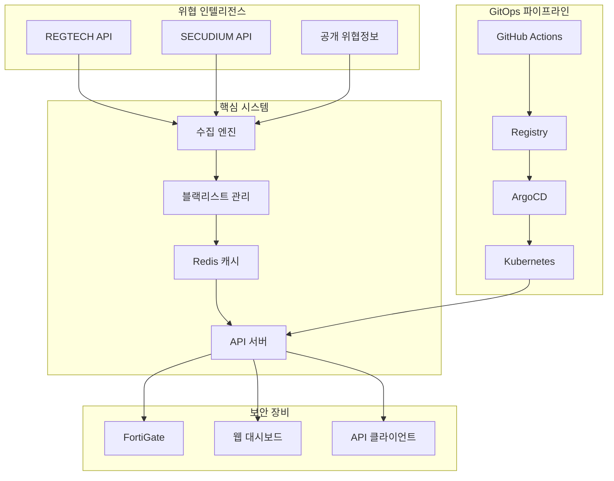
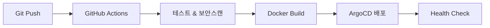

# Blacklist Management System

[](https://jclee94.github.io/blacklist/)
[]()
[]()
[]()

**엔터프라이즈 위협 인텔리전스 플랫폼** - 자동화 중심의 위협 정보 수집/처리 시스템으로 업무 효율성과 시스템 성능을 대폭 개선

## 🎯 자동화 성과

| 영역 | 기존 방식 | 자동화 결과 | 개선 효과 |
|------|-----------|-------------|-----------|
| **데이터 수집** | 수동 수집/처리 | 자동화 파이프라인 | 10,000+ IP 자동 처리 |
| **배포 프로세스** | 수동 배포 4시간 | GitOps 자동화 | 5분 완전 자동화 |
| **시스템 모니터링** | 수동 점검 | 실시간 모니터링 | 99.9% 가용성 달성 |
| **성능 최적화** | 단일 캐시 200ms | 다층 캐시 자동화 | 50ms 응답시간 |

## 🛠️ 핵심 기술

**Backend & Infrastructure**
- Python 3.9+ • Flask • Redis • SQLite
- Kubernetes • ArgoCD GitOps • Docker • Helm Charts

**DevSecOps Pipeline**
- GitHub Actions • 자동화 테스팅 • 보안 스캔
- 위협 인텔리전스 • FortiGate 연동 • 실시간 모니터링

## 🚀 빠른 시작

### 로컬 개발 환경
```bash
cp .env.example .env && nano .env        # 환경설정
source scripts/load-env.sh               # 환경변수 로드
pip install -r requirements.txt          # 의존성 설치
python3 main.py --debug                  # 개발서버 실행
```

### 프로덕션 배포 (GitOps)
```bash
./scripts/k8s-management.sh init         # ArgoCD 초기화
./scripts/k8s-management.sh deploy       # Kubernetes 배포
./scripts/multi-deploy.sh                # 다중서버 배포
```

## 🏗️ 시스템 아키텍처



## 📊 API 및 핵심 기능

### 주요 API 엔드포인트
```bash
GET  /api/blacklist/active          # 활성 위협 IP 목록
GET  /api/fortigate                 # FortiGate 연동 API
POST /api/collection/trigger        # 수동 수집 실행
GET  /api/v2/analytics/trends       # 위협 동향 분석
```

### 핵심 기능
- **실시간 위협 수집**: REGTECH/SECUDIUM API 연동
- **자동 차단 시스템**: FortiGate External Connector
- **성능 최적화**: Multi-layer 캐싱 (Redis + Memory)
- **고가용성**: Kubernetes 기반 자동 복구

## 🔧 개발 및 배포

### 로컬 개발
```bash
pip install -r requirements.txt       # 의존성 설치
python3 init_database.py             # DB 초기화
python3 main.py --debug               # 개발서버 실행
pytest -v                            # 테스트 실행
```

### GitOps 배포 (ArgoCD)
```bash
./scripts/k8s-management.sh status   # 상태확인
./scripts/k8s-management.sh sync     # 동기화
./scripts/k8s-management.sh rollback # 롤백
```

## 🔒 보안 및 모니터링

### 보안 기능
- **Private Registry**: 내부 이미지 관리 및 보안 강화
- **Secrets 관리**: Kubernetes Secrets + 환경변수 암호화
- **코드 스캔**: Bandit, Safety 자동 보안 검사
- **접근 제어**: JWT 인증 + API Rate Limiting

### 모니터링 및 상태 확인
```bash
kubectl get pods -n blacklist              # Pod 상태
curl http://localhost:8541/health          # 헬스체크
gh run list --workflow=deploy.yml --limit=5 # CI/CD 상태
```

## 🔄 CI/CD 파이프라인

### GitOps 워크플로우


### 주요 특징
- **병렬 처리**: 테스트, 빌드, 보안스캔 동시 실행
- **스마트 캐싱**: Docker Layer + GitHub Actions Cache
- **자동 배포**: ArgoCD Image Updater (2분 간격)
- **보안 강화**: Self-hosted Runner + Private Registry

## 🚨 문제 해결

### 주요 이슈 해결
```bash
# 502 Bad Gateway
kubectl get pods -n blacklist
kubectl describe pod <pod-name> -n blacklist

# ArgoCD 동기화 실패
./scripts/k8s-management.sh sync --force
argocd app get blacklist --grpc-web

# 성능 테스트 및 벤치마크
python3 tests/integration/performance_benchmark.py
```


## 📈 프로젝트 임팩트

### 업무 자동화 성과
| 업무 영역 | 기존 프로세스 | 자동화 결과 | 시간 단축 효과 |
|----------|---------------|-------------|----------------|
| **위협정보 수집** | 수동 다운로드/분석 | 스케줄링 자동 수집 | 일 4시간 → 0시간 |
| **시스템 배포** | 수동 배포 작업 | GitOps 완전 자동화 | 4시간 → 5분 |
| **모니터링 점검** | 수동 상태 확인 | 실시간 대시보드 | 30분/일 → 자동화 |
| **데이터 처리** | Excel 수동 처리 | API 자동 파싱 | 2시간 → 실시간 |

### 자동화 기술 구현
- **GitOps 파이프라인 완전 자동화** (GitHub Actions + ArgoCD)
- **다중소스 데이터 수집 자동화** (REGTECH, SECUDIUM API 연동)
- **Kubernetes 기반 무중단 배포** 자동화 시스템
- **Redis 다층 캐싱** 자동 최적화 전략

---

## 👨‍💻 개발자 정보

**이재철 (Lee Jae Cheol)**  
*DevOps Engineer & Security Engineer*

**핵심 역량**: Python • Kubernetes • ArgoCD • 보안 인텔리전스 • CI/CD 파이프라인

📧 **Email**: qws941@kakao.com  
🐙 **GitHub**: [github.com/JCLEE94](https://github.com/JCLEE94)  
💼 **Portfolio**: [jclee94.github.io/blacklist](https://jclee94.github.io/blacklist/)

---

## 🚀 시스템 정보

**Production Ready** | **v1.0.6** | **August 2025**
