# Blacklist Management System

[](https://github.com/JCLEE94/blacklist/actions)
[](https://argo.jclee.me)
[](https://kubernetes.io/)
[](https://registry.jclee.me)
[](https://blacklist.jclee.me)

통합 위협 정보 관리 플랫폼 - Kubernetes 네이티브 아키텍처, 다중 소스 데이터 수집, FortiGate External Connector 연동 지원

> **최신 업데이트 (2025.07.04)**: ArgoCD CI/CD 파이프라인 통합 완료
> **이전 업데이트 (2025.07.03)**: Stats API 만료 관리 기능 추가, 네임스페이스 마이그레이션 (`blacklist` → `blacklist-new`)

## 🏗️ Architecture

```mermaid
graph TB
    subgraph "Production Kubernetes Cluster"
        subgraph "blacklist-new namespace"
            A[Ingress/NodePort] --> B[Service]
            B --> C[Deployment<br/>4 Replicas]
            C --> D[Redis Cache]
            C --> E[PVC - SQLite DB]
            F[Collection Manager] --> C
        end
    end
    
    H[GitHub Push] --> I[GitHub Actions<br/>Self-hosted Runner]
    I --> J[Docker Registry<br/>registry.jclee.me]
    J --> K[Auto-updater CronJob<br/>5분마다 체크]
    K --> C
    
    L[REGTECH API] --> C
    M[SECUDIUM API] --> C
    N[FortiGate] --> A
```



## 🚀 Quick Start

### Prerequisites

- Kubernetes cluster (k3s/k8s v1.24+)
- kubectl 설정 완료
- Docker 및 registry 접근 권한
- Auto-updater CronJob 활성화 (자동 배포용)

### 🎯 자동 배포 (CI/CD)

**GitHub Actions + 자동 이미지 업데이트로 완전 자동화**

```bash
# 1. 저장소 클론
git clone https://github.com/JCLEE94/blacklist.git
cd blacklist

# 2. 간단 배포 (Ubuntu/Linux)
./scripts/deploy.sh

# 3. 자동 이미지 업데이트 활성화 (필수)
kubectl apply -f k8s/auto-updater-enhanced.yaml
```

### 🔄 CI/CD Pipeline

**코드 푸시 → 이미지 빌드 → 자동 배포 (2분 이내)**

1. **GitHub Push** → GitHub Actions 자동 트리거 (Self-hosted Runner)
2. **이미지 빌드** → `registry.jclee.me/blacklist:SHA` 태그로 푸시  
3. **자동 배포** → Enhanced CronJob이 5분마다 새 이미지 감지 & 배포
4. **헬스 체크** → 자동 롤백 및 실패 복구 지원

```bash
# CI/CD 상태 확인
kubectl get cronjob auto-updater -n blacklist-new
kubectl logs -f job/auto-updater-xxx -n blacklist-new

# 최근 CI/CD 실행 상태
gh run list --limit 5

# 배포 모니터링
kubectl get events -n blacklist-new --sort-by='.lastTimestamp'
```

## ⚡ 빠른 배포

### 방법 1: 관리 스크립트 사용 (권장)
```bash
# 초기 배포
./scripts/k8s-management.sh init

# 상태 확인
./scripts/k8s-management.sh status

# 롤백 (필요시)
./scripts/k8s-management.sh rollback
```

### 방법 2: 수동 배포
```bash
# Kubernetes 매니페스트 적용
kubectl apply -k k8s/

# Auto-updater 활성화
kubectl apply -f k8s/auto-updater-enhanced.yaml
```

### 개발 환경 실행

```bash
# 1. 의존성 설치
pip install -r requirements.txt

# 2. 데이터베이스 초기화
python3 init_database.py

# 3. 개발 서버 실행
python3 main.py --debug  # 또는 python3 main.py --port 8541
```

### 자동 배포 실패 방지 시스템

시스템적 재발 방지 대책이 구축되어 있습니다:

```bash
# 1. 자동 배포 시스템 (CI/CD)
ls .github/workflows/k8s-deploy.yml

# 2. 자동 복구 스크립트
./scripts/setup/auto-deployment-fix.sh

# 3. Enhanced Auto-updater (5분마다 실행, 자동 롤백)
kubectl get cronjob auto-updater -n blacklist-new

# 4. 실패 시 즉시 복구
./scripts/recovery/blacklist-recovery.sh
```

**주요 방지 기능:**
- Docker Registry 인증 실패 자동 복구
- PVC/PV 바인딩 문제 자동 해결
- 헬스 체크 실패 시 자동 롤백
- GitHub Secrets 자동 검증

## 📦 주요 기능

### 핵심 기능
- **다중 소스 IP 수집**: REGTECH(금융보안원), SECUDIUM, 공개 위협 정보
- **FortiGate 연동**: External Connector API 완벽 지원
- **자동 수집**: 매일 자동 수집 및 업데이트
- **고가용성**: 멀티 레플리카 구성 지원
- **데이터 영속성**: PVC 기반 SQLite 데이터베이스
- **통합 관리**: 웹 기반 대시보드 및 제어판
- **설정 관리**: `/settings/management` 웹 인터페이스
- **만료 관리**: 90일 자동 만료 및 상태 추적 (등록일 기준)

### Core API 엔드포인트
- `GET /` - 메인 대시보드 (활성 IP: 22,517개, 총 22,740개)
- `GET /health` - 상태 확인 및 상세 진단
- `GET /api/fortigate` - FortiGate External Connector 형식
- `GET /api/blacklist/active` - 활성 IP 목록 (텍스트)
- `GET /api/stats` - 시스템 통계 (만료 정보 포함)
  - `active_ips`: 현재 활성 IP 수
  - `expired_ips`: 만료된 IP 수
  - `expiring_soon`: 30일 내 만료 예정 IP 수
  - `cache_hit_rate`: 캐시 히트율
- `GET /test` - 간단한 테스트 엔드포인트

### Collection Management API
- `GET /api/collection/status` - 수집 서비스 상태
- `POST /api/collection/enable` - 수집 활성화 (기존 데이터 정리)
- `POST /api/collection/disable` - 수집 비활성화
- `POST /api/collection/regtech/trigger` - REGTECH 수동 수집
- `POST /api/collection/secudium/trigger` - SECUDIUM 수동 수집

### Settings Management API
- `GET /api/settings/all` - 모든 설정 조회
- `POST /api/settings/bulk` - 대량 설정 업데이트
- `GET /settings/management` - 설정 관리 웹 대시보드

### V2 API 엔드포인트 (고급 기능)
- `GET /api/v2/blacklist/enhanced` - 메타데이터 포함 블랙리스트
- `GET /api/v2/analytics/trends` - 고급 분석 및 추세
- `GET /api/v2/sources/status` - 다중 소스 상세 상태

### 보안
- TLS/HTTPS (Ingress 또는 NodePort)
- Kubernetes Secrets 기반 인증 정보 관리
- 환경 변수 분리 (ConfigMap/Secret)
- 컨테이너 권한 최소화

## 🛠️ 구성

### ConfigMap (환경 변수)
```yaml
apiVersion: v1
kind: ConfigMap
metadata:
  name: blacklist-config
  namespace: blacklist-new
data:
  PORT: "2541"
  FLASK_ENV: "production"
  TZ: "Asia/Seoul"
  REDIS_URL: "redis://blacklist-redis:6379/0"
  LOG_LEVEL: "INFO"
```

### Secret (인증 정보)
```yaml
apiVersion: v1
kind: Secret
metadata:
  name: blacklist-secret
  namespace: blacklist-new
type: Opaque
stringData:
  REGTECH_USERNAME: "your-username"
  REGTECH_PASSWORD: "your-password"
  SECUDIUM_USERNAME: "your-username"
  SECUDIUM_PASSWORD: "your-password"
  SECRET_KEY: "your-flask-secret-key"
```

## 📊 모니터링

### Pod 및 리소스 확인
```bash
# Pod 상태
kubectl get pods -n blacklist-new

# 리소스 사용량
kubectl top pods -n blacklist-new

# 로그 확인
kubectl logs -f deployment/blacklist -n blacklist-new

# 이벤트 확인
kubectl get events -n blacklist-new --sort-by='.lastTimestamp'
```

### 수집 상태 모니터링
```bash
# API를 통한 상태 확인
curl http://<node-ip>:32541/api/collection/status

# 통계 확인
curl http://<node-ip>:32541/api/stats
```

## 🔄 CI/CD 파이프라인

### Enhanced GitHub Actions → Kubernetes 자동 배포
1. **코드 푸시**: main 브랜치에 푸시
2. **GitHub Actions (Self-hosted Runner)**:
   - 품질 검사 (병렬): Python 구문 검사, 보안 스캔
   - Docker 인증: Private Registry 우선, Docker Hub 선택적
   - 멀티 태그 빌드: latest, SHA-7, SHA-8, branch, timestamp
   - registry.jclee.me에 안전한 푸시
3. **Enhanced Auto-updater CronJob**:
   - 5분마다 새 이미지 자동 감지
   - Rolling Update with Zero Downtime
   - 실패 시 자동 롤백 및 복구
   - 포스트 배포 헬스 체크

### Enhanced Auto-updater 설정
```yaml
# Enhanced Auto-updater CronJob
apiVersion: batch/v1
kind: CronJob
metadata:
  name: auto-updater
  namespace: blacklist-new
spec:
  schedule: "*/5 * * * *"  # 5분마다 실행
  successfulJobsHistoryLimit: 3
  failedJobsHistoryLimit: 5
  jobTemplate:
    spec:
      template:
        spec:
          serviceAccountName: auto-updater
          containers:
          - name: updater
            image: bitnami/kubectl:latest
            # 이미지 업데이트 및 롤백 로직 포함
```

**주요 개선사항:**
- RBAC 기반 ServiceAccount 사용
- 롤백 실패 시 자동 복구
- 포스트 업데이트 헬스 체크
- 상세한 로깅 및 모니터링

### 수동 배포
```bash
# 스크립트를 통한 배포
./scripts/k8s-management.sh deploy --tag v1.2.3

# 또는 직접 이미지 업데이트
kubectl set image deployment/blacklist blacklist=registry.jclee.me/blacklist:v1.2.3 -n blacklist-new
```

## 🧪 테스트

### 통합 테스트
```bash
# 클러스터 내부에서 실행
kubectl apply -f k8s/test-job.yaml
kubectl logs job/blacklist-integration-test -n blacklist

# 로컬 테스트
python3 scripts/integration_test_comprehensive.py
```

### 단위 테스트
```bash
pytest tests/
pytest --cov=src tests/
```

## 📁 프로젝트 구조

```
blacklist/
├── k8s/                    # Kubernetes 매니페스트
│   ├── namespace.yaml      # 네임스페이스
│   ├── configmap.yaml      # 환경 설정
│   ├── secret.yaml         # 민감 정보
│   ├── pvc.yaml           # 영구 스토리지
│   ├── deployment.yaml     # 메인 애플리케이션
│   ├── service.yaml       # 서비스 정의
│   ├── ingress.yaml       # 인그레스 설정 (선택)
│   ├── redis.yaml         # Redis 캐시
│   └── test-job.yaml      # 테스트 Job
│
├── deployment/            # 컨테이너 설정
│   ├── Dockerfile        # 멀티스테이지 빌드
│   └── docker-compose.yml # 로컬 개발용
│
├── .github/workflows/    # CI/CD 파이프라인
│   └── k8s-deploy.yml    # GitHub Actions (Self-hosted)
│
├── src/                  # 애플리케이션 소스
│   ├── core/            # 핵심 비즈니스 로직
│   │   ├── app_compact.py     # 메인 Flask 앱
│   │   ├── unified_service.py # 통합 서비스
│   │   ├── unified_routes.py  # 통합 API 라우트
│   │   ├── settings_routes.py # 설정 관리 라우트
│   │   ├── v2_routes.py       # V2 API 라우트
│   │   ├── container.py       # 의존성 주입 컨테이너
│   │   ├── regtech_collector.py # REGTECH 수집기
│   │   └── secudium_collector.py # SECUDIUM 수집기
│   └── utils/           # 유틸리티
│
├── scripts/             # 유틸리티 스크립트
│   ├── k8s-management.sh    # Kubernetes 관리 (Bash)
│   └── k8s-management.ps1   # Kubernetes 관리 (PowerShell)
├── tests/              # 테스트 코드
├── main.py            # 엔트리 포인트
├── requirements.txt   # Python 의존성
├── CLAUDE.md         # AI 어시스턴트 가이드
└── README.md         # 이 파일
```

## 🛠️ 기술 스택

### 런타임 환경
- **Python 3.9**: 안정성과 성능의 균형점
  - Alpine 기반 경량 이미지 사용 (python:3.9-slim)
  - 컨테이너 크기 최적화 (~150MB)
- **Gunicorn**: Production WSGI 서버
  - 멀티 워커 지원 (기본 4 workers)
  - 타임아웃 120초 설정
  - 자동 워커 재시작 기능

### 웹 프레임워크
- **Flask 2.3.3**: 경량 웹 프레임워크
  - RESTful API 설계
  - Flask-CORS, Flask-Compress 포함
  - 보안 헤더 자동 설정

### 데이터베이스
- **SQLite 3**: 파일 기반 임베디드 DB
  - PVC 기반 영구 스토리지
  - WAL 모드로 동시성 향상
  - 자동 백업 및 복구 지원
  - 3개월 데이터 자동 정리

### 캐싱
- **Redis 7-alpine**: 인메모리 캐시
  - Kubernetes StatefulSet 구성
  - 메모리 캐시 폴백 지원
  - TTL 기반 자동 만료

### 컨테이너 기술
- **Docker 20.10+**: 컨테이너화
  - 멀티스테이지 빌드로 이미지 크기 최적화 (~150MB)
  - 레이어 캐싱으로 빌드 시간 단축
  - 루트리스 컨테이너 실행 지원

### 오케스트레이션
- **Kubernetes 1.24+**: 컨테이너 오케스트레이션
  - k3s/k8s 완벽 지원
  - PVC로 데이터 영속성 보장
  - ConfigMap/Secret으로 설정 관리
  - 자동 재시작 및 헬스체크
  - HPA 기반 자동 스케일링
  - ArgoCD/FluxCD 통합

### 필수 Python 패키지 (requirements.txt)
```text
# 웹 프레임워크
Flask==2.3.3
Flask-CORS==6.0.1
Flask-Compress==1.13
Flask-Limiter==3.11.0
gunicorn==23.0.0

# 데이터베이스
SQLAlchemy==2.0.41

# 데이터 처리
pandas==2.0.3
openpyxl==3.1.2  # Excel 파일 처리
xlrd==2.0.1      # 구형 Excel 지원
numpy>=1.21.0,<1.25.0

# HTTP 통신
requests==2.32.4
beautifulsoup4==4.12.2
lxml==5.4.0

# 캐싱
redis==4.6.0
flask-caching==2.1.0

# JSON 처리
orjson==3.9.7  # 고성능 JSON

# 스케줄링
APScheduler==3.10.4

# 보안
PyJWT==2.8.0

# 유틸리티
python-dateutil==2.8.2
pytz==2023.3
psutil==5.9.8

# 로깅
python-json-logger==2.0.7

# 환경 변수
python-dotenv==1.1.1
```

### CI/CD 통합
- **GitHub Actions**: Self-hosted Runner 기반
  - 병렬 테스트 실행
  - 멀티 아키텍처 빌드 (amd64, arm64)
  - 자동 버전 태깅
  - 보안 스캔 (Trivy)
  
- **ArgoCD Image Updater**: 자동 이미지 업데이트
  - Registry webhook 통합
  - 신규 이미지 자동 감지
  - GitOps 기반 배포

### 시스템 의존성 (Alpine Linux)
```dockerfile
# Dockerfile에 포함된 시스템 패키지
RUN apk add --no-cache \
    gcc \
    musl-dev \
    linux-headers \
    libffi-dev \
    openssl-dev \
    python3-dev \
    libxml2-dev \
    libxslt-dev \
    jpeg-dev \
    zlib-dev
```

### 네트워크 구성
- **서비스 타입**
  - ClusterIP: 클러스터 내부 통신
  - NodePort: 외부 접근 (32541)
  - LoadBalancer/Ingress: 프로덕션 환경
  
### 보안 강화
- **이미지 스캔**: Trivy로 취약점 사전 검사
- **시크릿 관리**: Kubernetes Secrets 사용
- **최소 권한**: non-root 사용자 실행
- **네트워크 정책**: 필요 최소한의 포트만 개방

### 모니터링
- **내장 헬스체크**: /health 엔드포인트
- **메트릭 수집**: /api/stats 제공
- **로그 수집**: stdout/stderr → kubectl logs
- **리소스 모니터링**: kubectl top
- **Prometheus 연동 가능**: metrics 엔드포인트 제공

### 백업 및 복구
- **SQLite 백업**: CronJob 기반 자동 백업
- **설정 백업**: ConfigMap/Secret YAML 저장
- **전체 백업**: namespace 단위 YAML export
- **Velero 지원**: 클러스터 레벨 백업/복구

## 🎛️ 설정 관리

블랙리스트 시스템은 웹 기반 설정 관리 인터페이스를 제공합니다.

### 설정 관리 대시보드

웹 브라우저에서 `/settings/management` 경로로 접속하여 시스템 설정을 관리할 수 있습니다:

```
https://blacklist.jclee.me/settings/management
```

### 주요 설정 카테고리

1. **일반 설정**
   - 애플리케이션 이름
   - 시간대 설정
   - 페이지당 항목 수

2. **수집 설정**
   - 자동 수집 활성화/비활성화
   - 수집 주기 (시간 단위)
   - REGTECH/SECUDIUM 개별 활성화

3. **인증 정보**
   - REGTECH 사용자명/비밀번호
   - SECUDIUM 사용자명/비밀번호

4. **성능 설정**
   - 캐시 TTL (초)
   - 최대 동시 수집 수

5. **보안 설정**
   - 세션 타임아웃 (분)
   - API 요청 제한

### 설정 API 엔드포인트

프로그래밍 방식으로 설정을 관리하려면:

```bash
# 모든 설정 조회
curl http://localhost:2541/api/settings/all

# 대량 설정 업데이트
curl -X POST http://localhost:2541/api/settings/bulk \
  -H "Content-Type: application/json" \
  -d '{
    "collection_enabled": {
      "value": true,
      "type": "boolean",
      "category": "collection"
    }
  }'

# 개별 설정 업데이트
curl -X PUT http://localhost:2541/api/settings/collection_enabled \
  -H "Content-Type: application/json" \
  -d '{"value": true}'
```

## 🔧 문제 해결

### 설정 페이지 접속 문제

```bash
# 증상: /settings/management 페이지가 404 오류 반환

# 1. Pod 상태 확인
kubectl get pods -n blacklist
kubectl logs deployment/blacklist -n blacklist | grep settings

# 2. 라우트 충돌 확인
# - unified_routes.py와 settings_routes.py 간 충돌 확인
# - /api/settings → /api/settings/all, /api/settings/bulk로 변경됨

# 3. 최신 이미지 배포
kubectl rollout restart deployment/blacklist -n blacklist
kubectl rollout status deployment/blacklist -n blacklist

# 4. 브라우저 캐시 초기화
# Ctrl+Shift+R 또는 캐시 비우기
```

### 이미지 Pull 실패
```bash
# 증상: ImagePullBackOff 에러
# 원인: Registry 인증 실패 또는 네트워크 문제

# 1. Registry Secret 확인
kubectl get secret regcred -n blacklist -o yaml

# 2. Registry 접근 테스트
docker login registry.jclee.me
docker pull registry.jclee.me/blacklist:latest

# 3. Pod 이벤트 확인
kubectl describe pod <pod-name> -n blacklist
kubectl get events -n blacklist --sort-by='.lastTimestamp'

# 4. ImagePullSecret 재생성
kubectl delete secret regcred -n blacklist
kubectl create secret docker-registry regcred \
  --docker-server=registry.jclee.me \
  --docker-username=<username> \
  --docker-password=<password> \
  -n blacklist
```

### Pod 메모리 부족
```bash
# 증상: OOMKilled 상태

# 1. 현재 메모리 사용량 확인
kubectl top pods -n blacklist
kubectl describe pod <pod-name> -n blacklist | grep -A5 "Limits:"

# 2. 메모리 한계 증가
kubectl edit deployment blacklist -n blacklist
# resources.limits.memory: "2Gi"로 수정

# 3. 대량 데이터 처리 시 배치 크기 조정
kubectl set env deployment/blacklist BATCH_SIZE=1000 -n blacklist
```

### 데이터베이스 손상
```bash
# 증상: database disk image is malformed

# 1. 백업에서 복구
kubectl exec deployment/blacklist -n blacklist -- rm /app/instance/blacklist.db
kubectl cp backup/db-20250630.db blacklist/<pod-name>:/app/instance/blacklist.db -n blacklist

# 2. SQLite 무결성 검사
kubectl exec deployment/blacklist -n blacklist -- \
  sqlite3 /app/instance/blacklist.db "PRAGMA integrity_check;"

# 3. 데이터 재구축
kubectl exec deployment/blacklist -n blacklist -- \
  python3 init_database.py --force
```

### 네트워크 연결 이슈
```bash
# 증상: 외부 API 접근 실패

# 1. DNS 설정 확인
kubectl exec deployment/blacklist -n blacklist -- nslookup www.krcert.or.kr

# 2. 네트워크 정책 확인
kubectl get networkpolicies -n blacklist

# 3. Service 엔드포인트 확인
kubectl get endpoints -n blacklist

# 4. 프록시 설정 (필요시)
kubectl set env deployment/blacklist \
  HTTP_PROXY=http://proxy.company.com:8080 \
  HTTPS_PROXY=http://proxy.company.com:8080 \
  NO_PROXY=localhost,127.0.0.1,.cluster.local \
  -n blacklist
```

### 성능 저하 문제
```bash
# 증상: API 응답 시간 증가

# 1. Redis 캐시 상태 확인
kubectl exec deployment/blacklist-redis -n blacklist -- redis-cli INFO stats

# 2. 캐시 초기화
kubectl exec deployment/blacklist-redis -n blacklist -- redis-cli FLUSHALL

# 3. DB 인덱스 재구축
kubectl exec deployment/blacklist -n blacklist -- \
  sqlite3 /app/instance/blacklist.db "REINDEX;"

# 4. 불필요한 로그 정리
kubectl exec deployment/blacklist -n blacklist -- \
  find /app/logs -name "*.log" -mtime +7 -delete
```

### 롤백 절차
```bash
# 1. 롤백 히스토리 확인
kubectl rollout history deployment/blacklist -n blacklist

# 2. 이전 버전으로 롤백
kubectl rollout undo deployment/blacklist -n blacklist
# 또는 특정 버전으로
kubectl rollout undo deployment/blacklist --to-revision=2 -n blacklist

# 3. 롤백 상태 확인
kubectl rollout status deployment/blacklist -n blacklist

# 4. 스크립트를 통한 롤백
./scripts/k8s-management.sh rollback

# 5. ArgoCD를 통한 롤백 (GitOps)
argocd app rollback blacklist --revision 1.2.3
```

## 🏭 프로덕션 운영

### 최소 시스템 요구사항
```yaml
# 단일 노드 환경
CPU: 2 cores (4 cores 권장)
Memory: 4GB (8GB 권장)
Storage: 20GB SSD (데이터 증가 고려)

# Kubernetes 클러스터
Master Node: 2 cores, 4GB RAM
Worker Node: 2 cores, 4GB RAM (최소 2개)
Storage: NFS 또는 Local PV 20GB+
```

### 리소스 할당 가이드
```yaml
# Pod 리소스 (k8s/deployment.yaml)
resources:
  requests:
    memory: "512Mi"
    cpu: "250m"
  limits:
    memory: "1Gi"
    cpu: "1000m"

# Redis 리소스
resources:
  requests:
    memory: "128Mi"
    cpu: "100m"
  limits:
    memory: "256Mi"
    cpu: "200m"
```

### 성능 특성
- **최대 IP 처리 용량**: 100만개 이상
- **API 응답 시간**: 
  - 캐시 히트: < 10ms
  - 캐시 미스: < 100ms
  - 대량 조회: < 500ms
- **메모리 사용량**:
  - 기본 상태: ~300MB
  - 10만 IP: ~800MB
  - 100만 IP: ~2GB

### 백업 및 복구
```bash
# CronJob 기반 자동 백업 (k8s/cronjob.yaml에 정의)
kubectl apply -f k8s/cronjob.yaml

# 수동 데이터베이스 백업
kubectl exec deployment/blacklist -n blacklist -- \
  sqlite3 /app/instance/blacklist.db ".backup /tmp/backup.db"
kubectl cp blacklist/<pod-name>:/tmp/backup.db ./backup-$(date +%Y%m%d).db

# 전체 namespace 백업 (Velero 사용)
velero backup create blacklist-backup --include-namespaces blacklist

# 복구
velero restore create --from-backup blacklist-backup
```

### 고급 운영 기능

#### 자동 스케일링 설정
```yaml
# HPA (Horizontal Pod Autoscaler) 설정
apiVersion: autoscaling/v2
kind: HorizontalPodAutoscaler
metadata:
  name: blacklist-hpa
  namespace: blacklist
spec:
  scaleTargetRef:
    apiVersion: apps/v1
    kind: Deployment
    name: blacklist
  minReplicas: 2
  maxReplicas: 10
  metrics:
  - type: Resource
    resource:
      name: cpu
      target:
        type: Utilization
        averageUtilization: 70
  - type: Resource
    resource:
      name: memory
      target:
        type: Utilization
        averageUtilization: 80
```

#### 무중단 업데이트 전략
```yaml
# Deployment 롤링 업데이트 설정
spec:
  replicas: 4
  strategy:
    type: RollingUpdate
    rollingUpdate:
      maxSurge: 1
      maxUnavailable: 0
  template:
    spec:
      containers:
      - name: blacklist
        readinessProbe:
          httpGet:
            path: /health
            port: 2541
          initialDelaySeconds: 10
          periodSeconds: 5
        livenessProbe:
          httpGet:
            path: /health
            port: 2541
          initialDelaySeconds: 30
          periodSeconds: 10
```

#### 성능 최적화
```bash
# 1. 리소스 최적화
kubectl top pods -n blacklist --sort-by=memory
kubectl top nodes

# 2. 캐시 성능 튜닝
kubectl exec deployment/blacklist-redis -n blacklist -- \
  redis-cli CONFIG SET maxmemory-policy allkeys-lru

# 3. SQLite 최적화
kubectl exec deployment/blacklist -n blacklist -- \
  sqlite3 /app/instance/blacklist.db "PRAGMA optimize;"

# 4. 네트워크 최적화
kubectl annotate service blacklist \
  service.beta.kubernetes.io/aws-load-balancer-backend-protocol=tcp
```

#### 모니터링 대시보드 통합
```yaml
# Prometheus ServiceMonitor
apiVersion: monitoring.coreos.com/v1
kind: ServiceMonitor
metadata:
  name: blacklist-metrics
  namespace: blacklist
spec:
  selector:
    matchLabels:
      app: blacklist
  endpoints:
  - port: http
    interval: 30s
    path: /metrics
```

## 🤝 Contributing

1. Fork 저장소
2. Feature 브랜치 생성 (`git checkout -b feature/amazing`)
3. 변경사항 커밋 (`git commit -m 'Add amazing feature'`)
4. 브랜치 푸시 (`git push origin feature/amazing`)
5. Pull Request 생성

## 📝 License

이 프로젝트는 독점 소프트웨어입니다.

## 📚 추가 문서

### 기술 문서
- [CLAUDE.md](./CLAUDE.md) - AI 어시스턴트를 위한 상세 가이드
- [자동 배포 실패 방지 가이드](./docs/AUTO_DEPLOYMENT_PREVENTION.md) - 시스템적 재발 방지 대책

### 스크립트 및 도구
- [Kubernetes 관리 스크립트](./scripts/k8s-management.sh) - 배포 자동화 (Linux/macOS)
- [자동 배포 수정 스크립트](./scripts/setup/auto-deployment-fix.sh) - 실패 방지 설정
- [자동 복구 스크립트](./scripts/recovery/blacklist-recovery.sh) - 배포 실패 시 복구

### CI/CD 설정
- [GitHub Actions 워크플로우](./.github/workflows/k8s-deploy.yml) - 메인 배포 파이프라인
- [GitHub Actions 파이프라인](./.github/workflows/k8s-deploy.yml) - 자동화된 CI/CD
- [Enhanced Auto-updater](./k8s/auto-updater-enhanced.yaml) - 5분마다 자동 업데이트

## 🔄 최근 변경사항 (2025.07.03)

### 🚀 주요 신규 기능 (2025.07.03)
- **Stats API 만료 관리 기능**: IP 만료 정보 완전 구현
  - `expired_ips`: 만료된 IP 수 (현재 223개)
  - `expiring_soon`: 30일 내 만료 예정 IP 수 (현재 7,492개)
  - `cache_hit_rate`: 캐시 히트율 통계
  - 데이터베이스 스키마 업데이트 (`expires_at` 컬럼 추가)
- **네임스페이스 마이그레이션**: `blacklist` → `blacklist-new`
  - Terminating 상태 문제 해결
  - 모든 리소스 안전하게 이전 완료
  - Auto-updater 설정 업데이트

### 🚀 이전 주요 기능 (2025.07.01)
- **자동 배포 실패 방지 시스템**: 시스템적 재발 방지 대책 구축
  - GitHub Actions CI/CD 파이프라인
  - Enhanced Auto-updater CronJob (5분마다, 자동 롤백)
  - 자동 복구 스크립트 및 완전 자동화 시스템
- **설정 관리 대시보드**: `/settings/management` 웹 인터페이스 추가
- **V2 API**: 고급 분석 및 메타데이터 기능 추가 (`/api/v2/*`)
- **라우트 통합**: 모든 API 라우트를 `unified_routes.py`로 통합

### 🛠️ 중요 인프라 개선
- **CI/CD 파이프라인 강화**: Docker Hub 인증 실패 문제 완전 해결
  - Private Registry 우선순위 변경
  - 멀티 태그 전략 (SHA-7, SHA-8, timestamp)
  - 자동 롤백 및 헬스 체크 강화
- **PVC/PV 바인딩 문제 자동 해결**: Released 상태 자동 복구
- **Enhanced Auto-updater**: RBAC 기반 ServiceAccount 적용

### 🐛 버그 수정
- **Docker Registry 인증 실패**: 401 Unauthorized 오류 완전 해결
- Settings 라우트 충돌 해결 (`/api/settings` → `/api/settings/all`, `/api/settings/bulk`)
- **만료일 계산 수정**: detection_date 기준으로 정확한 90일 만료 계산
- PVC Terminating 상태 해결 (finalizers 제거)
- 405 Method Not Allowed 오류 해결

### 📊 현재 운영 상태
- **활성 IP**: 22,517개 / 총 22,740개 (REGTECH: 22,098개, SECUDIUM: 642개)
- **만료 상태**: 
  - 만료된 IP: 223개 (1.0%)
  - 30일 내 만료 예정: 7,492개 (33.0%)
- **네임스페이스**: `blacklist-new` (기존 `blacklist`에서 마이그레이션)
- **Pod 상태**: 4개 Pod 모두 Running (HPA 자동 스케일링)
- **배포 상태**: ✅ 정상 운영 중 (https://blacklist.jclee.me)
- **CI/CD**: ✅ 완전 자동화 (GitHub Actions + Auto-updater)

---

Built with ❤️ for enterprise security
