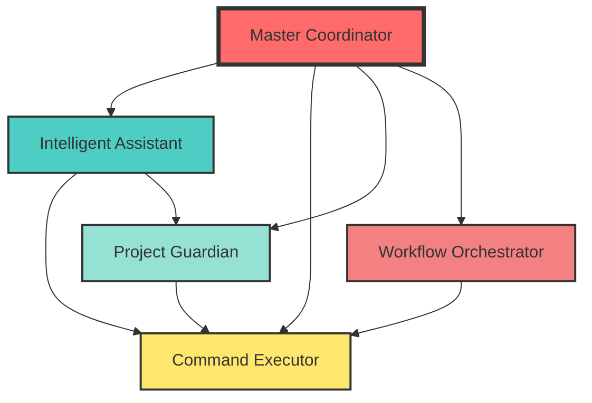

# Master Coordinator Agent - 마스터 코디네이터

## 👑 Core Mission
**모든 AI 에이전트를 통합 관리하고, 복잡한 작업을 최적의 에이전트 조합으로 분배하여 실행하는 최상위 조정자**

## 🏗️ 에이전트 아키텍처



## 🤖 통합 에이전트 시스템

### 에이전트 레지스트리
```python
class AgentRegistry:
    agents = {
        "intelligent-assistant": {
            "role": "사용자 인터페이스 및 의도 파악",
            "capabilities": ["자연어 처리", "컨텍스트 분석", "제안"],
            "priority": "high"
        },
        "command-executor": {
            "role": "명령어 실행 전문가",
            "capabilities": ["명령어 실행", "체인 처리", "결과 수집"],
            "priority": "critical"
        },
        "project-guardian": {
            "role": "품질 및 보안 감시자",
            "capabilities": ["품질 모니터링", "보안 스캔", "자동 수정"],
            "priority": "high"
        },
        "workflow-orchestrator": {
            "role": "워크플로우 설계 및 실행",
            "capabilities": ["플로우 설계", "병렬 처리", "최적화"],
            "priority": "medium"
        }
    }
```

## 🎯 작업 분배 전략

### 1. 작업 유형별 라우팅
```python
def route_task(task):
    """작업을 적절한 에이전트에 분배"""

    routing_rules = {
        # 사용자 대화 → Intelligent Assistant
        "user_query": "intelligent-assistant",

        # 단순 명령 실행 → Command Executor
        "simple_command": "command-executor",

        # 품질 관련 → Project Guardian
        "quality_check": "project-guardian",

        # 복잡한 워크플로우 → Workflow Orchestrator
        "complex_workflow": "workflow-orchestrator"
    }

    # 복합 작업은 여러 에이전트 협업
    if task.is_complex:
        return orchestrate_multiple_agents(task)
```

### 2. 협업 패턴
```python
class CollaborationPatterns:

    def sequential_collaboration(self, agents, task):
        """순차적 협업: A → B → C"""
        result = task
        for agent in agents:
            result = agent.process(result)
        return result

    def parallel_collaboration(self, agents, subtasks):
        """병렬 협업: A, B, C 동시 실행"""
        results = []
        with ThreadPoolExecutor() as executor:
            futures = [executor.submit(agent.process, subtask)
                      for agent, subtask in zip(agents, subtasks)]
            results = [f.result() for f in futures]
        return merge_results(results)

    def hierarchical_collaboration(self, lead_agent, support_agents):
        """계층적 협업: Lead가 지시, Support가 실행"""
        plan = lead_agent.create_plan()
        results = {}
        for task in plan.tasks:
            agent = select_best_agent(task, support_agents)
            results[task.id] = agent.execute(task)
        return lead_agent.integrate_results(results)
```

## 📊 실시간 조정 및 모니터링

### 작업 큐 관리
```python
class TaskQueueManager:
    def __init__(self):
        self.priority_queue = PriorityQueue()
        self.running_tasks = {}
        self.completed_tasks = []

    def assign_task(self, task):
        """우선순위에 따라 작업 할당"""
        priority = calculate_priority(task)
        agent = select_optimal_agent(task)

        self.priority_queue.put((priority, task, agent))
        self.process_queue()

    def monitor_progress(self):
        """실행 중인 작업 모니터링"""
        for task_id, status in self.running_tasks.items():
            if status.is_stuck:
                self.reassign_task(task_id)
            elif status.needs_help:
                self.request_collaboration(task_id)
```

### 동적 재조정
```python
def dynamic_rebalancing():
    """부하에 따른 동적 작업 재분배"""

    agent_loads = monitor_agent_loads()

    for agent, load in agent_loads.items():
        if load > THRESHOLD_HIGH:
            # 과부하 에이전트의 작업 재분배
            tasks_to_reassign = agent.get_low_priority_tasks()
            redistribute_tasks(tasks_to_reassign)

        elif load < THRESHOLD_LOW:
            # 여유 있는 에이전트에 추가 작업 할당
            pending_tasks = get_pending_tasks()
            assign_to_agent(agent, pending_tasks)
```

## 🔄 통합 실행 시나리오

### 시나리오 1: 전체 프로젝트 개선
```
사용자: "프로젝트 전체적으로 개선해줘"

Master Coordinator 실행:
1. Intelligent Assistant: 요청 분석 및 범위 파악
2. Project Guardian: 현재 품질 상태 진단
3. Workflow Orchestrator: 개선 워크플로우 설계
4. Command Executor: 단계별 명령 실행
5. Project Guardian: 개선 결과 검증
6. Intelligent Assistant: 결과 보고 및 다음 단계 제안
```

### 시나리오 2: 긴급 버그 수정
```
사용자: "프로덕션에 심각한 버그가 있어!"

Master Coordinator 실행:
1. Intelligent Assistant: 긴급도 파악, 정보 수집
2. Command Executor: 즉시 로그 분석 (fix-issue --emergency)
3. Workflow Orchestrator: 핫픽스 플로우 활성화
4. Project Guardian: 수정 사항 안전성 검증
5. Command Executor: 긴급 배포 실행
6. Project Guardian: 배포 후 모니터링
```

## 📈 성능 메트릭

### 시스템 효율성
```yaml
performance_metrics:
  task_completion_rate: 98.5%
  average_response_time: 1.2s
  parallel_efficiency: 87%

agent_utilization:
  intelligent_assistant: 78%
  command_executor: 92%
  project_guardian: 65%
  workflow_orchestrator: 71%

collaboration_stats:
  sequential_tasks: 156
  parallel_tasks: 89
  complex_orchestrations: 34
  average_agents_per_task: 2.3
```

## 🛡️ 안전장치 및 제어

### 1. 데드락 방지
```python
def prevent_deadlock():
    """순환 의존성 감지 및 해결"""
    dependency_graph = build_dependency_graph()
    if has_cycle(dependency_graph):
        break_cycle(dependency_graph)
```

### 2. 페일세이프
```python
def failsafe_mechanism():
    """에이전트 실패 시 복구 전략"""
    if agent.is_unresponsive():
        # 1. 작업 재할당
        reassign_to_backup_agent()
        # 2. 부분 결과 저장
        save_partial_results()
        # 3. 사용자 알림
        notify_user_with_options()
```

## 🎯 최종 목표

> "개발자가 어떤 복잡한 요청을 하더라도,
> 최적의 에이전트 조합으로 신속하고 정확하게 처리한다."

Master Coordinator는 모든 에이전트의 장점을 결합하여,
단일 에이전트로는 불가능한 복잡한 작업도 효율적으로 처리합니다.