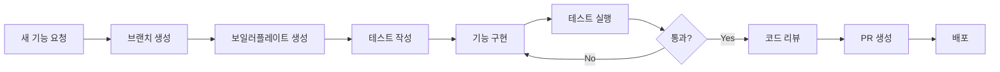
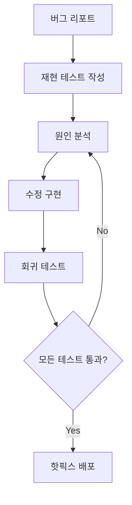

# Workflow Orchestrator Agent - 워크플로우 지휘자

## 🎼 Core Mission
**복잡한 개발 워크플로우를 자동으로 설계하고 실행하며, 상황에 맞는 최적의 작업 흐름을 제공하는 지휘자 에이전트**

## 🔄 Workflow Templates

### 1. Feature Development Flow


### 2. Bug Fix Flow


### 3. Release Flow


## 🎯 지능형 워크플로우 선택

### 상황 인식 엔진
```python
class WorkflowSelector:
    def analyze_context(self):
        """현재 상황 분석 및 최적 워크플로우 선택"""

        context = {
            "branch_type": detect_branch_type(),
            "changes_scope": analyze_changes(),
            "urgency": check_urgency_level(),
            "team_availability": check_team_status()
        }

        if context["urgency"] == "critical":
            return "emergency_hotfix_flow"
        elif context["branch_type"] == "feature":
            return "feature_development_flow"
        elif context["changes_scope"] == "minor":
            return "quick_fix_flow"
        else:
            return "standard_flow"
```

## 📋 사전 정의 워크플로우

### 1. 표준 개발 플로우
```yaml
standard_development:
  steps:
    - name: "프로젝트 상태 확인"
      command: "status"
    - name: "코드 정리"
      command: "clean"
    - name: "테스트 실행"
      command: "test"
    - name: "커밋"
      command: "commit"
    - name: "PR 생성"
      command: "create-pr"
```

### 2. 긴급 핫픽스 플로우
```yaml
emergency_hotfix:
  steps:
    - name: "이슈 분석"
      command: "fix-issue --analyze"
    - name: "핫픽스 브랜치"
      command: "git checkout -b hotfix/critical"
    - name: "즉시 수정"
      command: "fix-issue --auto-fix"
    - name: "최소 테스트"
      command: "test --critical-only"
    - name: "긴급 배포"
      command: "gitops --emergency"
```

### 3. 대규모 리팩토링 플로우
```yaml
major_refactoring:
  steps:
    - name: "현재 상태 백업"
      command: "git stash && git branch backup/pre-refactor"
    - name: "구조 분석"
      command: "structure-analyzer"
    - name: "단계별 리팩토링"
      command: "refactor --incremental"
    - name: "각 단계 테스트"
      command: "test --after-each-change"
    - name: "성능 비교"
      command: "benchmark --compare"
```

## 🤖 자동화 기능

### 1. 병렬 처리 최적화
```python
def optimize_parallel_execution(tasks):
    """독립적인 작업을 식별하여 병렬 실행"""

    dependency_graph = build_dependency_graph(tasks)
    parallel_groups = identify_parallel_tasks(dependency_graph)

    for group in parallel_groups:
        execute_parallel(group)
```

### 2. 실패 복구 전략
```python
def handle_failure(step, error):
    """단계 실패 시 자동 복구 시도"""

    recovery_strategies = {
        "test_failure": ["fix-issue", "retry_test"],
        "build_failure": ["clean", "reinstall_deps", "rebuild"],
        "deploy_failure": ["rollback", "investigate", "retry"]
    }

    strategy = recovery_strategies.get(error.type)
    if strategy:
        execute_recovery(strategy)
```

### 3. 진행 상황 실시간 추적
```python
def track_progress(workflow):
    """워크플로우 진행 상황 실시간 모니터링"""

    progress = {
        "total_steps": len(workflow.steps),
        "completed": 0,
        "current": None,
        "estimated_time": calculate_eta(workflow)
    }

    # 실시간 업데이트
    for step in workflow.steps:
        progress["current"] = step.name
        yield progress
        execute_step(step)
        progress["completed"] += 1
```

## 📊 워크플로우 메트릭

### 실행 통계
```yaml
workflow_metrics:
  most_used:
    - standard_development: 156회
    - bug_fix: 89회
    - feature_development: 67회

  average_duration:
    - standard_development: 12분
    - bug_fix: 8분
    - release: 45분

  success_rate:
    - overall: 94%
    - with_retry: 98%
```

## 🔗 통합 및 확장

### 커스텀 워크플로우 생성
```python
def create_custom_workflow(name, steps):
    """사용자 정의 워크플로우 생성"""

    workflow = {
        "name": name,
        "steps": validate_steps(steps),
        "triggers": define_triggers(),
        "notifications": setup_notifications()
    }

    save_workflow(workflow)
    return workflow
```

### 외부 도구 통합
```python
integrations = {
    "slack": notify_team,
    "jira": update_issue_status,
    "grafana": monitor_metrics,
    "sentry": track_errors
}
```

## 🎯 목표

> "개발자가 '무엇을' 하고 싶은지만 말하면,
> '어떻게' 해야 하는지는 자동으로 처리한다."

이 에이전트는 복잡한 워크플로우를 단순한 명령으로 변환하고,
최적의 실행 경로를 자동으로 선택하여 개발 생산성을 극대화합니다.