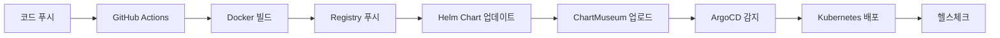

# GitOps CI/CD 설정 가이드

## 개요

이 문서는 Blacklist 프로젝트의 GitOps 기반 CI/CD 파이프라인 설정 방법을 설명합니다.

## 구성 요소

- **GitHub Actions**: CI/CD 파이프라인 자동화
- **Docker Registry**: `registry.jclee.me` (프라이빗 레지스트리)
- **Helm Chart**: Kubernetes 배포 패키징
- **ChartMuseum**: Helm Chart 저장소 (`charts.jclee.me`)
- **ArgoCD**: GitOps 기반 자동 배포

## 빠른 시작

### 1. 자동 설정 스크립트 실행

```bash
# GitOps 설정 스크립트 실행
./scripts/setup/gitops-setup.sh
```

스크립트는 다음 작업을 자동으로 수행합니다:
- GitHub Secrets/Variables 설정
- Kubernetes 네임스페이스 및 시크릿 생성
- ArgoCD 저장소 및 애플리케이션 설정
- 배포 검증 스크립트 생성

### 2. 변경사항 커밋 및 푸시

```bash
git add .
git commit -m "feat: GitOps CI/CD 구성"
git push origin main
```

### 3. 배포 확인

```bash
# 배포 상태 확인 (2-3분 후)
./scripts/verify-deployment.sh
```

## 상세 설정

### GitHub Secrets

다음 시크릿이 자동으로 설정됩니다:

| Secret Name | Description | Default Value |
|------------|-------------|---------------|
| REGISTRY_URL | Docker Registry URL | registry.jclee.me |
| REGISTRY_USERNAME | Registry 사용자명 | admin |
| REGISTRY_PASSWORD | Registry 비밀번호 | bingogo1 |
| CHARTMUSEUM_URL | Helm Chart 저장소 URL | https://charts.jclee.me |
| CHARTMUSEUM_USERNAME | ChartMuseum 사용자명 | admin |
| CHARTMUSEUM_PASSWORD | ChartMuseum 비밀번호 | bingogo1 |
| ARGOCD_SERVER | ArgoCD 서버 URL | argo.jclee.me |
| ARGOCD_USERNAME | ArgoCD 사용자명 | admin |
| ARGOCD_PASSWORD | ArgoCD 비밀번호 | bingogo1 |

### GitHub Variables

| Variable Name | Description | Default Value |
|--------------|-------------|---------------|
| GITHUB_ORG | GitHub 조직/사용자명 | JCLEE94 |
| APP_NAME | 애플리케이션 이름 | blacklist |
| NAMESPACE | Kubernetes 네임스페이스 | blacklist |

### Helm Chart 구조

```
charts/blacklist/
├── Chart.yaml          # Chart 메타데이터
├── values.yaml         # 기본 설정값
└── templates/          # Kubernetes 매니페스트 템플릿
    ├── deployment.yaml
    ├── service.yaml
    ├── ingress.yaml
    └── configmap.yaml
```

### ArgoCD Applications

두 개의 ArgoCD 애플리케이션이 생성됩니다:

1. **blacklist-production** (운영 환경)
   - 네임스페이스: `blacklist`
   - 자동 동기화 활성화
   - Self-healing 활성화
   - 3개 레플리카

2. **blacklist-development** (개발 환경)
   - 네임스페이스: `blacklist-dev`
   - develop 브랜치 추적
   - 1개 레플리카
   - 디버그 모드 활성화

## 워크플로우

### CI/CD 파이프라인 (.github/workflows/gitops-deploy.yaml)

1. **트리거**:
   - main/develop 브랜치 푸시
   - v* 태그 생성
   - Pull Request
   - 수동 실행 (workflow_dispatch)

2. **단계**:
   - 코드 체크아웃
   - Docker 이미지 빌드 및 푸시
   - 테스트 실행 (선택적)
   - Helm Chart 패키징 및 업로드
   - ArgoCD 자동 동기화 트리거

3. **이미지 태그 전략**:
   - `latest`: main 브랜치 최신
   - `develop`: develop 브랜치 최신
   - `v1.0.0`: 버전 태그
   - `main-abc123`: SHA 기반 태그
   - `20240115-120000-abc123`: 타임스탬프 태그

## 배포 프로세스



## 모니터링

### 배포 상태 확인

```bash
# GitHub Actions 상태
gh run list --limit 5

# ArgoCD 애플리케이션 상태
argocd app get blacklist-production

# Kubernetes Pod 상태
kubectl get pods -n blacklist

# 애플리케이션 헬스체크
curl http://blacklist.jclee.me/health
```

### 로그 확인

```bash
# Pod 로그
kubectl logs -f deployment/blacklist -n blacklist

# ArgoCD 동기화 로그
argocd app logs blacklist-production
```

## 문제 해결

### 일반적인 문제

1. **이미지 풀 실패**
   ```bash
   # Registry 시크릿 재생성
   kubectl delete secret regcred -n blacklist
   kubectl create secret docker-registry regcred \
     --docker-server=registry.jclee.me \
     --docker-username=admin \
     --docker-password=bingogo1 \
     --namespace=blacklist
   ```

2. **ArgoCD 동기화 실패**
   ```bash
   # 수동 동기화
   argocd app sync blacklist-production --force
   
   # 애플리케이션 재생성
   kubectl delete application blacklist-production -n argocd
   kubectl apply -f argocd-application.yaml
   ```

3. **Chart 업로드 실패**
   ```bash
   # ChartMuseum 상태 확인
   curl https://charts.jclee.me/health
   
   # 수동 업로드
   helm package charts/blacklist
   curl -u admin:bingogo1 --data-binary "@blacklist-*.tgz" \
     https://charts.jclee.me/api/charts
   ```

## 고급 설정

### 환경별 설정 오버라이드

```bash
# 개발 환경 values 파일
cat > charts/blacklist/values-dev.yaml << EOF
replicaCount: 1
image:
  tag: "develop"
env:
  - name: DEBUG
    value: "true"
EOF

# 운영 환경 values 파일
cat > charts/blacklist/values-prod.yaml << EOF
replicaCount: 3
resources:
  limits:
    cpu: 2000m
    memory: 2Gi
EOF
```

### 수동 배포

```bash
# Helm을 사용한 직접 배포
helm repo add chartmuseum https://charts.jclee.me
helm repo update
helm upgrade --install blacklist chartmuseum/blacklist \
  --namespace blacklist \
  --create-namespace \
  --values charts/blacklist/values-prod.yaml
```

## 보안 고려사항

1. **시크릿 관리**:
   - 모든 인증 정보는 GitHub Secrets에 저장
   - Kubernetes Secrets는 네임스페이스별로 격리
   - ArgoCD는 RBAC로 접근 제어

2. **네트워크 보안**:
   - 프라이빗 레지스트리 사용
   - HTTPS 통신 강제
   - Ingress를 통한 외부 노출 제어

3. **이미지 보안**:
   - 멀티스테이지 빌드로 최소화
   - 베이스 이미지 정기 업데이트
   - 취약점 스캔 통합 (선택적)

## 다음 단계

1. **모니터링 추가**:
   - Prometheus/Grafana 연동
   - 알림 설정 (Slack, Email)

2. **백업 전략**:
   - 데이터베이스 백업
   - 설정 백업

3. **성능 최적화**:
   - HPA (Horizontal Pod Autoscaler) 설정
   - 리소스 제한 조정

## 참고 자료

- [ArgoCD 문서](https://argo-cd.readthedocs.io/)
- [Helm 문서](https://helm.sh/docs/)
- [GitHub Actions 문서](https://docs.github.com/en/actions)