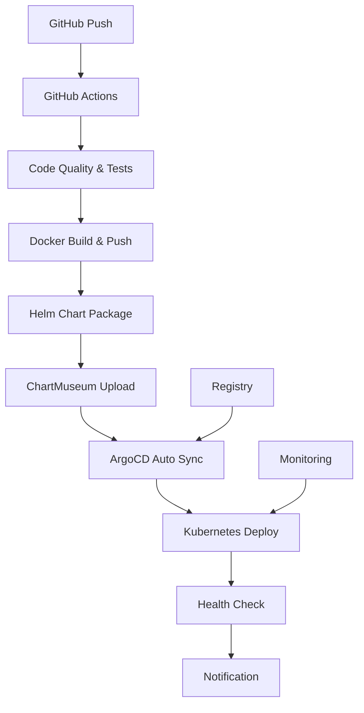

# GitOps CI/CD 구축 가이드 - Blacklist Management System

## 🎯 개요

Blacklist Management System을 위한 완전 자동화된 GitOps CI/CD 파이프라인 구축 가이드입니다. 이 가이드를 통해 GitHub Actions, Helm Charts, ArgoCD를 활용한 현대적인 DevOps 환경을 구축할 수 있습니다.

## 🏗️ 아키텍처



## 📋 구성요소

### 1. GitHub Actions 워크플로우
- **코드 품질 검사**: Black, isort, Flake8, MyPy
- **보안 스캔**: Bandit, Safety
- **단위/통합 테스트**: pytest 기반
- **Docker 빌드**: Multi-platform 지원
- **Helm 차트 패키징**: ChartMuseum 업로드
- **ArgoCD 동기화**: 자동 배포 트리거

### 2. Helm Charts
- **Enterprise 설정**: 고가용성, 리소스 최적화
- **보안 강화**: Security Context, Secret 관리
- **모니터링**: Health Check, Metrics
- **확장성**: HPA, Pod Anti-Affinity

### 3. ArgoCD GitOps
- **자동 동기화**: Self-Heal, Prune 활성화
- **Image Updater**: 자동 이미지 업데이트
- **Rollback 지원**: 빠른 장애 복구
- **Multi-Environment**: 환경별 설정 관리

## 🚀 빠른 시작

### 전체 자동 설정 (권장)

```bash
# 모든 설정을 한 번에 실행
./scripts/run-all-setup.sh
```

### 단계별 수동 설정

```bash
# 1. 초기 설정
./scripts/setup-gitops-cicd.sh

# 2. Helm Charts 생성
./scripts/generate-helm-charts.sh

# 3. GitHub Actions 워크플로우 생성
./scripts/create-github-workflow.sh

# 4. ArgoCD 애플리케이션 설정
./scripts/setup-argocd-app.sh

# 5. 배포 검증
./scripts/validate-deployment.sh
```

## 📝 사전 요구사항

### 필수 도구

```bash
# 기본 도구
- git
- curl  
- python3

# Kubernetes 도구
- kubectl (v1.28+)
- helm (v3.14+)
- argocd CLI (v2.8+)

# 선택사항
- gh (GitHub CLI) - GitHub Secrets 자동 설정용
```

### 인프라 요구사항

```yaml
# 필수 서비스
- Kubernetes 클러스터 (k3s/k8s)
- Docker Registry (registry.jclee.me)
- ChartMuseum (charts.jclee.me)
- ArgoCD (argo.jclee.me)

# 네트워크
- NodePort 32542 (애플리케이션 접근)
- 클러스터 내부 DNS 해석
```

## 🔐 GitHub Secrets 설정

### Registry 관련
```bash
REGISTRY_URL=registry.jclee.me
REGISTRY_USERNAME=admin
REGISTRY_PASSWORD=bingogo1
```

### ChartMuseum 관련
```bash
CHARTMUSEUM_URL=https://charts.jclee.me
CHARTMUSEUM_USERNAME=admin
CHARTMUSEUM_PASSWORD=bingogo1
```

### ArgoCD 관련
```bash
ARGOCD_URL=argo.jclee.me
ARGOCD_USERNAME=admin
ARGOCD_PASSWORD=bingogo1
```

### 애플리케이션 관련
```bash
REGTECH_USERNAME=nextrade
REGTECH_PASSWORD=Sprtmxm1@3
SECUDIUM_USERNAME=nextrade
SECUDIUM_PASSWORD=Sprtmxm1@3
```

## 📦 배포 프로세스

### 1. 코드 변경 시 (자동)

```bash
git add .
git commit -m "feat: 새로운 기능 추가"
git push origin main
```

**자동 실행 단계:**
1. GitHub Actions 트리거
2. 코드 품질 및 보안 검사
3. 단위/통합 테스트 실행
4. Docker 이미지 빌드 및 푸시
5. Helm 차트 패키징 및 업로드
6. ArgoCD 자동 동기화
7. Kubernetes 배포
8. 헬스체크 및 알림

### 2. 수동 배포 (필요시)

```bash
# ArgoCD를 통한 수동 동기화
argocd app sync blacklist-blacklist --grpc-web

# 또는 kubectl을 통한 직접 배포
kubectl apply -k k8s/
```

## 🔍 모니터링 및 검증

### 배포 상태 확인

```bash
# 종합 검증 실행
./scripts/validate-deployment.sh

# 개별 확인 명령어
kubectl get pods -n blacklist
argocd app get blacklist-blacklist --grpc-web
curl http://blacklist.jclee.me:32542/health
```

### 주요 엔드포인트

```bash
# 애플리케이션
http://blacklist.jclee.me:32542/
http://blacklist.jclee.me:32542/health
http://blacklist.jclee.me:32542/api/stats

# 관리 도구
https://argo.jclee.me/applications/blacklist-blacklist
https://charts.jclee.me/
http://registry.jclee.me/v2/_catalog
```

## 🛠️ 문제해결

### 일반적인 문제들

#### 1. GitHub Actions 실패
```bash
# 워크플로우 로그 확인
gh run list --limit 5
gh run view <RUN_ID> --log

# 주요 확인사항
- GitHub Secrets 설정 확인
- Registry 접근 권한 확인
- 테스트 코드 문법 오류 확인
```

#### 2. ArgoCD 동기화 실패
```bash
# ArgoCD 상태 확인
argocd app get blacklist-blacklist --grpc-web

# 수동 동기화 시도
argocd app sync blacklist-blacklist --force --grpc-web

# 주요 확인사항
- ChartMuseum에 차트 업로드 여부
- Kubernetes 클러스터 연결 상태
- Secret 및 ConfigMap 설정
```

#### 3. 애플리케이션 접근 불가
```bash
# Pod 상태 확인
kubectl get pods -n blacklist -o wide
kubectl logs -f deployment/blacklist -n blacklist

# Service 상태 확인
kubectl get svc -n blacklist
kubectl describe svc blacklist -n blacklist

# 주요 확인사항
- Pod가 Running 상태인지
- Service가 올바른 포트로 설정되었는지
- NodePort가 방화벽에서 허용되는지
```

#### 4. Image Pull 실패
```bash
# Secret 확인
kubectl get secret regcred -n blacklist -o yaml

# Registry 접근 테스트
docker login registry.jclee.me

# 주요 확인사항
- Registry 인증 정보 정확성
- 이미지 태그 존재 여부
- 네트워크 연결 상태
```

### 로그 확인 명령어

```bash
# 애플리케이션 로그
kubectl logs -f -l app=blacklist -n blacklist

# ArgoCD 로그
kubectl logs -f -l app.kubernetes.io/name=argocd-server -n argocd

# GitHub Actions 로그
gh run view --log

# Registry 접근 로그
curl -u admin:bingogo1 http://registry.jclee.me/v2/_catalog
```

## 📊 성능 및 확장성

### 리소스 설정

```yaml
# 기본 설정 (values.yaml)
resources:
  limits:
    cpu: 1000m
    memory: 1Gi
  requests:
    cpu: 200m
    memory: 256Mi

# HPA 설정
hpa:
  enabled: true
  minReplicas: 2
  maxReplicas: 6
  targetCPUUtilizationPercentage: 70
```

### 확장 방법

```bash
# 수동 스케일링
kubectl scale deployment blacklist --replicas=4 -n blacklist

# HPA 상태 확인
kubectl get hpa -n blacklist

# 리소스 사용량 확인
kubectl top pods -n blacklist
```

## 🔄 업데이트 및 롤백

### 자동 업데이트
- GitHub Push → 자동 CI/CD 실행
- ArgoCD Image Updater → 이미지 자동 업데이트
- Self-Heal → 설정 드리프트 자동 복구

### 수동 롤백

```bash
# ArgoCD를 통한 롤백
argocd app rollback blacklist-blacklist --grpc-web

# kubectl을 통한 롤백
kubectl rollout undo deployment/blacklist -n blacklist

# 특정 리비전으로 롤백
kubectl rollout undo deployment/blacklist --to-revision=2 -n blacklist
```

## 📚 추가 리소스

### 문서 링크
- [ArgoCD 공식 문서](https://argo-cd.readthedocs.io/)
- [Helm 공식 문서](https://helm.sh/docs/)
- [GitHub Actions 문서](https://docs.github.com/en/actions)
- [Kubernetes 공식 문서](https://kubernetes.io/docs/)

### 구성 파일 위치
```
.
├── .github/workflows/gitops-cicd.yaml    # GitHub Actions 워크플로우
├── charts/blacklist/                     # Helm Charts
├── argocd/                              # ArgoCD 설정
├── scripts/                             # 자동화 스크립트
└── docs/GITOPS_SETUP_GUIDE.md          # 이 문서
```

## 🎯 Best Practices

### 1. 보안
- Secrets 저장소에 민감 정보 저장
- 최소 권한 원칙 적용
- 정기적인 보안 스캔 실행

### 2. 모니터링
- 애플리케이션 헬스체크 활성화
- 리소스 사용량 모니터링
- 로그 집중화 및 알림 설정

### 3. 백업
- Database 정기 백업
- 설정 파일 버전 관리
- Disaster Recovery 계획 수립

### 4. 테스트
- 단위 테스트 커버리지 80% 이상 유지
- 통합 테스트 자동화
- 성능 테스트 정기 실행

---

## 🆘 지원

문제가 발생하거나 추가 도움이 필요한 경우:

1. **검증 스크립트 실행**: `./scripts/validate-deployment.sh`
2. **로그 확인**: 위의 문제해결 섹션 참조
3. **GitHub Issues**: 프로젝트 저장소에 이슈 등록
4. **문서 확인**: CLAUDE.md 및 관련 문서 검토

**Happy GitOps! 🚀**