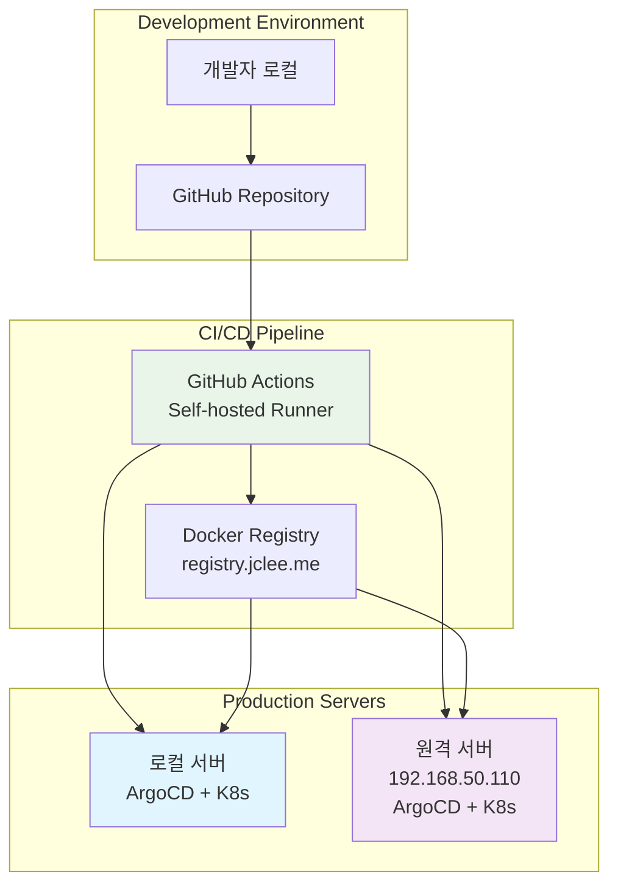

# 멀티 서버 동시 배포 가이드

## 🎯 개요

이 가이드는 로컬 서버와 원격 서버(192.168.50.110)에 Blacklist Management System을 동시에 배포하는 방법을 설명합니다.

## 🏗️ 아키텍처



## 🚀 빠른 시작

### 1단계: 원격 서버 초기 설정

```bash
# 원격 서버 SSH 및 도구 설정
./scripts/setup/remote-server-setup.sh
```

이 스크립트가 수행하는 작업:
- SSH 키 생성 및 배포
- 원격 서버에 Docker, kubectl, ArgoCD CLI 설치
- Kubernetes 설정 파일 복사
- Docker Registry 인증 설정
- 프로젝트 파일 동기화

### 2단계: 멀티 서버 동시 배포

```bash
# 로컬과 원격 서버에 동시 배포
./scripts/multi-deploy.sh
```

이 스크립트가 수행하는 작업:
- 사전 요구사항 확인
- 프로젝트 파일 동기화
- 로컬과 원격 서버에 병렬 배포
- 배포 진행 상황 실시간 모니터링
- 배포 결과 확인

### 3단계: 상태 확인

```bash
# 원격 서버 상태 확인
./scripts/check-remote-status.sh
```

## 📋 상세 설정 가이드

### 원격 서버 정보

- **IP 주소**: 192.168.50.110
- **사용자**: jclee
- **비밀번호**: bingogo1
- **Kubernetes 네임스페이스**: blacklist
- **NodePort**: 32542

### SSH 설정

```bash
# SSH 키 생성 (자동으로 수행됨)
ssh-keygen -t rsa -b 4096 -f ~/.ssh/id_rsa -N ""

# SSH 키 복사 (자동으로 수행됨)
sshpass -p "bingogo1" ssh-copy-id -o StrictHostKeyChecking=no jclee@192.168.50.110

# SSH 연결 테스트
ssh jclee@192.168.50.110 "echo 'SSH 연결 성공'"
```

### 수동 원격 서버 설정

자동 스크립트가 실패할 경우 수동으로 설정:

```bash
# 1. 원격 서버에 SSH 접속
ssh jclee@192.168.50.110

# 2. 필요한 도구 설치
sudo apt-get update
curl -fsSL https://get.docker.com -o get-docker.sh && sudo sh get-docker.sh
sudo usermod -aG docker $USER

# 3. kubectl 설치
curl -LO "https://dl.k8s.io/release/$(curl -L -s https://dl.k8s.io/release/stable.txt)/bin/linux/amd64/kubectl"
sudo install -o root -g root -m 0755 kubectl /usr/local/bin/kubectl

# 4. ArgoCD CLI 설치
curl -sSL -o argocd-linux-amd64 https://github.com/argoproj/argo-cd/releases/latest/download/argocd-linux-amd64
sudo install -m 555 argocd-linux-amd64 /usr/local/bin/argocd

# 5. 프로젝트 클론
mkdir -p ~/app
cd ~/app
git clone https://github.com/JCLEE94/blacklist.git
```

## 🔄 CI/CD 자동 배포

### GitHub Actions 워크플로우

GitHub에 코드를 푸시하면 자동으로 두 서버에 배포됩니다:

```bash
# 코드 변경 후 푸시
git add .
git commit -m "feat: 새로운 기능 추가"
git push origin main
```

**자동 배포 흐름:**
1. GitHub Actions 트리거
2. 테스트 및 빌드 (병렬 실행)
3. Docker 이미지 빌드 및 레지스트리 푸시
4. 로컬 ArgoCD 동기화
5. 원격 서버 파일 동기화 및 ArgoCD 동기화

### 배포 상태 모니터링

```bash
# GitHub Actions 상태 확인
gh run list --limit 5

# 로컬 서버 상태
kubectl get pods -n blacklist
argocd app get blacklist --grpc-web

# 원격 서버 상태
ssh jclee@192.168.50.110 'kubectl get pods -n blacklist'
ssh jclee@192.168.50.110 'argocd app get blacklist --grpc-web'
```

## 🌐 접속 정보

### 로컬 서버

- **프로덕션 URL**: https://blacklist.jclee.me
- **NodePort**: http://localhost:32542
- **ArgoCD 대시보드**: https://argo.jclee.me/applications/blacklist
- **Health Check**: http://localhost:32542/health

### 원격 서버 (192.168.50.110)

- **NodePort**: http://192.168.50.110:32542
- **Health Check**: http://192.168.50.110:32542/health
- **SSH 접속**: `ssh jclee@192.168.50.110`

## 🔧 문제 해결

### 일반적인 문제들

#### 1. SSH 연결 실패

```bash
# 네트워크 연결 확인
ping 192.168.50.110

# SSH 서비스 상태 확인
ssh -v jclee@192.168.50.110

# SSH 키 재설정
./scripts/setup/remote-server-setup.sh
```

#### 2. Kubernetes 연결 실패

```bash
# 원격 서버에서 클러스터 상태 확인
ssh jclee@192.168.50.110 'kubectl cluster-info'

# kubeconfig 파일 재복사
scp ~/.kube/config jclee@192.168.50.110:~/.kube/config
```

#### 3. ArgoCD 인증 실패

```bash
# 원격 서버에서 ArgoCD 재로그인
ssh jclee@192.168.50.110 'argocd login argo.jclee.me --username admin --password <password> --grpc-web'
```

#### 4. Docker Registry 인증 실패

```bash
# 원격 서버에서 Docker 로그인
ssh jclee@192.168.50.110 'docker login registry.jclee.me'
```

#### 5. 포트 접속 실패

```bash
# 방화벽 상태 확인
ssh jclee@192.168.50.110 'sudo ufw status'

# 포트 리스닝 확인
ssh jclee@192.168.50.110 'netstat -tlnp | grep :32542'

# 서비스 상태 확인
ssh jclee@192.168.50.110 'kubectl get svc -n blacklist'
```

### 로그 확인

```bash
# 로컬 서버 로그
kubectl logs -f deployment/blacklist -n blacklist

# 원격 서버 로그
ssh jclee@192.168.50.110 'kubectl logs -f deployment/blacklist -n blacklist'

# GitHub Actions 로그
gh run view --log

# ArgoCD 로그
argocd app logs blacklist --grpc-web
ssh jclee@192.168.50.110 'argocd app logs blacklist --grpc-web'
```

## 🛠️ 유지보수

### 정기적인 작업

```bash
# 1. 주간 상태 점검
./scripts/check-remote-status.sh

# 2. 프로젝트 파일 수동 동기화 (필요시)
rsync -avz --delete --exclude='.git' ./ jclee@192.168.50.110:~/app/blacklist/

# 3. 시크릿 업데이트 (필요시)
kubectl create secret generic blacklist-secret \
  --from-literal=REGTECH_USERNAME="new-username" \
  --from-literal=REGTECH_PASSWORD="new-password" \
  --dry-run=client -o yaml | kubectl apply -f -

ssh jclee@192.168.50.110 'kubectl create secret generic blacklist-secret \
  --from-literal=REGTECH_USERNAME="new-username" \
  --from-literal=REGTECH_PASSWORD="new-password" \
  --dry-run=client -o yaml | kubectl apply -f -'
```

### 백업 및 복구

```bash
# 설정 백업
kubectl get all -n blacklist -o yaml > backup-local-$(date +%Y%m%d).yaml
ssh jclee@192.168.50.110 'kubectl get all -n blacklist -o yaml' > backup-remote-$(date +%Y%m%d).yaml

# 데이터베이스 백업 (SQLite)
kubectl cp blacklist/<pod-name>:/app/instance/blacklist.db ./backup-db-local-$(date +%Y%m%d).db -n blacklist
ssh jclee@192.168.50.110 'kubectl cp blacklist/<pod-name>:/app/instance/blacklist.db ./backup-db-remote-$(date +%Y%m%d).db -n blacklist'
```

## 📊 성능 모니터링

### 리소스 사용량 확인

```bash
# 로컬 서버 리소스
kubectl top nodes
kubectl top pods -n blacklist

# 원격 서버 리소스
ssh jclee@192.168.50.110 'kubectl top nodes'
ssh jclee@192.168.50.110 'kubectl top pods -n blacklist'
```

### 애플리케이션 상태 확인

```bash
# Health Check
curl http://localhost:32542/health
curl http://192.168.50.110:32542/health

# API 응답 시간 테스트
time curl -s http://localhost:32542/api/stats > /dev/null
time curl -s http://192.168.50.110:32542/api/stats > /dev/null
```

## 🎉 성공 사례

이 멀티 서버 배포 시스템으로 달성할 수 있는 것들:

- **고가용성**: 한 서버 장애 시 다른 서버로 트래픽 라우팅
- **부하 분산**: 두 서버 간 워크로드 분산
- **재해 복구**: 빠른 복구 및 데이터 보호
- **무중단 배포**: 롤링 업데이트를 통한 서비스 지속성
- **자동화**: GitHub Actions를 통한 완전 자동 배포

---

더 자세한 정보나 문제 해결이 필요하면 다음을 참고하세요:
- [ArgoCD CI/CD 문서](docs/ARGOCD_CICD.md)
- [워크플로우 최적화 가이드](docs/WORKFLOW_OPTIMIZATION.md)
- [메인 README](README.md)