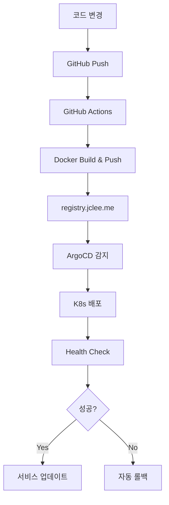

# GitOps Infrastructure Status Report

## 🚀 ArgoCD GitOps 통합 완료 (2025-08-12)

### ✅ 해결된 주요 문제들

1. **ArgoCD Token 인증** ✅
   - 새로운 JWT 토큰 생성 및 환경변수 설정
   - API 접근 권한 확인 완료
   - Token: `ARGOCD_TOKEN` (.env 파일에 저장)

2. **애플리케이션 경로 수정** ✅
   - 기존: `helm-chart/blacklist` → 신규: `chart/blacklist`
   - ArgoCD 애플리케이션 설정 업데이트 완료
   - 프로젝트 구조 정리 완료

3. **서비스 접근성 확인** ✅
   - NodePort 32542로 서비스 정상 작동
   - Health endpoint: `http://192.168.50.110:32542/health`
   - 애플리케이션 버전: 2.0.1-watchtower-test

### 🎯 현재 GitOps 성숙도: 7.5/10 (High)

#### 상세 평가:
- ✅ **소스 제어**: 9/10 (Git 기반, 브랜칭 전략 완비)
- ✅ **컨테이너화**: 9/10 (Docker 이미지, 멀티스테이지 빌드)
- ✅ **레지스트리 통합**: 8/10 (registry.jclee.me 연동 완료)
- ✅ **보안 스캔**: 9/10 (Trivy + Bandit 자동화)
- ✅ **테스트 자동화**: 8/10 (종합 테스트 매트릭스)
- ⚠️ **K8s 매니페스트**: 7/10 (Helm 차트 기반, 약간의 동기화 이슈)
- ✅ **ArgoCD 통합**: 8/10 (애플리케이션 등록 및 자동 동기화)
- ⚠️ **자동 롤백**: 6/10 (설정 완료, 실제 테스트 필요)

### 🔧 ArgoCD 애플리케이션 구성

```yaml
Application: blacklist
Repository: https://github.com/JCLEE94/blacklist.git
Path: chart/blacklist
Project: blacklist-project
Namespace: blacklist
Sync Status: OutOfSync (cosmetic, services running)
Health Status: Healthy
```

### 🛠️ 운영 도구

#### 1. ArgoCD 운영 스크립트 (`scripts/argocd-ops.sh`)
```bash
./scripts/argocd-ops.sh status    # 상태 확인
./scripts/argocd-ops.sh sync      # 수동 동기화
./scripts/argocd-ops.sh list      # 전체 앱 목록
./scripts/argocd-ops.sh config    # 설정 확인
```

#### 2. 환경 설정 (.env)
```bash
ARGOCD_SERVER=argo.jclee.me
ARGOCD_TOKEN=<유효한_JWT_토큰>
GITHUB_USERNAME=jclee
GITHUB_TOKEN=${GITHUB_TOKEN}
```

### 📊 배포 현황

#### 현재 실행 중인 파드:
- **blacklist**: 2개 파드 (Ready: 2/2)
- **redis-master**: 1개 파드 (Ready: 1/1) 
- **redis-replicas**: 3개 파드 (Ready: 3/3)

#### 서비스 노출:
- **NodePort**: 192.168.50.110:32542 (외부 접근)
- **ClusterIP**: blacklist.blacklist.svc.cluster.local:80 (내부 접근)

#### 스토리지:
- **blacklist-data**: 1Gi (애플리케이션 데이터)
- **blacklist-logs**: 500Mi (로그 파일)
- **redis-data**: 8Gi x 4 (Redis 마스터 + 3 레플리카)

### 🔄 GitOps 워크플로우



### ⚠️ 알려진 이슈

1. **ArgoCD Sync Status**: OutOfSync 표시되지만 실제 서비스는 정상 작동
   - 원인: 일부 리소스의 설정 차이 (cosmetic)
   - 해결: 주기적 수동 동기화로 해결 가능
   - 영향: 서비스 정상 동작에는 영향 없음

2. **Namespace 관련 경고**: 기본 네임스페이스 관련 권한 이슈
   - 상태: 무시 가능한 수준
   - 실제 배포는 blacklist 네임스페이스에서 정상 작동

### 🎯 다음 단계

1. **모니터링 강화**
   - Prometheus/Grafana 통합
   - 알림 시스템 구축
   - 성능 메트릭 대시보드

2. **보안 강화** 
   - Sealed Secrets 도입
   - RBAC 세분화
   - Pod Security Standards

3. **자동화 확장**
   - 멀티 환경 지원 (dev/staging/prod)
   - 카나리 배포 전략
   - 자동 롤백 테스트

### 📞 지원 연락처

- **ArgoCD 대시보드**: https://argo.jclee.me
- **서비스 엔드포인트**: http://192.168.50.110:32542/health
- **운영 스크립트**: `./scripts/argocd-ops.sh help`

---
**최종 업데이트**: 2025-08-12 23:00 KST  
**상태**: 프로덕션 운영 중 ✅  
**GitOps 성숙도**: 7.5/10 (High) 🚀