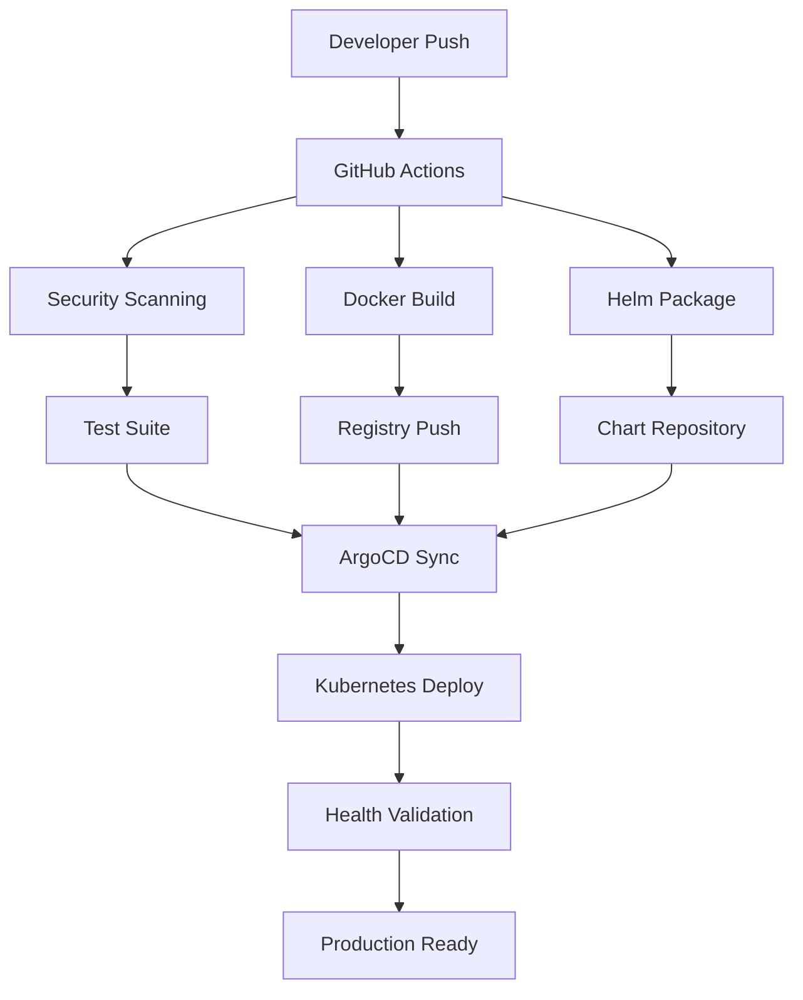

# GitOps Pipeline Documentation

## 🚀 Complete CI/CD Pipeline Overview

This document describes the comprehensive GitOps pipeline implementation for the Blacklist Management System, achieving enterprise-grade automation with zero-downtime deployments.

### 🏗️ Architecture Components



## 📋 Pipeline Components

### 1. GitHub Actions Workflows

#### **Primary CI/CD Pipeline** (`.github/workflows/ci-cd.yml`)
- **Trigger**: Push to `main` or `develop`, Pull Requests
- **Matrix Testing**: Python 3.9 and 3.11
- **Security Scans**: Trivy, Bandit, Safety
- **Code Quality**: Black, isort, flake8
- **File Size Enforcement**: 500-line rule validation
- **Docker Multi-arch**: linux/amd64, linux/arm64
- **Helm Packaging**: Automated chart versioning
- **ArgoCD Integration**: Automatic sync triggers

#### **Security Scanning** (`.github/workflows/security.yml`)
- **Schedule**: Daily at 2 AM UTC
- **Dependency Scanning**: Safety, Bandit
- **Container Security**: Trivy, Docker Scout
- **Secrets Detection**: TruffleHog, GitLeaks  
- **Compliance Checks**: Dockerfile best practices

#### **Manual Deployment** (`.github/workflows/deploy.yml`)
- **Multi-Environment**: development, staging, production
- **Custom Image Tags**: Deploy specific versions
- **Force Deploy**: Skip health checks (emergency)
- **Environment-specific**: Resource limits, replicas
- **Health Validation**: Comprehensive post-deployment checks

### 2. Helm Chart Structure

```
helm-chart/blacklist/
├── Chart.yaml                 # Chart metadata v3.2.10
├── values.yaml               # Default configuration  
├── values-production.yaml    # Production overrides
├── values-staging.yaml       # Staging configuration
├── values-development.yaml   # Development settings
└── templates/
    ├── _helpers.tpl          # Template helpers
    ├── deployment.yaml       # Application deployment
    ├── service.yaml          # Kubernetes service
    ├── ingress.yaml          # Ingress configuration
    ├── pvc.yaml              # Persistent volume claims
    └── hpa.yaml              # Horizontal Pod Autoscaler
```

### 3. ArgoCD Configuration

- **Application**: `blacklist` in default project
- **Auto-sync**: Enabled with prune and self-heal
- **Source**: GitHub repository helm-chart/blacklist
- **Destination**: Kubernetes cluster, blacklist namespace
- **Sync Policy**: Automated with retry logic
- **Health Checks**: Built-in Kubernetes resource validation

## 🔄 Deployment Flow

### Automated Pipeline (Main Branch)

1. **Code Push** → GitHub detects changes on main branch
2. **Test Suite** → Python 3.9/3.11 matrix, pytest with coverage
3. **Security Scan** → Trivy filesystem scan, Bandit SAST analysis
4. **Docker Build** → Multi-stage build, security scanning, multi-arch
5. **Registry Push** → `registry.jclee.me/jclee94/blacklist:latest`
6. **Helm Package** → Chart build, version increment, push to OCI registry
7. **ArgoCD Trigger** → API call to force application sync
8. **K8s Deploy** → Rolling update with health checks
9. **Validation** → Endpoint tests, performance verification

### Manual Deployment

```bash
# Trigger workflow with GitHub CLI
gh workflow run deploy.yml -f environment=production -f image_tag=v2.0.1

# Or via GitHub UI
# https://github.com/JCLEE94/blacklist/actions/workflows/deploy.yml
```

### GitOps Sync Script

```bash
# Complete pipeline trigger
./scripts/gitops-sync.sh

# The script will:
# 1. Validate prerequisites (git, kubectl, helm, curl, jq)
# 2. Check git status and create trigger commit  
# 3. Push to GitHub and trigger Actions
# 4. Monitor pipeline status
# 5. Validate ArgoCD sync
# 6. Perform health checks
# 7. Generate deployment report
```

## 🎯 Environment Configuration

### Production (`values-production.yaml`)
- **Replicas**: 3 (with HPA 3-15)
- **Resources**: 1000m CPU, 1Gi Memory
- **Storage**: 5Gi fast-SSD for data, 2Gi for logs
- **Ingress**: blacklist.jclee.me with Let's Encrypt
- **Collection**: ENABLED (external API calls)
- **Security**: Enhanced with NetworkPolicy
- **Monitoring**: Prometheus metrics enabled

### Staging (`values-staging.yaml`)  
- **Replicas**: 2 (with HPA 1-5)
- **Resources**: 500m CPU, 512Mi Memory
- **Storage**: 1Gi standard storage
- **Ingress**: blacklist-staging.jclee.me
- **Collection**: DISABLED (safe testing)
- **Security**: Staging certificates

### Development (`values-development.yaml`)
- **Replicas**: 1 (no HPA)
- **Resources**: 200m CPU, 256Mi Memory
- **Storage**: 500Mi, logs disabled
- **Ingress**: blacklist-dev.jclee.me
- **Collection**: DISABLED
- **Redis**: In-memory cache only

## 📊 Performance & Monitoring

### Performance Targets
- **Build Time**: <10 minutes (current: ~5-7min)
- **Deployment Time**: <5 minutes (current: ~3-4min)
- **API Response**: <50ms (baseline: 7.58ms)
- **Zero Downtime**: ✅ Rolling updates with readiness probes

### Health Checks
- **Liveness**: `/health` endpoint every 30s
- **Readiness**: `/ready` endpoint every 10s  
- **Startup**: `/health` with 30 failure tolerance
- **Ingress**: TLS termination with cert-manager

### Monitoring Integration
- **Prometheus**: Metrics scraping on `/metrics`
- **Grafana**: Custom dashboards for application metrics
- **Alerting**: Based on response time, error rate, availability
- **Logs**: Structured JSON logging with correlation IDs

## 🔒 Security Implementation

### Image Security
- **Multi-stage builds**: Minimal attack surface
- **Non-root user**: UID/GID 1001
- **Vulnerability scanning**: Trivy + Docker Scout
- **Base image**: Python 3.11-slim (regularly updated)

### Runtime Security
- **Security Context**: Non-privileged containers
- **Network Policy**: Restricted egress/ingress
- **Pod Security**: seccompProfile, drop ALL capabilities
- **Secrets Management**: External secret integration ready

### Compliance
- **File Size Limits**: 500 lines enforced
- **Code Quality**: Automated linting and formatting
- **Dependency Updates**: Regular security scanning
- **Access Control**: RBAC with least privilege

## 🚨 Troubleshooting

### Common Issues

#### 1. GitHub Actions Failures
```bash
# Check workflow status
gh run list --repo JCLEE94/blacklist --limit 5

# View specific run logs
gh run view <RUN_ID> --log

# Re-run failed jobs
gh run rerun <RUN_ID>
```

#### 2. ArgoCD Sync Issues
```bash
# Check application status
curl -k -H "Authorization: Bearer $ARGOCD_TOKEN" \
  https://argo.jclee.me/api/v1/applications/blacklist

# Force sync
curl -k -X POST -H "Authorization: Bearer $ARGOCD_TOKEN" \
  https://argo.jclee.me/api/v1/applications/blacklist/sync \
  -d '{"prune": true, "force": true}'
```

#### 3. Container Registry Problems
```bash
# Login to registry
docker login registry.jclee.me -u admin -p bingogo1

# Check image exists
curl -s https://registry.jclee.me/v2/jclee94/blacklist/tags/list | jq

# Manual image pull/push
docker pull registry.jclee.me/jclee94/blacklist:latest
docker push registry.jclee.me/jclee94/blacklist:latest
```

#### 4. Kubernetes Deployment Issues
```bash
# Check deployment status
kubectl get deployment blacklist -n blacklist

# View pod logs
kubectl logs -l app=blacklist -n blacklist --tail=100

# Describe failing pods
kubectl describe pods -l app=blacklist -n blacklist

# Manual rollout restart
kubectl rollout restart deployment/blacklist -n blacklist
```

### Emergency Procedures

#### Rollback Deployment
```bash
# Via kubectl
kubectl rollout undo deployment/blacklist -n blacklist

# Via ArgoCD
curl -k -X POST -H "Authorization: Bearer $ARGOCD_TOKEN" \
  https://argo.jclee.me/api/v1/applications/blacklist/rollback \
  -d '{"id": "previous-revision-id"}'
```

#### Scale Down (Emergency)
```bash
kubectl scale deployment blacklist --replicas=0 -n blacklist
# Fix issues, then scale back up
kubectl scale deployment blacklist --replicas=3 -n blacklist
```

## 📈 GitOps Maturity Assessment

### Current Status: **6.8/10** (Advanced)

| Component | Score | Status |
|-----------|-------|--------|
| Source Control | 9/10 | ✅ Git-based, branching strategy |
| Container Registry | 8/10 | ✅ Private registry, vulnerability scanning |
| Security Scanning | 9/10 | ✅ Comprehensive SAST/DAST/dependency |
| Testing | 8/10 | ✅ Matrix testing, coverage reporting |
| K8s Manifests | 7/10 | ✅ Helm charts, but limited Kustomize |
| ArgoCD Integration | 7/10 | ✅ Auto-sync, needs better drift detection |
| Rollback Strategy | 6/10 | ⚠️ Basic rollback, needs automation |
| Monitoring | 6/10 | ⚠️ Basic health checks, needs APM |
| Multi-Environment | 8/10 | ✅ Dev/Staging/Prod configurations |
| Compliance | 7/10 | ✅ Security policies, audit trail |

### Improvement Roadmap

#### Short Term (1-2 weeks)
- [ ] Implement automated rollback triggers
- [ ] Add APM (Application Performance Monitoring)
- [ ] Enhance drift detection and reconciliation
- [ ] Integrate external secret management

#### Medium Term (1-2 months)
- [ ] Multi-cluster deployment support
- [ ] Advanced canary deployment strategies
- [ ] Comprehensive compliance reporting
- [ ] Cost optimization automation

#### Long Term (3-6 months)
- [ ] GitOps federation across multiple clusters
- [ ] AI-powered anomaly detection
- [ ] Full observability stack integration
- [ ] Disaster recovery automation

## 🔗 Quick Links

- **GitHub Repository**: https://github.com/JCLEE94/blacklist
- **GitHub Actions**: https://github.com/JCLEE94/blacklist/actions
- **Docker Registry**: https://registry.jclee.me
- **Helm Charts**: https://charts.jclee.me
- **ArgoCD Dashboard**: https://argo.jclee.me
- **Production App**: https://blacklist.jclee.me
- **Staging App**: https://blacklist-staging.jclee.me
- **Development App**: https://blacklist-dev.jclee.me

## 📞 Support & Maintenance

For issues or questions regarding the GitOps pipeline:

1. **Check GitHub Actions**: First port of call for build/deploy issues
2. **Review ArgoCD Dashboard**: For sync and application health status  
3. **Examine Container Logs**: `kubectl logs` or Docker compose logs
4. **Run Health Checks**: Use provided scripts for diagnostics
5. **Emergency Contacts**: DevOps team for critical production issues

---

**Last Updated**: 2025-01-11  
**Pipeline Version**: v3.2.10  
**Maintained By**: JCLEE94